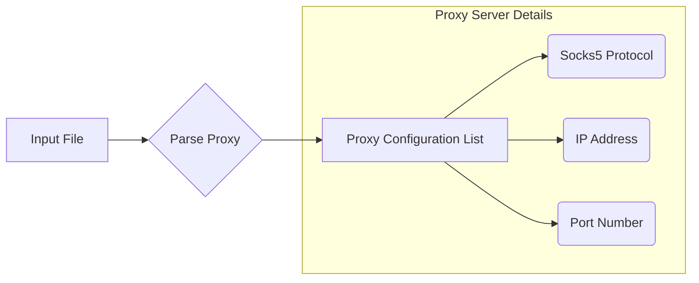

# Анализ кода

**1. <input code>**

```
socks5://208.102.51.6:58208
socks5://184.178.172.17:4145
socks5://192.252.208.67:14287
socks5://192.252.208.70:14282
socks5://192.111.129.145:16894
socks5://192.111.139.163:19404
socks5://184.178.172.25:15291
socks5://70.166.167.55:57745
socks5://70.166.167.38:57728
socks5://103.156.74.154:8199
socks5://5.39.69.35:29690
socks5://5.39.69.35:46544
socks5://34.124.190.108:8080
socks5://5.39.69.35:60096
socks5://172.104.209.44:1080
socks5://172.233.155.25:1080
socks5://172.104.164.41:1080
socks5://163.172.187.22:16379
socks5://184.168.121.153:47137
socks5://208.109.14.49:18854
socks5://184.168.121.153:11609
socks5://139.84.135.239:1080
socks5://188.166.230.38:20507
socks5://188.166.230.38:57946
socks5://103.143.88.9:1080
socks5://184.168.121.153:1052
socks5://184.168.121.153:20974
socks5://5.39.69.35:38322
... (many more lines)
```

**2. <algorithm>**

This code doesn't have a defined algorithm in the traditional sense.  It's a list of proxy configurations.  Each line represents a proxy server with its protocol ("socks5://" or "socks4://"), address, and port.  There's no looping, conditional logic, or function calls.  The data itself is a list of strings.

**3. <mermaid>**



**4. <explanation>**

The provided code is a simple text file containing a list of proxy server configurations.  It's not a program; it's data that would likely be used by a program or script.

- **Imports**: There are no imports because this is not a Python script but a data file.

- **Classes**: There are no classes.

- **Functions**: There are no functions.

- **Variables**: The data in the file is treated as a collection of string variables representing proxy configuration details.

- **Possible errors or improvements**: The biggest improvement would be to structure this data in a more organized way, like a JSON file, for easier parsing by a program.  The file is currently hard to manage, and proxy server details (protocol, address, port) are all intermingled.  Using structured data would allow programs to access this information correctly and automatically rather than relying on tedious parsing.


**Relationships with other parts of the project**:

This file (`proxies.txt`) likely serves as an input for a WebDriver class or function in the `hypotez/src/webdriver` directory. A WebDriver might need these proxy configurations to establish connections to the internet when interacting with web applications.  The connection to other parts of the project is implicit; the WebDriver will likely read these entries and use them to configure a specific proxy server for subsequent requests.  Example of use could be with a `requests` or `selenium` library.