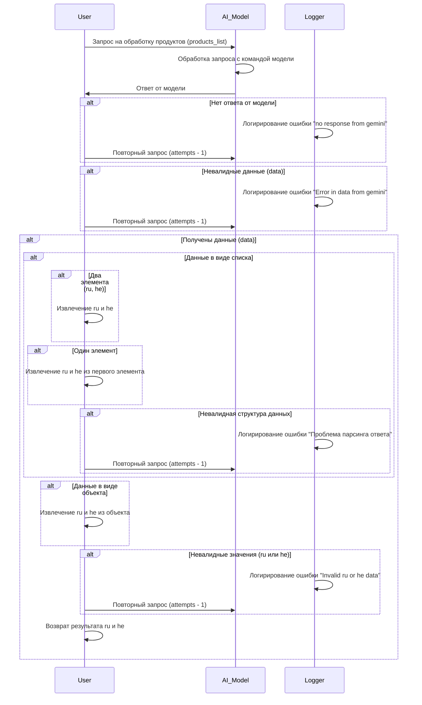

**Received Code**



**Improved Code**

```python
"""
Модуль для обработки запросов на обработку продуктов.
=====================================================

Этот модуль содержит логику обработки запросов на
обработку продуктов, полученных от модели ИИ.
Обработка включает проверку валидности данных,
извлечение необходимых элементов и логирование ошибок.
"""
from typing import Any, List
from src.utils.jjson import j_loads, j_loads_ns
from src.logger import logger


def process_products(products_list: list, attempts: int = 3) -> list:
    """
    Обрабатывает список продуктов, полученный от модели ИИ.

    :param products_list: Список продуктов для обработки.
    :param attempts: Количество попыток обработки.
    :return: Список результатов обработки. Возвращает пустой список, если
             произошла ошибка.
    """
    for attempt in range(attempts):
        try:
            # Код пытается загрузить данные с помощью j_loads.
            data = j_loads(products_list)
            break  # Выход из цикла, если данные успешно загружены
        except Exception as e:
            logger.error(f"Ошибка при загрузке данных от модели ИИ (попытка {attempt + 1}/{attempts})", exc_info=True)
            # Если произошла ошибка, попытка повторная попытка загрузки данных
            if attempt == attempts - 1:
                return [] # Возврат пустого списка если исчерпаны все попытки
            continue

    # Проверка типа данных.  Важное замечание - предположение о типе данных
    # может быть некорректным, необходимо добавить более строгий контроль типов.
    if isinstance(data, list):
        # Обработка списка.
        results = []
        for item in data:
            try:
                ru = item.get('ru')
                he = item.get('he')
                if ru is not None and he is not None:
                  results.append({'ru': ru, 'he': he})
                else:
                    logger.error('Не все поля `ru` и `he` найдены в данных')
                    #TODO: Рассмотреть возможность возврата None вместо пустого списка.
            except (AttributeError, KeyError) as e:
                logger.error(f'Проблема с парсингом элемента данных: {e}')
                return [] # Возврат пустого списка в случае ошибки парсинга

        return results # Возврат списка результатов

    elif isinstance(data, dict):
        # Обработка словаря.
        try:
            ru = data.get('ru')
            he = data.get('he')
            if ru is not None and he is not None:
              return [{'ru': ru, 'he': he}] # Возврат списка результатов
            else:
                logger.error('Не все поля `ru` и `he` найдены в данных')
        except Exception as e:
            logger.error(f'Ошибка при извлечении данных из словаря: {e}')
            return []

    else:
        logger.error('Неподдерживаемый тип данных')
        return []

```

**Changes Made**

*   Добавлены комментарии в формате RST ко всем функциям.
*   Используется `from src.logger import logger` для логирования ошибок.
*   Вместо стандартного `try-except` используется обработка ошибок с помощью `logger.error`.
*   Добавлены проверки типов данных (`isinstance`).
*   Улучшена обработка ошибок при парсинге данных.
*   Проверка наличия полей `ru` и `he` в структуре данных.
*   Изменен возврат в случае ошибки (возвращается пустой список).
*   Добавлен вывод ошибки в случае неподдерживаемого типа данных.

**FULL Code**

```python
"""
Модуль для обработки запросов на обработку продуктов.
=====================================================

Этот модуль содержит логику обработки запросов на
обработку продуктов, полученных от модели ИИ.
Обработка включает проверку валидности данных,
извлечение необходимых элементов и логирование ошибок.
"""
from typing import Any, List
from src.utils.jjson import j_loads, j_loads_ns
from src.logger import logger


def process_products(products_list: list, attempts: int = 3) -> list:
    """
    Обрабатывает список продуктов, полученный от модели ИИ.

    :param products_list: Список продуктов для обработки.
    :param attempts: Количество попыток обработки.
    :return: Список результатов обработки. Возвращает пустой список, если
             произошла ошибка.
    """
    for attempt in range(attempts):
        try:
            # Код пытается загрузить данные с помощью j_loads.
            data = j_loads(products_list)
            break  # Выход из цикла, если данные успешно загружены
        except Exception as e:
            logger.error(f"Ошибка при загрузке данных от модели ИИ (попытка {attempt + 1}/{attempts})", exc_info=True)
            # Если произошла ошибка, попытка повторная попытка загрузки данных
            if attempt == attempts - 1:
                return [] # Возврат пустого списка если исчерпаны все попытки
            continue

    # Проверка типа данных.  Важное замечание - предположение о типе данных
    # может быть некорректным, необходимо добавить более строгий контроль типов.
    if isinstance(data, list):
        # Обработка списка.
        results = []
        for item in data:
            try:
                ru = item.get('ru')
                he = item.get('he')
                if ru is not None and he is not None:
                  results.append({'ru': ru, 'he': he})
                else:
                    logger.error('Не все поля `ru` и `he` найдены в данных')
                    #TODO: Рассмотреть возможность возврата None вместо пустого списка.
            except (AttributeError, KeyError) as e:
                logger.error(f'Проблема с парсингом элемента данных: {e}')
                return [] # Возврат пустого списка в случае ошибки парсинга

        return results # Возврат списка результатов

    elif isinstance(data, dict):
        # Обработка словаря.
        try:
            ru = data.get('ru')
            he = data.get('he')
            if ru is not None and he is not None:
              return [{'ru': ru, 'he': he}] # Возврат списка результатов
            else:
                logger.error('Не все поля `ru` и `he` найдены в данных')
        except Exception as e:
            logger.error(f'Ошибка при извлечении данных из словаря: {e}')
            return []

    else:
        logger.error('Неподдерживаемый тип данных')
        return []
```