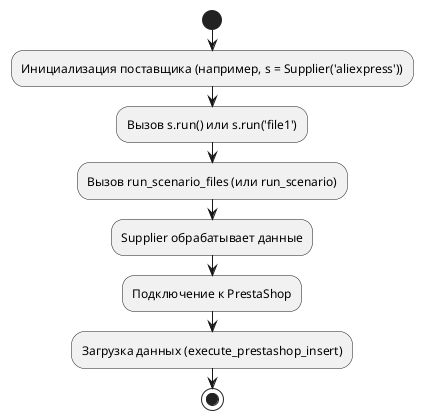

```markdown
# Модуль `hypotez/src/scenario/__init__.py`

## Описание

Модуль `hypotez/src/scenario/__init__.py` содержит функции для выполнения сценариев, используемых поставщиками данных.  Он обеспечивает логику взаимодействия между сценариями, исполнителем и поставщиками (например, PrestaShop).

## Функции

* **`run_scenario_files(supplier, scenario_files)`:** Выполняет сценарии, описанные в указанных файлах.
* **`run_scenarios(supplier, scenarios)`:** Выполняет указанные сценарии.
* **`run_scenario(supplier, scenario)`:** Выполняет один сценарий.
* **`run_scenario_file(supplier, scenario_file)`:** Выполняет сценарий из одного файла.
* **`execute_prestashop_insert(data)`:** Выполняет загрузку данных в PrestaShop.
* **`execute_prestashop_insert_async(data)`:** Выполняет асинхронную загрузку данных в PrestaShop.


## Использование

Модуль предоставляет различные способы запуска сценариев:

* Передача объекта поставщика (`Supplier`) и имени файла сценария (`'file1'`).
* Передача объекта поставщика и списка файлов сценариев (`['file1', ...]`).
* Передача объекта поставщика и словаря сценариев (`{'key': 'value'}`).
* Передача объекта поставщика и списка словарей сценариев (`[{'key': 'value'}, ...]`).

Пример сценария (файл):

```json
{
  "scenarios": {
    "feet-hand-treatment": {
      "url": "https://hbdeadsea.co.il/product-category/bodyspa/feet-hand-treatment/",
      "name": "Foot and Hand Care",
      "condition": "new",
      "presta_categories": {
        "default_category": 11259,
        "additional_categories": []
      }
    },
    "creams-butters-serums-for-body": {
      "url": "https://hbdeadsea.co.il/product-category/bodyspa/creams-butters-serums-for-body/",
      "name": "Creams, Butters, and Serums for Body",
      "condition": "new",
      "presta_categories": {
        "default_category": 11260,
        "additional_categories": []
      }
    }
  }
}
```

**Важный момент:** Приведенный пример показывает структуру сценария.  Для детального описания словаря сценария см. указанный в комментарии ресурс.


## Диаграмма потока

Диаграмма иллюстрирует последовательность выполнения:



## Подключение к другим модулям

Модуль импортирует необходимые функции из модулей `.executor`, что указывает на наличие связанных компонентов.

## Версия и детали

Модуль использует модуль `packaging.version`, что подразумевает необходимость совместимости с определёнными версиями Python пакетов.


## Улучшения

* Добавьте примеры использования функций (включая обработку ошибок).
* Добавьте более подробное описание формата входных данных (сценариев).
* Добавьте описание возможных ошибок и их обработки.
* Разделите комментарии на более мелкие абзацы для лучшего понимания.


```