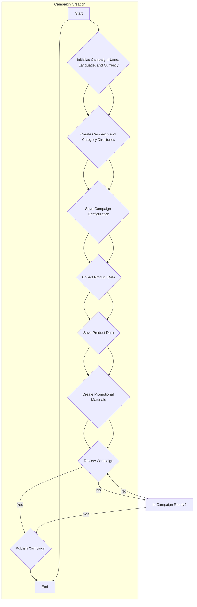

```markdown
# Campaign Creation Flow - AliExpress

This document outlines the process for creating an advertising campaign on AliExpress.

## Module: `src.suppliers.aliexpress.campaign`

**Mode:** `debug`

**Flowchart:**



**Detailed Steps:**

* **Initialize Campaign:** Set the campaign's name, language, and currency.
* **Create Directories:**  Establish the necessary directories for the campaign and product data.
* **Save Campaign Configuration:** Store the campaign settings in a structured format.
* **Collect Product Data:** Gather product information relevant to the campaign.
* **Save Product Data:** Store the collected product data.
* **Create Promotional Materials:** Develop promotional assets (e.g., banners, descriptions).
* **Review Campaign:** Verify that all elements meet the required criteria.
* **Publish Campaign:** Finalize and publish the campaign on AliExpress.

**Note:** The flowchart clearly illustrates the steps involved in creating a campaign. The "Is Campaign Ready?" step provides a crucial check before final publication, ensuring accuracy and completeness. This documentation serves as a reference for developers working on the AliExpress campaign creation process.  Any specific error handling or data validation steps should be described in greater detail in the relevant code.
```