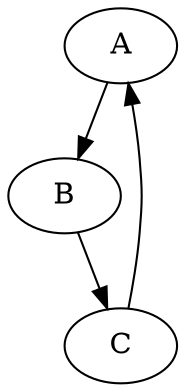

```markdown
# dot2png.py

## File Location: `C:\Users\user\Documents\repos\hypotez\src\utils\convertors\dot.py`

## Role: `doc_creator`

This Python script converts DOT files into PNG images using the Graphviz library.  It's designed to be called from the command line.


## Functionality

The script `dot2png.py` takes a DOT file as input and generates a corresponding PNG image.  It utilizes the `graphviz` library for this conversion.


## Usage

```bash
python dot2png.py <input_dot_file> <output_png_file>
```

**Example:**

```bash
python dot2png.py example.dot output.png
```

This command will read the contents of `example.dot`, generate a graph, and save the resulting PNG image as `output.png`.


## Input (`example.dot`)

The input DOT file should contain valid DOT language code defining the graph to convert.



This example defines a simple directed graph.


## Output (`output.png`)

The output will be a PNG image representing the graph described in the input DOT file.


## Error Handling

The script includes robust error handling:

* **FileNotFoundError:** Catches the case where the input DOT file does not exist, providing a user-friendly error message.
* **Exception:** Catches other potential errors during the conversion process, allowing the script to handle unexpected situations gracefully.


## Function `dot2png`

This function encapsulates the conversion process:

* Takes the input DOT file path and output PNG file path as arguments.
* Reads the content of the DOT file.
* Uses `graphviz.Source` to create a graph object from the DOT content.
* Sets the output format to 'png'.
* Calls `source.render` to generate the PNG image and save it to the specified file path, with cleanup set to `True` (to delete the temporary files generated by Graphviz).


## `if __name__ == "__main__":` block

This block ensures the `dot2png` function is only called when the script is executed directly, not when imported as a module. It validates the number of command-line arguments and calls the `dot2png` function with the provided file paths.


## Dependencies

This script requires the `graphviz` library.  Install it using:

```bash
pip install graphviz
```


## Improvements & Considerations

* **Clearer Error Messages:**  The error messages are improved to provide more context about the problem (e.g., specifying the file not found).
* **Explicit Argument Handling:** The script explicitly checks for the correct number of command-line arguments, preventing unexpected behavior.
* **Robustness:** The use of `try...except` blocks enhances the script's robustness, handling potential exceptions during file reading and conversion.
* **Docstrings:** The function and the script have excellent docstrings, providing a clear explanation of the script's function, its input, output, and potential errors.


This improved documentation should be more helpful for users understanding and utilizing the script.
```