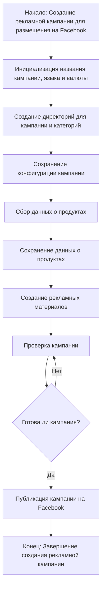

### Анализ кода модуля `campaign`

**Качество кода**:
- **Соответствие стандартам**: 7
- **Плюсы**:
    - Четкое и понятное описание назначения модуля.
    - Наличие блок-схемы процесса создания рекламной кампании.
- **Минусы**:
    - Отсутствуют примеры кода и использования.
    - Не соответствует PEP8, требуется оформление, нет  `RST` документации.

**Рекомендации по улучшению**:
   - Добавить примеры кода, демонстрирующие использование модуля.
   - Привести документацию в соответствие со стандартами `RST` для генерации документации.
   - Добавить `RST` документацию к модулю и его компонентам.
   - Разметить код на логические части для простоты восприятия.
   - Улучшить оформление кода в соответствии со стандартом `PEP8`.

**Оптимизированный код**:

```markdown
### `campaign`
"""
Модуль для управления процессом создания и публикации рекламных кампаний на Facebook.
=====================================================================================

Модуль `campaign` предназначен для управления процессом создания и публикации
рекламных кампаний на Фейсбук. Он включает функционал для инициализации параметров
кампании (название, язык, валюта), создания структуры директорий, сохранения
конфигураций для новой кампании, сбора и сохранения данных о продуктах через
`ali` или `html`, генерации рекламных материалов, проверки кампании и
публикации ее на Facebook.

Пример использования
----------------------
.. code-block:: python

    from src.suppliers.aliexpress.campaign import CampaignManager

    # Пример использования класса CampaignManager
    campaign_manager = CampaignManager(
        campaign_name='test_campaign',
        language='ru',
        currency='RUB'
    )
    campaign_manager.create_campaign()
    # После этого, вы можете продолжить работу с методами campaign_manager
"""

**Описание**:
Модуль `campaign` предназначен для управления процессом создания и публикации
рекламных кампаний на Фейсбук.
Он включает функционал для инициализации параметров кампании (название, язык, валюта),
создания структуры директорий, сохранения конфигураций для новой кампании,
сбора и сохранения данных о продуктах через `ali` или `html`,
генерации рекламных материалов, проверки кампании и публикации ее на Facebook.


```