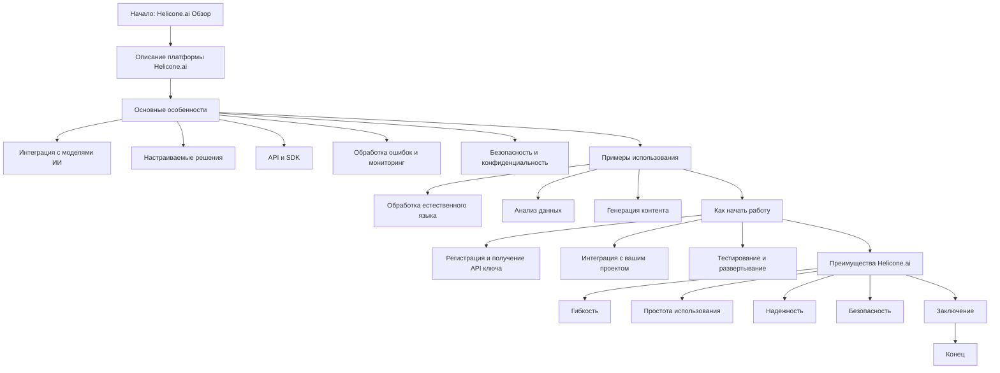

## Анализ документа `hypotez/src/ai/helicone/about.ru.md`

### <алгоритм>

1.  **Начало**: Документ начинается с заголовка "Helicone.ai: Обзор", представляя собой текстовое описание платформы Helicone.ai.

2.  **Описание платформы**:
    *   Представление Helicone.ai как платформы, предоставляющей доступ к специализированным функциям ИИ.
    *   Указание целевой аудитории: разработчики и бизнес, ищущие настраиваемые решения ИИ.
    *   Отмечается интеграция с различными моделями ИИ, что обеспечивает гибкость и расширяемость.

3.  **Основные особенности**:
    *   **Интеграция с моделями ИИ**: Описание возможности интеграции с различными моделями ИИ, включая OpenAI, Google и других провайдеров. Например:
    
        ```
        "Helicone.ai обеспечивает интеграцию с широким спектром моделей ИИ, включая модели от OpenAI, Google, и других провайдеров."
        ```
    *   **Настраиваемые решения**: Платформа предоставляет инструменты для адаптации моделей под конкретные потребности, например:
    
        ```
        "Платформа предоставляет инструменты для создания настраиваемых решений ИИ. Разработчики могут адаптировать модели под специфические потребности своих проектов..."
        ```
    *   **API и SDK**: Описание наличия API и SDK для упрощения интеграции с различными языками программирования, например:
    
        ```
        "Helicone.ai предлагает API и SDK для упрощения интеграции с различными языками программирования."
        ```
    *   **Обработка ошибок и мониторинг**: Включает инструменты для обработки ошибок и мониторинга производительности, например:
        ```
        "Платформа включает в себя инструменты для обработки ошибок и мониторинга производительности моделей ИИ."
        ```
    *   **Безопасность и конфиденциальность**: Подчеркивается важность защиты данных и конфиденциальности пользователей, например:
    
        ```
        "Helicone.ai уделяет большое внимание безопасности и конфиденциальности данных."
        ```

4.  **Примеры использования**:
    *   **Обработка естественного языка**: Описание применения для чат-ботов и анализа тональности, например:
    
        ```
        "Helicone.ai может использоваться для создания чат-ботов, систем анализа тональности текста..."
        ```
    *   **Анализ данных**: Платформа используется для анализа больших объемов данных, например:
    
        ```
        "Платформа может быть использована для анализа больших объемов данных, выявления закономерностей..."
        ```
    *   **Генерация контента**: Описание возможностей генерации статей и описаний продуктов, например:
    
        ```
        "Helicone.ai предоставляет возможность генерировать контент, такой как статьи, описания продуктов и многое другое..."
        ```

5.  **Как начать работу**:
    *   **Регистрация и получение API ключа**: Процесс регистрации и получения API ключа, например:
    
        ```
        "Зарегистрируйтесь на платформе Helicone.ai и получите API ключ для доступа к функциям платформы."
        ```
    *   **Интеграция с проектом**: Описание использования API ключа и SDK для интеграции, например:
    
        ```
        "Используйте предоставленный API ключ и SDK для интеграции Helicone.ai с вашим проектом."
        ```
    *   **Тестирование и развертывание**: Процесс тестирования и развертывания решения, например:
    
        ```
        "Протестируйте интеграцию в тестовой среде, убедившись, что все функции работают корректно. После успешного тестирования разверните решение в рабочей среде."
        ```

6.  **Преимущества Helicone.ai**:
    *   **Гибкость**: Интеграция с различными моделями ИИ и создание настраиваемых решений.
    *   **Простота использования**: Доступность API и SDK.
    *   **Надежность**: Инструменты для обработки ошибок и мониторинга.
    *   **Безопасность**: Защита данных и конфиденциальности.

7.  **Заключение**: Подведение итогов о Helicone.ai как мощной платформе для ИИ-решений.

### <mermaid>



**Разбор диаграммы `mermaid`:**

*   **Start** (Начало: Helicone.ai Обзор): Начальная точка процесса, представляющая заголовок документа.
*   **PlatformDescription** (Описание платформы Helicone.ai): Содержит общее описание платформы Helicone.ai и её предназначения.
*   **CoreFeatures** (Основные особенности): Представляет основные характеристики платформы Helicone.ai, которые включают в себя:
    *   **IntegrationWithAIModels** (Интеграция с моделями ИИ): Описывает возможность интеграции с различными моделями ИИ.
    *   **CustomSolutions** (Настраиваемые решения): Подчеркивает возможность создания настраиваемых решений.
    *    **APIAndSDK** (API и SDK): Показывает, что для интеграции предоставляются API и SDK.
    *   **ErrorHandlingMonitoring** (Обработка ошибок и мониторинг): Описывает наличие инструментов для обработки ошибок и мониторинга.
    *   **SecurityAndPrivacy** (Безопасность и конфиденциальность):  Описывает важность защиты данных и конфиденциальности.
*  **UsageExamples** (Примеры использования): Представляет примеры использования платформы, которые включают в себя:
    *   **NaturalLanguageProcessing** (Обработка естественного языка): Использование для чат-ботов и анализа текста.
    *   **DataAnalysis** (Анализ данных): Использование для анализа больших объемов данных.
    *   **ContentGeneration** (Генерация контента): Использование для генерации статей и описаний продуктов.
*   **GettingStarted** (Как начать работу): Описывает шаги для начала работы с Helicone.ai, включающие:
    *   **RegistrationAndAPIKey** (Регистрация и получение API ключа): Процесс получения API ключа.
    *   **ProjectIntegration** (Интеграция с вашим проектом): Процесс интеграции с проектом.
    *   **TestingDeployment** (Тестирование и развертывание): Процесс тестирования и развертывания.
*  **HeliconeAdvantages** (Преимущества Helicone.ai): Представляет преимущества использования платформы, которые включают в себя:
    *   **Flexibility** (Гибкость): Гибкость интеграции и создания решений.
    *   **EaseOfUse** (Простота использования): Доступность API и SDK.
    *   **Reliability** (Надежность): Инструменты для обработки ошибок и мониторинга.
    *   **DataProtection** (Безопасность): Защита данных и конфиденциальности.
*   **Conclusion** (Заключение):  Подводит итог описания платформы Helicone.ai.
*   **End** (Конец): Конечная точка процесса.

### <объяснение>

Этот документ представляет собой обзор платформы Helicone.ai на русском языке, предназначенный для разработчиков и бизнесов, которые ищут инструменты для создания настраиваемых решений на основе искусственного интеллекта.

**Импорты:**

В данном документе нет импортов, так как это текстовый файл `markdown`, а не код `python`. Тем не менее, он описывает платформу, которая использует API и SDK, которые могут быть связаны с другими частями проекта.

**Классы:**

Данный документ не содержит описания классов, так как это текстовый файл `markdown`. Однако упоминание API и SDK намекает на наличие классов в кодовой базе, которая взаимодействует с платформой Helicone.ai.

**Функции:**

Документ не содержит явных функций, так как это текстовый файл. Однако он описывает функциональность платформы Helicone.ai, которая реализуется через API и SDK. Например, функции могут включать в себя вызовы API для отправки запросов к моделям ИИ, обработки ответов и интеграцию с другими системами.

**Переменные:**

В документе нет переменных, так как это текстовый файл. Однако при использовании API и SDK переменные будут использоваться для хранения API-ключей, параметров запросов, ответов от моделей ИИ и других данных, необходимых для работы платформы.

**Потенциальные ошибки и области для улучшения:**

*   **Недостаток конкретики:** В документе есть общее описание, но нет деталей о том, как именно интегрировать Helicone.ai, какие модели ИИ поддерживаются и какие типы данных можно анализировать. Было бы полезно добавить более подробную информацию и примеры кода.
*   **Отсутствие технических деталей:** Документ не описывает технические ограничения, требования к инфраструктуре и подробности о безопасности.
*   **Отсутствие информации о ценообразовании:** В документе не упоминается стоимость использования Helicone.ai.
*   **Необходимость обновления**: Так как технологии ИИ быстро развиваются, документ нужно регулярно обновлять.
*   **Интернационализация**: Возможно, потребуется адаптировать этот документ и на другие языки.

**Цепочка взаимосвязей с другими частями проекта:**

Этот документ является частью документации по Helicone.ai и, вероятно, связан со следующими элементами проекта:

1.  **Кодовая база API и SDK**: Документ описывает платформу, которая использует API и SDK. Это подразумевает наличие кодовой базы, реализующей функции платформы и предоставляющей интерфейсы для разработчиков.
2.  **Документация API**: Подробная документация API должна описывать все доступные endpoints, форматы запросов и ответов.
3.  **Примеры интеграции**: В репозитории проекта должны быть примеры интеграции для различных языков программирования.
4.  **Демо-проекты**: Примеры демо-проектов, демонстрирующие возможности платформы и способы ее интеграции.
5.  **Инфраструктура**: Платформа, скорее всего, развернута на какой-то инфраструктуре (облачной или локальной), которая должна быть стабильной и масштабируемой.
6.  **Система авторизации и управления доступом**: Для использования API необходима система авторизации и управления доступом, которая будет защищать данные пользователей.

В целом, этот документ представляет собой обзор Helicone.ai, который предоставляет полезную информацию для потенциальных пользователей. Однако для более эффективного использования платформы и ее интеграции требуется более подробная техническая информация и примеры.