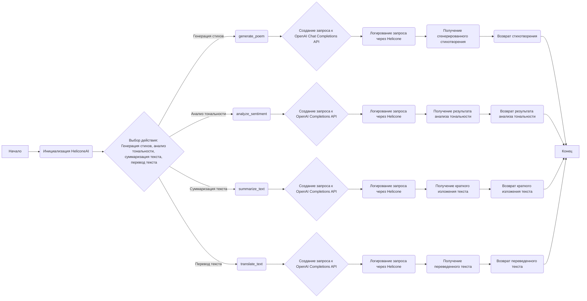
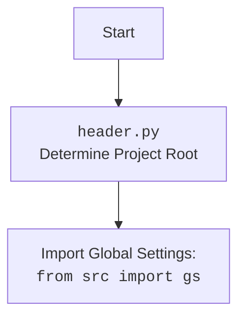

## <алгоритм>

### Блок-схема рабочего процесса класса `HeliconeAI`



1.  **Начало**: Программа начинает выполнение.
2.  **Инициализация `HeliconeAI`**: Создается экземпляр класса `HeliconeAI`, который инициализирует клиентов `Helicone` и `OpenAI`.
3.  **Выбор действия**: В зависимости от желаемой операции (генерация стихов, анализ тональности, суммаризация или перевод текста) вызывается соответствующий метод класса `HeliconeAI`.
4.  **`generate_poem`**:
    *   Создает запрос к OpenAI Chat Completions API для генерации стихотворения на основе заданного промпта.
    *   Логирует запрос через Helicone для мониторинга и анализа использования API.
    *   Получает сгенерированное стихотворение из ответа OpenAI.
    *   Возвращает сгенерированное стихотворение.
5.  **`analyze_sentiment`**:
    *   Создает запрос к OpenAI Completions API для анализа тональности заданного текста.
    *   Логирует запрос через Helicone.
    *   Получает результат анализа тональности из ответа OpenAI.
    *   Возвращает результат анализа тональности.
6.  **`summarize_text`**:
    *   Создает запрос к OpenAI Completions API для создания краткого изложения заданного текста.
    *   Логирует запрос через Helicone.
    *   Получает краткое изложение текста из ответа OpenAI.
    *   Возвращает краткое изложение текста.
7.  **`translate_text`**:
    *   Создает запрос к OpenAI Completions API для перевода заданного текста на указанный язык.
    *   Логирует запрос через Helicone.
    *   Получает переведенный текст из ответа OpenAI.
    *   Возвращает переведенный текст.
8.  **Конец**: Программа завершает выполнение.

### Примеры для каждого логического блока

*   **Инициализация `HeliconeAI`**:

    ```python
    helicone_ai = HeliconeAI()
    ```
*   **`generate_poem`**:

    ```python
    poem = helicone_ai.generate_poem("Напиши мне стихотворение про кота.")
    ```
*   **`analyze_sentiment`**:

    ```python
    sentiment = helicone_ai.analyze_sentiment("Сегодня был отличный день!")
    ```
*   **`summarize_text`**:

    ```python
    summary = helicone_ai.summarize_text("Длинный текст для изложения...")
    ```
*   **`translate_text`**:

    ```python
    translation = helicone_ai.translate_text("Hello, how are you?", "русский")
    ```

## <mermaid>

```mermaid
flowchart TD
    A[HeliconeAI] --> B(Helicone);
    A --> C(OpenAI Client);
    B --> D{Helicone API};
    C --> E{OpenAI API};
    A --> F{generate_poem(prompt: str)};
    A --> G{analyze_sentiment(text: str)};
    A --> H{summarize_text(text: str)};
    A --> I{translate_text(text: str, target_language: str)};
    F --> C;
    G --> C;
    H --> C;
    I --> C;
```

### Описание диаграммы Mermaid:

Диаграмма описывает зависимости и взаимодействия класса `HeliconeAI` с другими компонентами:

*   `HeliconeAI`: Главный класс, который использует Helicone и OpenAI для выполнения различных задач обработки текста.
*   `Helicone`: Объект класса `Helicone`, используемый для логирования запросов к OpenAI API.
*   `OpenAI Client`: Клиент OpenAI, используемый для выполнения запросов к OpenAI API.
*   `Helicone API`: API Helicone, используемое для логирования и мониторинга запросов.
*   `OpenAI API`: API OpenAI, используемое для выполнения задач генерации текста, анализа тональности, суммаризации и перевода текста.
*   `generate_poem(prompt: str)`: Метод класса `HeliconeAI`, используемый для генерации стихотворений на основе заданного промпта.
*   `analyze_sentiment(text: str)`: Метод класса `HeliconeAI`, используемый для анализа тональности текста.
*   `summarize_text(text: str)`: Метод класса `HeliconeAI`, используемый для создания краткого изложения текста.
*   `translate_text(text: str, target_language: str)`: Метод класса `HeliconeAI`, используемый для перевода текста на указанный язык.

### Объяснение зависимостей:

*   `HeliconeAI` зависит от `Helicone` и `OpenAI Client` для выполнения своих задач.
*   `Helicone` использует `Helicone API` для логирования запросов.
*   `OpenAI Client` использует `OpenAI API` для выполнения запросов к OpenAI.
*   Методы `generate_poem`, `analyze_sentiment`, `summarize_text` и `translate_text` используют `OpenAI Client` для выполнения запросов к OpenAI API.

### Дополнительно



## <объяснение>

### Импорты:

*   `header`: Предположительно, содержит общие настройки и утилиты для проекта.
*   `helicone`: Импортирует класс `Helicone` из библиотеки `helicone`. Этот класс используется для взаимодействия с Helicone API, который предоставляет инструменты для мониторинга и анализа использования OpenAI API.
*   `openai`: Импортирует класс `OpenAI` из библиотеки `openai`. Этот класс используется для взаимодействия с OpenAI API, который предоставляет доступ к различным моделям машинного обучения, таким как GPT-3.

### Класс `HeliconeAI`:

*   **Роль**: Предоставляет интерфейс для взаимодействия с OpenAI API через Helicone API. Он упрощает выполнение таких задач, как генерация стихов, анализ тональности, суммаризация и перевод текста.
*   **Атрибуты**:
    *   `helicone`: Экземпляр класса `Helicone`, используемый для логирования запросов к OpenAI API.
    *   `client`: Экземпляр класса `OpenAI`, используемый для выполнения запросов к OpenAI API.
*   **Методы**:
    *   `__init__(self)`: Инициализирует класс `HeliconeAI`, создавая экземпляры `Helicone` и `OpenAI`.
    *   `generate_poem(self, prompt: str) -> str`: Генерирует стихотворение на основе заданного промпта, используя OpenAI Chat Completions API.
        *   Аргументы:
            *   `prompt (str)`: Промпт для генерации стихотворения.
        *   Возвращает:
            *   `str`: Сгенерированное стихотворение.
        *   Пример:

            ```python
            poem = self.generate_poem("Напиши мне стихотворение про кота.")
            ```
    *   `analyze_sentiment(self, text: str) -> str`: Анализирует тональность текста, используя OpenAI Completions API.
        *   Аргументы:
            *   `text (str)`: Текст для анализа.
        *   Возвращает:
            *   `str`: Результат анализа тональности.
        *   Пример:

            ```python
            sentiment = self.analyze_sentiment("Сегодня был отличный день!")
            ```
    *   `summarize_text(self, text: str) -> str`: Создает краткое изложение текста, используя OpenAI Completions API.
        *   Аргументы:
            *   `text (str)`: Текст для изложения.
        *   Возвращает:
            *   `str`: Краткое изложение текста.
        *   Пример:

            ```python
            summary = self.summarize_text("Длинный текст для изложения...")
            ```
    *   `translate_text(self, text: str, target_language: str) -> str`: Переводит текст на указанный язык, используя OpenAI Completions API.
        *   Аргументы:
            *   `text (str)`: Текст для перевода.
            *   `target_language (str)`: Целевой язык перевода.
        *   Возвращает:
            *   `str`: Переведенный текст.
        *   Пример:

            ```python
            translation = self.translate_text("Hello, how are you?", "русский")
            ```

### Функция `main()`:

*   Создает экземпляр класса `HeliconeAI`.
*   Вызывает методы `generate_poem`, `analyze_sentiment`, `summarize_text` и `translate_text` для выполнения различных задач обработки текста.
*   Выводит результаты выполнения этих задач в консоль.

### Переменные:

*   `helicone_ai`: Экземпляр класса `HeliconeAI`.
*   `poem`: Сгенерированное стихотворение.
*   `sentiment`: Результат анализа тональности.
*   `summary`: Краткое изложение текста.
*   `translation`: Переведенный текст.

### Потенциальные ошибки и области для улучшения:

*   Обработка ошибок: В коде не предусмотрена обработка ошибок, которые могут возникнуть при взаимодействии с OpenAI API или Helicone API. Рекомендуется добавить обработку исключений, чтобы программа могла корректно обрабатывать ошибки и продолжать выполнение.
*   Конфигурация API: Параметры API, такие как модель и максимальное количество токенов, жестко заданы в коде. Рекомендуется вынести эти параметры в конфигурационный файл, чтобы их можно было легко изменять без необходимости изменения кода.
*   Логирование: В коде используется только логирование запросов к OpenAI API через Helicone. Рекомендуется добавить логирование других событий, таких как инициализация класса `HeliconeAI` и результаты выполнения методов, чтобы упростить отладку и мониторинг программы.
*   Асинхронность: Запросы к OpenAI API выполняются синхронно, что может привести к блокировке программы во время ожидания ответа от API. Рекомендуется использовать асинхронные запросы, чтобы программа могла продолжать выполнение других задач во время ожидания ответа от API.

### Связи с другими частями проекта:

*   `header.py`: Предположительно, содержит общие настройки и утилиты для проекта, которые могут использоваться для конфигурации `HeliconeAI`.
*   `src.logger.logger`: Может использоваться для добавления логирования в класс `HeliconeAI`.
*   Другие модули проекта: Могут использовать класс `HeliconeAI` для выполнения задач обработки текста.