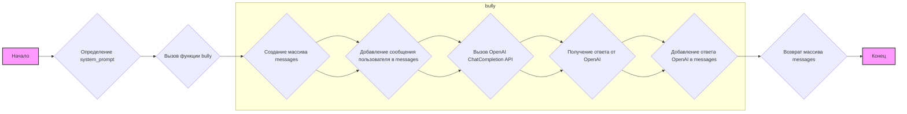

## АНАЛИЗ КОДА: `src/ai/openai/bully.py`

### 1. <алгоритм>

**Блок-схема:**



**Примеры:**

1. **Определение `system_prompt`:**
   - Задается строка, инструктирующая модель OpenAI вести себя как эксперт по ненавистническим высказываниям и отвечать примерами запугиваний в формате JSON.
   - Пример: `system_prompt` присваивается строка, начинающаяся с "You are an expert on hate speech...".

2.  **Вызов функции `bully`:**
    - Функция вызывается либо с сообщением пользователя и массивом сообщений (как при первом вызове), либо по умолчанию с сообщением "Hello!" и начальным массивом.
    - Пример: `bully(user_message="Ты неудачник!", messages=[{"role": "system", "content": system_prompt}])`

3. **Создание массива `messages`:**
   - Исходный массив сообщений (либо переданный, либо сгенерированный по умолчанию) используется для хранения всех сообщений, включая системное.
   - Пример: Изначально массив `messages` содержит системное сообщение.

4.  **Добавление сообщения пользователя в `messages`:**
    - Сообщение пользователя добавляется в массив `messages`.
    - Пример: `messages.append({"role": "user", "content": user_message})`

5.  **Вызов OpenAI `ChatCompletion` API:**
    - Используется метод `openai.ChatCompletion.create` для получения ответа от модели OpenAI.
    - Пример: `openai.ChatCompletion.create(model="gpt-3.5-turbo", messages=messages)`

6.  **Получение ответа от OpenAI:**
    - Ответ от OpenAI приходит в виде объекта `completion`, содержащего, например, список `choices`, где первый элемент содержит сообщение от ИИ.
    - Пример: `completion.choices[0].message`

7.  **Добавление ответа OpenAI в `messages`:**
    - Ответ от OpenAI добавляется в массив `messages`.
    - Пример: `messages.append({"role": "user", "content": completion.choices[0].message})`

8. **Возврат массива `messages`:**
   - Функция возвращает массив сообщений, включая сообщение пользователя и ответ от OpenAI.

### 2. <mermaid>

```mermaid
flowchart TD
    Start(Начало) --> DefineSystemPrompt[<code>system_prompt</code><br>Определение системного промпта];
    DefineSystemPrompt --> CallBullyFunction[Вызов <code>bully()</code><br>c user_message и messages];
    CallBullyFunction --> CreateMessagesArray[<code>messages</code><br>Создание массива сообщений];
    CreateMessagesArray --> AppendUserMessage[<code>messages.append()</code><br>Добавление сообщения пользователя];
    AppendUserMessage --> CallOpenAIChatCompletion[<code>openai.ChatCompletion.create()</code><br>Вызов OpenAI API];
    CallOpenAIChatCompletion --> GetOpenAIResponse[Получение <code>completion.choices[0].message</code><br>Ответа от OpenAI];
    GetOpenAIResponse --> AppendOpenAIResponse[<code>messages.append()</code><br>Добавление ответа OpenAI];
    AppendOpenAIResponse --> ReturnMessages[<code>return messages</code><br>Возврат массива сообщений];
    ReturnMessages --> End(Конец);

    style Start fill:#f9f,stroke:#333,stroke-width:2px
    style End fill:#f9f,stroke:#333,stroke-width:2px

```

**Объяснение зависимостей:**

-   `import os`: Хотя `os` импортируется, в этом коде он не используется. Это может быть следствием предыдущих версий кода или потенциального расширения.
-   `import src.ai.openai`: Импортируется собственный модуль `src.ai.openai`, который предположительно предоставляет интерфейс для взаимодействия с OpenAI. Это предполагает наличие в проекте файла `/src/ai/openai/__init__.py` или модуля `openai` в этой директории.
    - `openai.API_KEY = "YOUR_API_KEYS_OPENAI"`: Здесь устанавливается ключ API, который нужен для подключения к OpenAI. Замените `YOUR_API_KEYS_OPENAI` на ваш настоящий ключ.
-  **Связь с другими модулями:**
  - Модуль `src.ai.openai` используется для отправки запросов к OpenAI.

### 3. <объяснение>

**Импорты:**

-   `import os`: Импортирует модуль `os`, но в данном коде не используется. Это может быть заделом на будущее.
-   `import src.ai.openai`: Импортирует пользовательский модуль для работы с API OpenAI. В этом модуле предположительно находится функциональность `openai.ChatCompletion`.

**Переменные:**

-   `openai.API_KEY`: Ключ API для доступа к сервисам OpenAI. Замените `"YOUR_API_KEYS_OPENAI"` на ваш ключ.
-   `system_prompt`: Строка, задающая инструкции для модели OpenAI (роль, контекст, формат вывода). Это основной "инструктаж" для модели.
-   `user_message`: Сообщение пользователя, которое отправляется модели. По умолчанию `"Hello!"`.
-   `messages`: Массив сообщений, содержащий системные и пользовательские запросы, а также ответы модели. Формат: `[{"role": "system", "content": "..."}, {"role": "user", "content": "..."}]`
-   `completion`: Объект, возвращаемый `openai.ChatCompletion.create()`, содержит ответ от модели OpenAI.

**Классы:**

-   В явном виде классы не определены, но используется класс `ChatCompletion` из модуля `openai`.

**Функции:**

-   `bully(user_message="Hello!", messages=[{"system": "user", "content": system_prompt}])`:
    -   **Аргументы**:
        -   `user_message` (str): Сообщение пользователя (по умолчанию `"Hello!"`).
        -   `messages` (list): Массив сообщений для диалога с OpenAI (по умолчанию список с системным промптом).
    -   **Возвращаемое значение**: Массив сообщений `messages` после добавления сообщения пользователя и ответа от OpenAI.
    -   **Назначение**: Функция отправляет запрос к OpenAI, добавляя сообщение пользователя и ответ от ИИ в массив сообщений. По сути, эта функция реализует взаимодействие с OpenAI.
    -   **Примеры**:
        -   `bully()` - вернет ответ от OpenAI на сообщение "Hello!"
        -   `bully(user_message="Покажи мне пример буллинга.")` -  вернет ответ от OpenAI на пользовательский промпт.

**Объяснение:**

Код предназначен для демонстрации того, как можно использовать OpenAI для получения примеров буллинга.  Функция `bully()` принимает сообщение пользователя, добавляет его в массив сообщений, затем отправляет запрос в OpenAI API и возвращает обновленный массив сообщений.

**Потенциальные ошибки и улучшения:**

-   **Отсутствует обработка ошибок**: Не реализована обработка ошибок при взаимодействии с OpenAI API. Рекомендуется добавить блоки `try-except` для обработки сетевых ошибок или ошибок API.
-   **Жестко заданный API ключ**: API ключ вставлен напрямую в код. Рекомендуется использовать переменные окружения или конфигурационный файл для хранения API ключа.
-   **Некорректное возвращение `messages`**: В коде указано `return messagess`, что является ошибкой, должно быть `return messages`.
-   **Отсутствие проверок на наличие ключа API:** Не проводится проверка наличия API ключа, что может привести к ошибке.
-   **Отсутствие обработки ответа от API:** Не обрабатывается ответ от API, кроме получения первого сообщения. В `completion` могут быть и другие полезные данные.
-   **Неиспользуемый импорт `os`**: Можно удалить, если он действительно не нужен.

**Цепочка взаимосвязей:**

1.  **Запуск приложения**: Запускается скрипт `bully.py`.
2.  **Настройка OpenAI**: Устанавливается ключ API и системный промпт для OpenAI.
3.  **Вызов функции `bully`**: Функция формирует запрос к OpenAI, отправляя сообщение пользователя, и получает ответ.
4.  **Обработка ответа**: Ответ от OpenAI добавляется к истории сообщений.
5.  **Возврат результата**: Функция возвращает массив сообщений.
6.  **Взаимодействие с пользователем**: Результаты могут быть использованы для отображения пользователю или дальнейшей обработки.

**Дополнительно:**

-   `system_prompt` играет ключевую роль в определении поведения модели. Можно поэкспериментировать с разными инструкциями, чтобы получить разные результаты.
-   В `messages` накапливается история сообщений, что позволяет вести диалог с OpenAI.
-  Замените "YOUR_API_KEYS_OPENAI" на ваш реальный ключ API.