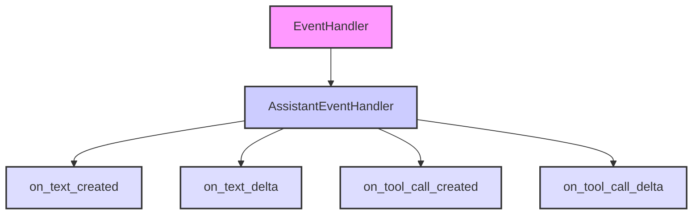

## Анализ кода `hypotez/src/ai/openai/model/event_handler.py`

### 1. <алгоритм>

Этот код определяет класс `EventHandler`, который наследуется от `AssistantEventHandler` из библиотеки `openai`. `EventHandler` переопределяет несколько методов, чтобы обрабатывать различные события, возникающие при потоковой передаче ответов от ассистента OpenAI.

1.  **`on_text_created(self, text: Text) -> None`**:
    *   Вызывается при создании нового текстового блока.
    *   Печатает "`\nassistant > `" в консоль, чтобы указать начало ответа ассистента.

    ```python
    def on_text_created(self, text: Text) -> None:
        print(f"\nassistant > ", end="", flush=True)
    ```

    *Пример*: Когда ассистент начинает генерировать текстовый ответ, этот метод вызывается первым, чтобы обозначить начало ответа.

2.  **`on_text_delta(self, delta: TextDelta, snapshot: Text)`**:
    *   Вызывается при получении инкрементных изменений (дельт) текстового блока.
    *   Печатает значение дельты (`delta.value`) в консоль.

    ```python
    def on_text_delta(self, delta: TextDelta, snapshot: Text):
        print(delta.value, end="", flush=True)
    ```

    *Пример*: Если ассистент генерирует текст "Hello", этот метод может быть вызван несколько раз с дельтами "H", "e", "l", "l", "o".

3.  **`on_tool_call_created(self, tool_call: ToolCall)`**:
    *   Вызывается при создании нового вызова инструмента (например, вызова code interpreter).
    *   Печатает тип инструмента в консоль.

    ```python
    def on_tool_call_created(self, tool_call: ToolCall):
        print(f"\nassistant > {tool_call.type}\n", flush=True)
    ```

    *Пример*: Если ассистент решает использовать code interpreter, этот метод вызывается с `tool_call.type == "code_interpreter"`.

4.  **`on_tool_call_delta(self, delta: ToolCallDelta, snapshot: ToolCall)`**:
    *   Вызывается при получении инкрементных изменений вызова инструмента.
    *   Обрабатывает дельты для `code_interpreter`.
    *   Печатает ввод (`delta.code_interpreter.input`) и вывод (`output.logs`) code interpreter в консоль.

    ```python
    def on_tool_call_delta(self, delta: ToolCallDelta, snapshot: ToolCall):
        if delta.type == "code_interpreter" and delta.code_interpreter:
            if delta.code_interpreter.input:
                print(delta.code_interpreter.input, end="", flush=True)
            if delta.code_interpreter.outputs:
                print(f"\n\noutput >", flush=True)
                for output in delta.code_interpreter.outputs:
                    if output.type == "logs":
                        print(f"\n{output.logs}", flush=True)
    ```

    *Пример*: Если code interpreter получает ввод "print('Hello')", `delta.code_interpreter.input` будет содержать эту строку. Если code interpreter возвращает вывод "Hello", `output.logs` будет содержать эту строку.

**Блок-схема:**

```mermaid
graph LR
    A[Начало] --> B{Событие от ассистента};
    B -- text_created --> C[on_text_created: Печать "assistant >"];
    B -- text_delta --> D[on_text_delta: Печать delta.value];
    B -- tool_call_created --> E[on_tool_call_created: Печать tool_call.type];
    B -- tool_call_delta --> F{delta.type == "code_interpreter"};
    F -- Да --> G{delta.code_interpreter};
    G -- input --> H[Печать delta.code_interpreter.input];
    G -- outputs --> I[Печать output.logs для каждого output];
    F -- Нет --> J[Конец обработки];
    C --> J;
    D --> J;
    E --> J;
    H --> J;
    I --> J;
```

### 2. <mermaid>



**Импорты и зависимости:**

*   `from typing_extensions import override`: Импортирует декоратор `override` для указания, что метод переопределяет метод базового класса. Это помогает обнаруживать ошибки, когда метод не переопределяет ничего.
*   `from openai import AssistantEventHandler, OpenAI`: Импортирует `AssistantEventHandler` (базовый класс для обработчиков событий ассистента) и `OpenAI` (клиент для взаимодействия с OpenAI API) из библиотеки `openai`.
*   `from openai.types.beta.threads import Text, TextDelta`: Импортирует типы `Text` и `TextDelta`, представляющие текстовые блоки и их изменения в потоке ответов.
*   `from openai.types.beta.threads.runs import ToolCall, ToolCallDelta`: Импортирует типы `ToolCall` и `ToolCallDelta`, представляющие вызовы инструментов и их изменения.

### 3. <объяснение>

**Импорты:**

*   `typing_extensions.override`: Используется для явного указания, что метод переопределяет метод из базового класса. Это улучшает читаемость и помогает предотвратить ошибки, когда метод случайно не переопределяет ничего.
*   `openai.AssistantEventHandler`: Базовый класс, который предоставляет интерфейс для обработки событий, генерируемых ассистентом OpenAI.  Класс `EventHandler` наследуется от него и переопределяет его методы.
*   `openai.OpenAI`: Клиент OpenAI для взаимодействия с API. В данном коде явно не используется, но, вероятно, используется в других частях проекта для создания и запуска потоков (threads) и запусков (runs).
*   `openai.types.beta.threads.Text, TextDelta`:  `Text` представляет собой полный текстовый блок, а `TextDelta` представляет собой изменение (добавление) в этот блок.  Это позволяет получать текст ответа ассистента по частям, что особенно полезно при потоковой передаче.
*   `openai.types.beta.threads.runs.ToolCall, ToolCallDelta`:  `ToolCall` представляет собой вызов инструмента, например, code interpreter.  `ToolCallDelta` представляет собой изменение в этом вызове инструмента.  Они используются для обработки взаимодействия ассистента с инструментами.

**Класс `EventHandler`:**

*   **Роль**: Обработка событий, генерируемых ассистентом OpenAI во время выполнения `run`.
*   **Атрибуты**: Отсутствуют.
*   **Методы**:
    *   `on_text_created(self, text: Text) -> None`: Вызывается при создании нового текстового блока.  В данном случае, просто печатает "`\nassistant > `" в консоль.
    *   `on_text_delta(self, delta: TextDelta, snapshot: Text)`: Вызывается при получении изменений текстового блока.  Печатает значение дельты в консоль.
    *   `on_tool_call_created(self, tool_call: ToolCall)`: Вызывается при создании нового вызова инструмента.  Печатает тип инструмента в консоль.
    *   `on_tool_call_delta(self, delta: ToolCallDelta, snapshot: ToolCall)`: Вызывается при получении изменений вызова инструмента.  Обрабатывает изменения для `code_interpreter`, печатая ввод и вывод в консоль.
*   **Взаимодействие**:  `EventHandler` используется вместе с клиентом `OpenAI` для создания и запуска `run`.  Когда происходят события во время выполнения `run`, методы `EventHandler` вызываются для обработки этих событий.

**Функции:**

*   Методы класса `EventHandler` являются функциями обратного вызова (callbacks), которые вызываются библиотекой `openai` при возникновении определенных событий.

**Переменные:**

*   `text: Text`:  Переменная, представляющая полный текстовый блок.
*   `delta: TextDelta`: Переменная, представляющая изменение в текстовом блоке.
*   `tool_call: ToolCall`: Переменная, представляющая вызов инструмента.
*   `snapshot: Text, ToolCall`: Переменная, представляющая текущее состояние `Text` или `ToolCall`.
*   `output`: Переменная, представляющая вывод code interpreter.

**Потенциальные ошибки и области для улучшения:**

*   Обработка ошибок: Код не содержит обработки ошибок.  Например, если при печати в консоль возникает исключение, оно не будет обработано.
*   Логирование:  Вместо `print` следует использовать модуль `logger` для логирования событий и ошибок.
*   Конфигурация:  Вывод в консоль может быть нежелательным в production-среде.  Следует предусмотреть возможность настройки вывода, например, через переменные окружения или конфигурационный файл.
*   Обработка других типов инструментов:  Код обрабатывает только `code_interpreter`.  Следует предусмотреть возможность обработки других типов инструментов.

**Взаимосвязь с другими частями проекта:**

Этот код, вероятно, используется в сочетании с другими частями проекта `hypotez`, которые отвечают за:

1.  Создание и настройку ассистента OpenAI.
2.  Создание и управление потоками (threads).
3.  Запуск потоков (runs) с использованием `EventHandler` для обработки событий.

Пример использования:

```python
from openai import OpenAI

client = OpenAI()

thread = client.beta.threads.create()
message = client.beta.threads.messages.create(
    thread_id=thread.id,
    role="user",
    content="Напиши 'Hello World!' на питоне.",
)
run = client.beta.threads.runs.create(
  thread_id=thread.id,
  assistant_id="asst_...",
  stream=True,
  event_handler=EventHandler(),
)