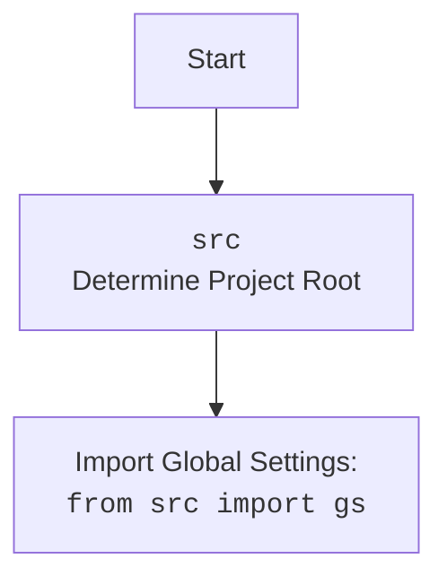

# Анализ кода `hypotez`

## 1. <алгоритм>

### Блок-схема процесса перевода текста с использованием OpenAI API

1.  **Начало**: Функция `translate(text, source_language, target_language)` вызывается с текстом, исходным языком и целевым языком.
    *   Пример: `translate("Привет, как дела?", "Russian", "English")`

2.  **Формирование запроса**: Создается строка запроса `prompt` для OpenAI API, включающая исходный текст и указание языков перевода.

    ```python
    prompt = (
        f"Translate the following text from {source_language} to {target_language}:\n\n"
        f"{text}\n\n"
        f"Translation:"
    )
    ```

    *   Пример: Если `text` = "Привет, как дела?", `source_language` = "Russian", `target_language` = "English", то `prompt` будет:

    ```text
    Translate the following text from Russian to English:

    Привет, как дела?

    Translation:
    ```

3.  **Отправка запроса к OpenAI API**: Используется `openai.Completion.create` для отправки запроса на перевод. Параметры включают модель (`engine`), запрос (`prompt`), максимальное количество токенов (`max_tokens`), количество возвращаемых вариантов (`n`), условие остановки (`stop`) и температуру (`temperature`).

    ```python
    response = openai.Completion.create(
        engine="text-davinci-003",  # Укажите нужную модель
        prompt=prompt,
        max_tokens=1000,
        n=1,
        stop=None,
        temperature=0.3
    )
    ```

4.  **Обработка ответа**: Извлекается переведенный текст из ответа API.

    ```python
    translation = response.choices[0].text.strip()
    return translation
    ```

    *   Пример: Если `response.choices[0].text` содержит "Hello, how are you?", то `translation` будет "Hello, how are you?".

5.  **Обработка ошибок**: Если во время запроса или обработки ответа возникает исключение, оно логируется с использованием `logger.error`.

    ```python
    except Exception as ex:
        # Логируем ошибку
        logger.error("Error during translation", ex)
        return
    ```

6.  **Завершение**: Функция возвращает переведенный текст или `None` в случае ошибки.

### Блок-схема

```mermaid
graph TD
    A[Начало: translate(text, source_language, target_language)] --> B{Формирование запроса prompt};
    B --> C{Отправка запроса к OpenAI API};
    C --> D{Обработка ответа};
    D --> E{Извлечение переведенного текста};
    E --> F{Возврат переведенного текста};
    C -- Ошибка --> G{Логирование ошибки};
    G --> H[Возврат None];
    F --> I[Конец];
    H --> I;
```

## 2. <mermaid>

```mermaid
graph TD
    A[translate(text, source_language, target_language)] --> B{Формирование запроса prompt};
    B --> C{openai.Completion.create(engine, prompt, max_tokens, n, stop, temperature)};
    C --> D{response.choices[0].text.strip()};
    D --> E[return translation];
    C -- Exception --> F{logger.error("Error during translation", ex)};
    F --> G[return None];
```

### Объяснение зависимостей `mermaid`:

-   `translate(text, source_language, target_language)`: Главная функция, принимающая текст и языки для перевода.
-   `Формирование запроса prompt`: Этап, на котором формируется запрос к OpenAI API.
-   `openai.Completion.create(engine, prompt, max_tokens, n, stop, temperature)`: Функция из библиотеки `openai`, отправляющая запрос к API.
-   `response.choices[0].text.strip()`: Обработка ответа от OpenAI API для извлечения переведенного текста.
-   `logger.error("Error during translation", ex)`: Логирование ошибки в случае возникновения исключения.

### Дополнительно: `src`



## 3. <объяснение>

### Импорты:

*   `openai`: Используется для взаимодействия с OpenAI API. Этот модуль позволяет отправлять запросы на перевод текста и получать ответы.
*   `src`: Импортируется для доступа к глобальным настройкам проекта через `gs`.
*   `src.logger.logger`: Используется для логирования ошибок и отладочной информации.

### Переменные:

*   `text` (str): Текст, который необходимо перевести.
*   `source_language` (str): Язык исходного текста.
*   `target_language` (str): Язык, на который нужно перевести текст.
*   `prompt` (str): Строка запроса, формируемая для отправки в OpenAI API.
*   `response`: Объект ответа, возвращаемый OpenAI API после запроса.
*   `translation` (str): Переведенный текст, извлеченный из ответа API.

### Функция `translate`:

*   **Аргументы**:
    *   `text` (str): Текст для перевода.
    *   `source_language` (str): Язык исходного текста.
    *   `target_language` (str): Язык для перевода.
*   **Возвращаемое значение**:
    *   `str`: Переведенный текст.
    *   `None`: В случае ошибки.
*   **Назначение**:
    *   Функция `translate` принимает текст, язык оригинала и язык перевода, формирует запрос к OpenAI API и возвращает переведенный текст. В случае ошибки функция логирует ошибку и возвращает `None`.
*   **Пример**:

    ```python
    source_text = "Привет, как дела?"
    source_language = "Russian"
    target_language = "English"
    translation = translate(source_text, source_language, target_language)
    print(f"Translated text: {translation}")
    ```

### Потенциальные ошибки и области для улучшения:

*   **Обработка ошибок**: В блоке `except` логируется только общая ошибка. Можно добавить более детальную обработку различных типов исключений, чтобы точнее определять причины сбоев.
*   **Использование модели**: Жестко задана модель `"text-davinci-003"`. Можно сделать выбор модели конфигурируемым параметром.
*   **Параметры API**: Параметры `max_tokens`, `n`, `stop`, `temperature` заданы фиксированно. Можно сделать их конфигуриемыми.
*   **Логирование**: Добавить больше информации в логи, например, время запроса, использованные параметры и т.д.

### Связь с другими частями проекта:

*   Функция использует `src.gs` для получения учетных данных OpenAI API. Это позволяет централизованно управлять учетными данными и настройками проекта.
*   Функция использует `src.logger.logger` для логирования ошибок, что обеспечивает единый подход к логированию во всем проекте.