## <алгоритм>

1.  **Начало:** Документ начинается с инструкций по документированию кода в стиле Markdown.
2.  **Модуль:**
    *   Описание модуля должно быть в начале, объясняя его предназначение.
    *   Предоставляются примеры использования модуля, если это возможно, в блоке кода `python`.
    *   Указываются платформы и синопсис модуля.
    *   Используются заголовки для описания атрибутов и методов модуля.
    *   **Пример:** Описание модуля `Programming Assistant`, включающее пример использования класса `CodeAssistant`.
3.  **Классы:**
    *   Каждый класс описывается согласно его назначению, включая описание класса, его атрибуты и методы.
    *   В секции класса перечисляются все методы, их назначение и примеры использования.
    *   Для каждого метода указываются параметры, возвращаемые значения и примеры.
    *   **Пример:** Описание класса `CodeAssistant`, включая атрибуты (`role`, `lang`, `model`) и метод `process_files`.
4.  **Функции и Методы:**
    *   Каждая функция или метод документируется с указанием параметров и возвращаемых значений.
    *   Для каждой функции даётся описание её назначения и примеры использования в блоке кода `python`.
    *   **Пример:** Описание метода `process_files`, включая параметры (`files`, `options`) и возвращаемое значение.
5.  **Комментарии к коду:**
    *   Все комментарии в коде должны быть в формате Markdown и объяснять, что делает конкретная часть кода.
    *   Комментарии должны быть в блоках, а не построчно, для описания логики и решений.
    *   **Пример:** Комментарий, объясняющий обработку исключения `FileNotFoundError`.
6.  **Исключения:**
    *   Документируются исключения для классов, методов и функций.
    *   Указываются, какие исключения могут быть вызваны и при каких обстоятельствах.
    *   **Пример:** Описание исключения `FileNotFoundError`, включая параметры и пример использования.
7.  **Конец:** Инструкции завершаются требованием, что все комментарии должны быть ясными, информативными и соответствовать стандарту Markdown, с указанием формата кодировки ответа.

```mermaid
flowchart TD
    Start[Начало] --> ModuleSection[Модуль]
    ModuleSection --> ModuleDescription[Описание модуля]
    ModuleDescription --> ModuleExample[Примеры использования модуля]
    ModuleExample --> ModulePlatforms[Платформы и синопсис модуля]
    ModulePlatforms --> ModuleAttributesMethods[Атрибуты и методы модуля]
    ModuleAttributesMethods --> ClassSection[Классы]
    ClassSection --> ClassDescription[Описание класса]
    ClassDescription --> ClassAttributes[Атрибуты класса]
    ClassAttributes --> ClassMethods[Методы класса]
    ClassMethods --> FunctionMethodSection[Функции и методы]
    FunctionMethodSection --> FunctionMethodDescription[Описание функции/метода]
    FunctionMethodDescription --> FunctionMethodParameters[Параметры функции/метода]
    FunctionMethodParameters --> FunctionMethodReturnValue[Возвращаемое значение функции/метода]
    FunctionMethodReturnValue --> CodeCommentsSection[Комментарии к коду]
    CodeCommentsSection --> CodeCommentsExplanation[Объяснение комментариев]
    CodeCommentsExplanation --> ExceptionsSection[Исключения]
    ExceptionsSection --> ExceptionDescription[Описание исключения]
    ExceptionDescription --> ExceptionParameters[Параметры исключения]
    ExceptionParameters --> End[Конец]
```

## <mermaid>

**Объяснение диаграммы:**

*   `Start`: Начало процесса документирования кода.
*   `ModuleSection`: Секция, посвященная документированию модулей.
    *   `ModuleDescription`: Описание назначения модуля.
    *   `ModuleExample`: Примеры использования модуля.
    *   `ModulePlatforms`: Платформы и синопсис модуля.
    *   `ModuleAttributesMethods`: Описание атрибутов и методов модуля.
*   `ClassSection`: Секция, посвященная документированию классов.
    *   `ClassDescription`: Описание класса.
    *   `ClassAttributes`: Атрибуты класса.
    *   `ClassMethods`: Методы класса.
*   `FunctionMethodSection`: Секция, посвященная документированию функций и методов.
    *   `FunctionMethodDescription`: Описание функции/метода.
    *   `FunctionMethodParameters`: Параметры функции/метода.
    *   `FunctionMethodReturnValue`: Возвращаемое значение функции/метода.
*   `CodeCommentsSection`: Секция, посвященная документированию комментариев к коду.
    *   `CodeCommentsExplanation`: Объяснение комментариев.
*   `ExceptionsSection`: Секция, посвященная документированию исключений.
    *   `ExceptionDescription`: Описание исключения.
    *   `ExceptionParameters`: Параметры исключения.
*  `End`: Конец процесса документирования кода.

**Зависимости импорта:**
В данном фрагменте кода нет импортов. Это HTML-инструкция, а не код Python.

## <объяснение>

**Общее описание:**

Этот HTML-документ представляет собой подробную инструкцию для документирования кода в стиле Markdown. Он определяет структуру и формат, которые разработчики должны соблюдать при написании комментариев к коду, описаний модулей, классов, методов и исключений. Целью является создание четкой, понятной и информативной документации, которая соответствует стандарту Markdown.

**Разделы инструкции:**

1.  **Модули:**
    *   **Назначение:** Описывает общую цель модуля.
    *   **Примеры:** Показывает, как можно использовать модуль, и предоставляет практические примеры.
    *   **Платформы и синопсис:** Уточняет, где и как модуль применяется.
    *   **Атрибуты и методы:** Подробно описывает составные части модуля.

2.  **Классы:**
    *   **Описание:** Даёт общее представление о предназначении класса.
    *   **Атрибуты:** Описывает переменные, которые принадлежат классу.
    *   **Методы:** Перечисляет и описывает методы класса, включая их назначение и использование.

3.  **Функции и Методы:**
    *   **Описание:** Описывает назначение функции или метода.
    *   **Параметры:** Указывает, какие данные функция или метод принимает.
    *   **Возвращаемое значение:** Описывает результат работы функции или метода.

4.  **Комментарии к коду:**
    *   **Формат:** Все комментарии должны быть написаны в формате Markdown.
    *   **Цель:** Комментарии должны объяснять логику кода, решения и временные решения.
    *   **Пример:** Показывает, как правильно комментировать код, например, при обработке исключений.

5.  **Исключения:**
    *   **Описание:** Описывает, какие исключения могут быть вызваны.
    *   **Параметры:** Указывает, какие данные исключение может содержать.
    *   **Примеры:** Показывает, как обрабатывать и документировать исключения.

**Формат документации:**

*   Документация должна быть написана в формате Markdown (`.md`).
*   Используются заголовки для структурирования информации.
*   Примеры кода приводятся в fenced code blocks с указанием языка (`python`).
*   Все комментарии должны быть ясными, информативными и соответствовать Markdown.

**Взаимосвязи с другими частями проекта:**
Эта инструкция является частью процесса создания документации для проекта, а не кодом, поэтому взаимосвязь заключается в том, что она определяет стандарты документирования для всех частей кодовой базы.

**Потенциальные ошибки и области для улучшения:**

*   **Недостаточная конкретика:** Инструкция может быть дополнена конкретными примерами для каждого случая, чтобы избежать разночтений.
*   **Отсутствие контроля:**  Нет механизма, гарантирующего соблюдение всех инструкций. Можно было бы добавить чек-лист или автоматизированные тесты.
*   **Масштабируемость:** В документе не указано, как документировать более сложные сценарии или большие проекты, что может потребовать дополнительных уточнений.

**Заключение:**
Инструкция хорошо структурирована и предоставляет четкие указания для документирования кода, что позволяет создавать понятную и информативную документацию. Однако, можно улучшить ее, сделав более конкретной и добавив механизмы для контроля ее соблюдения.