## АНАЛИЗ КОДА: `tinytroupe/control.py`

### 1. <алгоритм>

**Общий рабочий процесс:**

1. **Инициализация (`Simulation.__init__`)**: Создается объект `Simulation`, который управляет состоянием симуляции. Включает в себя агентов, окружения, фабрики и механизм кеширования.
2. **Начало симуляции (`Simulation.begin`)**: Симуляция запускается, очищаются старые данные агентов, окружений и фабрик. Загружается кеш, если он есть.
3. **Добавление объектов (`Simulation.add_agent`, `Simulation.add_environment`, `Simulation.add_factory`)**: В симуляцию добавляются агенты, окружения и фабрики.
4. **Транзакции (`Transaction.execute`)**: Функции, помеченные декоратором `@transactional`, оборачиваются в транзакции. Транзакции могут быть закешированы для ускорения повторных запусков.
5. **Кеширование**:  Состояния симуляции и результаты транзакций кэшируются для повторного использования, если это возможно.
6. **Сохранение и загрузка состояния (`Simulation._save_cache_file`, `Simulation._load_cache_file`)**: Состояние симуляции сохраняется в файл и загружается из файла.
7. **Завершение симуляции (`Simulation.end`)**: Симуляция завершается, и происходит сохранение состояния.

**Блок-схема пошагово:**

1. **Инициализация симуляции:**
    *   **Пример**: `sim = Simulation(id="test_sim")`
    *   Создается объект `Simulation` с идентификатором "test_sim".
    *   Инициализируются списки для агентов, окружений, фабрик и кеша.

2.  **Начало симуляции:**
    *   **Пример**: `sim.begin(cache_path="./test_cache.json", auto_checkpoint=True)`
    *   Устанавливается статус симуляции на "started".
    *   Очищаются старые данные агентов, окружений и фабрик.
    *   Загружается кеш из файла "./test_cache.json".
    *   Включается автоматическая запись в кеш после каждой транзакции.

3.  **Добавление агента:**
    *   **Пример**: `sim.add_agent(agent1)`
    *   Агент `agent1` добавляется в список агентов симуляции.
    *   Имя агента добавляется в словарь `name_to_agent` для быстрого доступа.

4.  **Начало транзакции (`Transaction.execute`):**
    *   **Пример**: `@transactional` перед функцией `agent.move()`
    *   Проверяется, начата ли симуляция. Если нет, то транзакция не кешируется.
    *   Вычисляется `event_hash` для текущего вызова функции.
    *   Проверяется, есть ли в кеше состояние для текущего `event_hash`.
    *   Если есть, состояние восстанавливается из кеша, и возвращается кешированный результат.
    *   Если нет, выполняется функция, результат и состояние кэшируются.

5. **Кеширование результата транзакции:**
    *   **Пример**: После выполнения `agent.move()`, состояние и результат сохраняются в `cached_trace` и `execution_trace`.
    *   Состояние симуляции кодируется в словарь и сохраняется в `cached_trace` и `execution_trace` вместе с `event_hash` и `event_output`.

6.  **Сохранение кеша (`Simulation.checkpoint`)**:
    *   **Пример**: `sim.checkpoint()`
    *   Сохраняет `cached_trace` в файл.

7.  **Завершение симуляции:**
    *   **Пример**: `sim.end()`
    *   Устанавливается статус симуляции на "stopped".
    *   Сохраняется кеш.

**Поток данных:**

*   **`Simulation`**: Управляет состоянием симуляции, агентами, окружениями, фабриками и кешем.
*   **`Transaction`**: Оборачивает вызовы функций, обеспечивает кэширование и управление состоянием.
*   **`Agent`, `Environment`, `Factory`**: Объекты, которые участвуют в симуляции и чье состояние кэшируется.
*   **Кеш**: `cached_trace` хранит состояния симуляции и результаты транзакций.
*   **Файлы кеша**: Используются для сохранения и загрузки состояний между запусками.

```mermaid
flowchart TD
    subgraph Simulation
        A[Simulation<br>id: str, cached_trace: list, ... ]
        B[begin<br>cache_path: str, auto_checkpoint: bool]
        C[add_agent<br>agent: object]
        D[add_environment<br>environment: object]
        E[add_factory<br>factory: object]
        F[checkpoint]
        G[end]
        H[_execution_trace_position]
        I[_function_call_hash<br>function_name: str, *args, **kwargs]
        J[_skip_execution_with_cache]
        K[_is_transaction_event_cached<br>event_hash: int]
        L[_drop_cached_trace_suffix]
        M[_add_to_execution_trace<br>state: dict, event_hash: int, event_output: Any]
        N[_add_to_cache_trace<br>state: dict, event_hash: int, event_output: Any]
        O[_load_cache_file<br>cache_path: str]
        P[_save_cache_file<br>cache_path: str]
        Q[begin_transaction]
        R[end_transaction]
        S[is_under_transaction]
        T[_clear_communications_buffers]
        U[_encode_simulation_state]
        V[_decode_simulation_state<br>state: dict]
    end
     
    subgraph Transaction
        X[Transaction<br>obj_under_transaction: object, simulation: Simulation, function: function, *args, **kwargs]
        Y[execute]
        Z[_encode_function_output<br>output: Any]
        AA[_decode_function_output<br>encoded_output: dict]
    end

    subgraph ControlFunctions
        BB[reset]
        CC[_simulation<br>id: str]
        DD[begin<br>cache_path: str, id: str, auto_checkpoint: bool]
        EE[end<br>id: str]
        FF[checkpoint<br>id: str]
        GG[current_simulation]
    end

    A --> B
    A --> C
    A --> D
    A --> E
    A --> F
    A --> G
    A --> H
    A --> I
    A --> J
    A --> K
    A --> L
    A --> M
    A --> N
    A --> O
    A --> P
    A --> Q
    A --> R
    A --> S
    A --> T
    A --> U
    A --> V

    X --> Y
    X --> Z
    X --> AA

    BB --> CC
    CC --> DD
    CC --> EE
    CC --> FF
    CC --> GG

    Y --> K
    Y --> J
    Y --> V
    Y --> Z
    Y --> N
    Y --> M
    Y --> Q
    Y --> R
    Y --> U

    style A fill:#f9f,stroke:#333,stroke-width:2px
    style X fill:#ccf,stroke:#333,stroke-width:2px
    style BB fill:#cfc,stroke:#333,stroke-width:2px
```

### 2. <mermaid>

**Объяснение `mermaid`:**

1.  **`Simulation`**: Представляет класс `Simulation`.
    *   Поля: `id`, `cached_trace` и другие.
    *   Методы: `begin`, `add_agent`, `add_environment`, `checkpoint`, `end`, и методы для управления кэшем и транзакциями.
2.  **`Transaction`**: Представляет класс `Transaction`.
    *   Поля: `obj_under_transaction`, `simulation`, `function`, `args`, `kwargs`.
    *   Методы: `execute` (основной метод для выполнения транзакции), `_encode_function_output`, `_decode_function_output` для обработки результатов.
3.  **`ControlFunctions`**: Включает вспомогательные функции для управления симуляцией.
    *   Функции: `reset`, `_simulation`, `begin`, `end`, `checkpoint`, `current_simulation`.
4.  **Связи**: Стрелки показывают вызовы методов и использование классов.
    *   `Simulation` методы управляют кэшем и состоянием.
    *   `Transaction` использует `Simulation` для кэширования и управления транзакциями.
    *   `ControlFunctions` используют `Simulation` для управления общим процессом симуляции.
5.  **Стили**: Цвета выделяют блоки для лучшей визуализации.

**Импортируемые зависимости (дополнительно):**

*   `json`: Используется для сериализации/десериализации данных при сохранении и загрузке кэша.
*   `os`: Используется для операций с файловой системой, таких как замена файла.
*   `tempfile`: Используется для создания временных файлов при сохранении кэша.
*   `tinytroupe`: Основной пакет, к которому относится Модуль.
*   `tinytroupe.utils`: Содержит вспомогательные утилиты, в частности, функцию `custom_hash`.
*   `logging`: Используется для логирования событий.

### 3. <объяснение>

**Импорты:**

*   `json`: Используется для сериализации и десериализации данных в формате JSON. Это важно для сохранения и загрузки состояния симуляции в файл.
*   `os`: Предоставляет функции для взаимодействия с операционной системой, например, для работы с файлами.
*   `tempfile`: Позволяет создавать временные файлы, что используется для безопасного сохранения состояния симуляции.
*   `tinytroupe`: Основной пакет проекта, к которому относится Модуль.
*   `tinytroupe.utils`: Включает вспомогательные функции, такие как `custom_hash` для вычисления хешей состояний.
*   `logging`: Используется для записи сообщений о событиях в процессе выполнения программы.

**Классы:**

*   `Simulation`:
    *   **Роль**: Управляет состоянием симуляции, включая агентов, окружения, фабрики, а также кэширование.
    *   **Атрибуты**:
        *   `id`: Идентификатор симуляции.
        *   `agents`, `environments`, `factories`: Списки объектов, участвующих в симуляции.
        *   `name_to_agent`, `name_to_environment`, `name_to_factory`: Словари для быстрого доступа к объектам по имени.
        *   `status`: Статус симуляции (`started` или `stopped`).
        *   `cache_path`: Путь к файлу кэша.
        *   `auto_checkpoint`: Флаг автоматической записи в кеш после каждой транзакции.
        *   `has_unsaved_cache_changes`: Флаг наличия несохраненных изменений в кэше.
        *   `_under_transaction`: Флаг наличия текущей транзакции.
        *   `cached_trace`: Список закешированных состояний симуляции.
        *   `execution_trace`: Список состояний текущего выполнения.
    *   **Методы**:
        *   `__init__`: Инициализирует объект симуляции.
        *   `begin`: Начинает симуляцию, загружает кэш.
        *   `end`: Завершает симуляцию, сохраняет кэш.
        *   `checkpoint`: Сохраняет кэш в файл.
        *   `add_agent`, `add_environment`, `add_factory`: Добавляет объекты в симуляцию.
        *   `_execution_trace_position`: Возвращает текущую позицию в `execution_trace`.
        *   `_function_call_hash`: Вычисляет хеш вызова функции.
        *   `_skip_execution_with_cache`: Пропускает выполнение, если состояние есть в кэше.
        *   `_is_transaction_event_cached`: Проверяет, есть ли в кэше состояние для текущего вызова функции.
        *   `_drop_cached_trace_suffix`: Отбрасывает суффикс кэша, начиная с текущей позиции.
        *   `_add_to_execution_trace`, `_add_to_cache_trace`: Добавляет состояние в `execution_trace` и `cached_trace`.
        *   `_load_cache_file`, `_save_cache_file`: Загружает и сохраняет кэш в файл.
        *   `begin_transaction`, `end_transaction`, `is_under_transaction`: Методы управления транзакциями.
        *   `_clear_communications_buffers`: Очищает буферы обмена сообщениями у агентов и окружений.
        *   `_encode_simulation_state`, `_decode_simulation_state`: Кодирует и декодирует состояние симуляции.
*   `Transaction`:
    *   **Роль**: Управляет транзакциями, кэширует их результаты.
    *   **Атрибуты**:
        *   `obj_under_transaction`: Объект, над которым выполняется транзакция.
        *   `simulation`: Объект `Simulation`.
        *   `function_name`, `function`: Функция, выполняемая в транзакции.
        *   `args`, `kwargs`: Аргументы функции.
    *   **Методы**:
        *   `__init__`: Инициализирует объект транзакции.
        *   `execute`: Выполняет транзакцию, управляет кэшированием.
        *   `_encode_function_output`, `_decode_function_output`: Кодирует и декодирует результаты функции для кэширования.

**Функции:**

*   `transactional(func)`: Декоратор, оборачивающий функцию в транзакцию.
*   `reset()`: Сбрасывает состояние симуляций.
*   `_simulation(id="default")`: Возвращает объект симуляции по идентификатору.
*   `begin(cache_path=None, id="default", auto_checkpoint=False)`: Начинает симуляцию.
*   `end(id="default")`: Завершает симуляцию.
*   `checkpoint(id="default")`: Сохраняет текущее состояние симуляции.
*   `current_simulation()`: Возвращает текущую активную симуляцию.

**Переменные:**

*   `_current_simulations`: Словарь текущих симуляций.
*   `_current_simulation_id`: Идентификатор текущей активной симуляции.

**Потенциальные ошибки и области для улучшения:**

1.  **Исключения**:
    *   Обработка исключений в `_load_cache_file` и `_save_cache_file` может быть улучшена (например, логирование ошибки вместо простого `print`).
    *   В `_decode_simulation_state` используется `try except`, который может скрывать более глубокие проблемы. Следует использовать более точные `except`.
2.  **Кэширование**:
    *   Кэширование опирается на хеширование вызовов функций, что может быть недостаточно для сложных случаев. Следует усовершенствовать логику хеширования.
3.  **Масштабируемость**:
    *   Текущая реализация не поддерживает параллельное выполнение нескольких симуляций. Необходимо доработать управление симуляциями для параллельной работы.
4.  **Рефакторинг:**
    *   Функции `_encode_function_output` и `_decode_function_output` могут быть вынесены в отдельный класс для лучшей организации.
    *   Управление кэшированием можно вынести в отдельный класс.

**Взаимосвязи с другими частями проекта:**

*   **`tinytroupe.agent`**: Используется для управления агентами.
*   **`tinytroupe.environment`**: Используется для управления окружениями.
*   **`tinytroupe.factory`**: Используется для управления фабриками объектов.
*   **`tinytroupe.utils`**: Используется для общих утилит, таких как хеширование.

**Общая картина:**

Модуль `control.py` реализует основной механизм управления симуляцией, включая добавление агентов, окружений, фабрик, а также кэширование и управление транзакциями. Он предоставляет функционал для создания, запуска, завершения и сохранения состояния симуляции, что позволяет контролировать выполнение симуляций и оптимизировать их работу за счет повторного использования закешированных состояний.