## <алгоритм>

### 1. `ResultsExtractor`: Извлечение результатов из агентов и миров

   *   **Инициализация**:
        *   При создании `ResultsExtractor` задается путь к шаблону промпта `interaction_results_extractor.mustache`.
        *   Инициализируются кэши `agent_extraction` и `world_extraction` для хранения результатов извлечения.
   *   **`extract_results_from_agent(tinyperson, extraction_objective, situation, fields, fields_hints, verbose)`**:
        1.  Формирование сообщений:
            *   Создается список сообщений (`messages`).
            *   Формируются `rendering_configs`, включающие `fields` и `fields_hints`, если они заданы.
            *   Первое сообщение (`role = system`) создается из шаблона `interaction_results_extractor.mustache` с использованием `chevron.render` и `rendering_configs`.
            *   Получается история взаимодействий агента `interaction_history` с помощью `tinyperson.pretty_current_interactions()`.
            *   Формируется промпт `extraction_request_prompt`, содержащий цель извлечения, контекст и историю взаимодействий.
            *   Второе сообщение (`role = user`) добавляется в `messages` с `extraction_request_prompt`.
        2.  Отправка сообщения в OpenAI:
            *   `openai_utils.client().send_message()` отправляет запрос в OpenAI API, возвращая `next_message`.
            *   Результат логируется.
        3.  Обработка ответа:
            *   Извлекается JSON из `next_message` с помощью `utils.extract_json()`.
            *   Результат кэшируется в `self.agent_extraction[tinyperson.name]`.
        4.  Возврат результата:
            *   Возвращается извлеченный результат.
   *   **`extract_results_from_world(tinyworld, extraction_objective, situation, fields, fields_hints, verbose)`**:
        1.  Формирование сообщений:
            *   Аналогично `extract_results_from_agent`, но используется `tinyworld.pretty_current_interactions()` для получения истории взаимодействий мира.
            *   Формируется промпт для извлечения результатов из мира.
        2.  Отправка сообщения в OpenAI:
            *   Аналогично `extract_results_from_agent`.
        3.  Обработка ответа:
            *   Аналогично `extract_results_from_agent`, но результат кэшируется в `self.world_extraction[tinyworld.name]`.
        4.  Возврат результата:
            *   Возвращается извлеченный результат.
   *  **`save_as_json(filename, verbose)`**:
        1.  Сохранение в JSON:
            *   Сохраняет кэшированные результаты извлечения `agent_extraction` и `world_extraction` в JSON файл.

### 2. `ResultsReducer`: Свертка результатов

   *   **Инициализация**:
        *   Создаются пустые словари `results` и `rules`.
   *   **`add_reduction_rule(trigger, func)`**:
        *   Добавляет правило редукции в `rules` по триггеру.
   *   **`reduce_agent(agent)`**:
        1.  Итерация по сообщениям:
            *   Проходит по всем сообщениям в `agent.episodic_memory`.
            *   Пропускает системные сообщения (`role = system`).
        2.  Обработка сообщений `user`:
            *   Извлекается тип, содержимое, источник и время стимула.
            *   Если есть правило редукции для типа стимула, применяется функция из `self.rules` и результат добавляется в `reduction`.
        3.  Обработка сообщений `assistant`:
            *   Извлекается тип, содержимое, цель и время действия.
            *   Если есть правило редукции для типа действия, применяется функция из `self.rules` и результат добавляется в `reduction`.
        4.  Возврат результата:
            *   Возвращается список результатов редукции.
   *   **`reduce_agent_to_dataframe(agent, column_names)`**:
        *   Преобразует результаты редукции в `pandas.DataFrame`.

### 3. `ArtifactExporter`: Экспорт артефактов

   *   **Инициализация**:
        *   Принимает базовую папку вывода.
   *   **`export(artifact_name, artifact_data, content_type, content_format, target_format, verbose)`**:
        1.  Подготовка данных:
            *   Удаляет лишние отступы из `artifact_data`.
            *   Очищает имя артефакта от недопустимых символов.
        2.  Формирование пути к файлу:
            *   Формирует путь к файлу с помощью `_compose_filepath`.
        3.  Экспорт:
            *   Вызывает соответствующий метод экспорта в зависимости от `target_format` (`_export_as_json`, `_export_as_txt`, `_export_as_docx`).
   *   **`_export_as_txt(artifact_file_path, artifact_data, content_type, verbose)`**:
        *   Экспортирует данные в текстовый файл.
   *   **`_export_as_json(artifact_file_path, artifact_data, content_type, verbose)`**:
        *   Экспортирует данные в JSON файл.
   *  **`_export_as_docx(artifact_file_path, artifact_data, content_original_format, verbose)`**:
       * Экспортирует данные в файл DOCX, конвертируя из `markdown` в `html` и затем в `docx` с помощью `pypandoc`.
   *   **`_compose_filepath(artifact_data, artifact_name, content_type, target_format, verbose)`**:
        *   Формирует путь к файлу на основе имени, типа и формата артефакта, создавая промежуточные папки при необходимости.

### 4. `Normalizer`: Нормализация текстовых элементов

   *   **Инициализация**:
        *   Уникализирует входные элементы.
        *   Инициализирует `normalized_elements` (результат нормализации), `normalizing_map` (кэш).
        *   Отправляет запрос в OpenAI для нормализации, используя шаблоны `normalizer.system.mustache` и `normalizer.user.mustache`.
   *   **`normalize(element_or_elements)`**:
        1.  Подготовка:
            *   Преобразует вход в список, если это строка.
        2.  Кэширование:
            *   Проверяет кэш для элементов.
        3.  Отправка в OpenAI:
            *   Отправляет запрос в OpenAI для нормализации новых элементов, используя шаблоны `normalizer.applier.system.mustache` и `normalizer.applier.user.mustache`.
        4.  Обновление кэша:
            *   Добавляет новые элементы и их нормализованные формы в кэш.
        5.  Возврат:
           *  Возвращает нормализованные элементы, сохраняя порядок.

### 5. `default_extractor`: Объект класса `ResultsExtractor` по умолчанию
*   Создается экземпляр `ResultsExtractor`.

```mermaid
flowchart TD
    subgraph ResultsExtractor
        A[<code>__init__</code><br>Initialize extractor] --> B[Set Prompt Template Path]
        B --> C[Initialize Caches: <br><code>agent_extraction</code>, <code>world_extraction</code>]
        C --> D[<code>extract_results_from_agent</code><br>Extract results from TinyPerson]
        D --> E[Compose System Message<br>using mustache template]
        E --> F[Get Agent Interaction History]
        F --> G[Compose User Message: Extraction objective, situation, interaction history]
        G --> H[Send message to OpenAI API]
        H --> I{Check for result}
        I -- Yes --> J[Extract JSON from the result]
        J --> K[Cache result: <br><code>agent_extraction</code>]
        K --> L[Return result]
         I -- No --> M[Return None]
        
         C --> N[<code>extract_results_from_world</code><br>Extract results from TinyWorld]
         N --> O[Compose System Message<br>using mustache template]
        O --> P[Get World Interaction History]
        P --> Q[Compose User Message: Extraction objective, situation, interaction history]
        Q --> R[Send message to OpenAI API]
        R --> S{Check for result}
         S -- Yes --> T[Extract JSON from the result]
        T --> U[Cache result: <br><code>world_extraction</code>]
        U --> V[Return result]
        S -- No --> W[Return None]

        C --> X[<code>save_as_json</code><br>Save results to JSON]
        X --> Y[Save agent and world extractions to JSON]
    end

    subgraph ResultsReducer
        Z[<code>__init__</code><br>Initialize reducer] --> AA[Initialize <code>results</code> and <code>rules</code>]
        AA --> AB[<code>add_reduction_rule</code><br>Add reduction rule]
        AB --> AC[Add rule to <code>rules</code>]
        AA --> AD[<code>reduce_agent</code><br>Reduce agent data]
        AD --> AE[Iterate through agent messages]
        AE --> AF{Check message role}
        AF -- "system" --> AG[Skip]
        AF -- "user" --> AH[Extract stimulus info]
        AH --> AI{Check rule for stimulus type}
        AI -- Yes --> AJ[Apply reduction rule]
        AJ --> AK[Add reduction result to <code>reduction</code> list]
        AI -- No --> AL[Skip]
        AF -- "assistant" --> AM[Extract action info]
        AM --> AN{Check rule for action type}
        AN -- Yes --> AO[Apply reduction rule]
         AO --> AP[Add reduction result to <code>reduction</code> list]
        AN -- No --> AQ[Skip]
        
        AE --> AR[Return <code>reduction</code> list]
       AA --> AS[<code>reduce_agent_to_dataframe</code><br>Convert reduction to DataFrame]
       AS --> AT[Call <code>reduce_agent</code>]
       AT --> AU[Create Pandas DataFrame]

    end

    subgraph ArtifactExporter
        AV[<code>__init__</code><br>Initialize exporter] --> AW[Set base output folder]
        AW --> AX[<code>export</code><br>Export artifact]
         AX --> AY[Prepare artifact data]
         AY --> AZ[Clean artifact name]
         AZ --> BA[Compose file path]
        BA --> BB{Check target format}
        BB -- json --> BC[<code>_export_as_json</code><br>Export as JSON]
        BB -- txt/text/md/markdown --> BD[<code>_export_as_txt</code><br>Export as TXT]
        BB -- docx --> BE[<code>_export_as_docx</code><br>Export as DOCX]
         BC --> BF[Save artifact to JSON file]
         BD --> BG[Save artifact to TXT file]
         BE --> BH[Convert to HTML]
         BH --> BI[Convert to DOCX]
         AX --> BJ[Raise Error]
         
    end
    
    subgraph Normalizer
        BK[<code>__init__</code><br>Initialize normalizer] --> BL[Unique elements]
        BL --> BM[Set n and verbose]
        BM --> BN[Init normalized_elements, normaling_map]
        BN --> BO[Compose messages using templates]
        BO --> BP[Send message to OpenAI]
        BP --> BQ[Extract JSON from message]
        BQ --> BR[Store Result]
        
        BR --> BS[<code>normalize</code><br>Normalize Element or Elements]
        BS --> BT{Check if single element or list}
        BT -- single element --> BU[Put into a List]
        BT -- List of elements --> BV[Keep as List]
        BU --> BW[Check cache]
        BV --> BW
        BW --> BX[Prepare elements to normalize]
        BX --> BY{Any elements to normalize}
        BY -- No --> BZ[Return Normalized element]
        BY -- Yes --> CA[Prepare template for LLM]
        CA --> CB[Send message to OpenAI API]
        CB --> CC[Extract JSON from result]
        CC --> CD[Update cache with normalized elements]
        CD --> CE[Return normalized elements with the same order as in input]

    end
    
    
    subgraph Default Extractor
        CF[default_extractor] --> CG[Create instance of <code>ResultsExtractor</code>]
    end
    

    
    
   
    
    
    
    
  
    
```

## <mermaid>

## <объяснение>

### 1. Импорты

*   `os`: Предоставляет функции для взаимодействия с операционной системой, такие как работа с путями к файлам.
*   `json`: Используется для работы с JSON данными, включая сериализацию и десериализацию.
*   `chevron`: Используется для рендеринга шаблонов (например, для генерации промптов на основе шаблонов Mustache).
*   `logging`: Модуль для записи событий и ошибок.
*   `pandas`: Предоставляет структуры данных и инструменты для анализа данных (в данном случае, для создания DataFrame).
*   `pypandoc`: Используется для конвертации документов (например, из HTML в DOCX).
*   `markdown`: Используется для преобразования текста в формате markdown в HTML.
*  `typing`: Используется для аннотаций типов, повышая читаемость кода.
*   `tinytroupe.agent`: Содержит класс `TinyPerson`, представляющий агента.
*   `tinytroupe.environment`: Содержит класс `TinyWorld`, представляющий среду.
*   `tinytroupe.factory`: Содержит класс `TinyPersonFactory` для создания агентов.
*   `tinytroupe.utils`: Содержит вспомогательные функции, такие как `JsonSerializableRegistry` и `extract_json`.
*   `tinytroupe.openai_utils`: Содержит функции для взаимодействия с OpenAI API.
*   `tinytroupe.utils as utils`: Импортирует модуль `tinytroupe.utils` под псевдонимом `utils`.

### 2. Классы

#### `ResultsExtractor`

*   **Роль:** Извлекает данные из агентов (`TinyPerson`) и миров (`TinyWorld`).
*   **Атрибуты:**
    *   `_extraction_prompt_template_path`: Путь к файлу шаблона промпта.
    *   `agent_extraction`: Словарь для кэширования результатов извлечения из агентов.
    *   `world_extraction`: Словарь для кэширования результатов извлечения из миров.
*   **Методы:**
    *   `__init__()`: Инициализирует класс, устанавливая путь к шаблону и кэши.
    *   `extract_results_from_agent(tinyperson, extraction_objective, situation, fields, fields_hints, verbose)`: Извлекает результаты из агента, используя промпт и OpenAI API.
    *   `extract_results_from_world(tinyworld, extraction_objective, situation, fields, fields_hints, verbose)`: Извлекает результаты из мира, используя промпт и OpenAI API.
    *  `save_as_json(filename, verbose)`: Сохраняет кэшированные результаты извлечения в файл JSON.
*  **Взаимодействие**: 
    - Зависит от `tinytroupe.agent.TinyPerson` и `tinytroupe.environment.TinyWorld`.
    - Использует `chevron` для рендеринга шаблонов промптов.
    - Использует `openai_utils.client()` для взаимодействия с OpenAI API.
    - Использует `tinytroupe.utils.extract_json` для обработки ответа от OpenAI API.

#### `ResultsReducer`

*   **Роль:** Уменьшает объем данных, извлеченных из агентов, применяя заданные правила.
*   **Атрибуты:**
    *   `results`: Словарь для хранения промежуточных результатов редукции.
    *   `rules`: Словарь правил редукции, где ключ — триггер, а значение — функция для редукции.
*   **Методы:**
    *   `__init__()`: Инициализирует класс.
    *   `add_reduction_rule(trigger, func)`: Добавляет правило редукции.
    *   `reduce_agent(agent)`: Уменьшает данные агента, применяя правила редукции.
    *  `reduce_agent_to_dataframe(agent, column_names)`: Преобразует результаты редукции в pandas DataFrame.
*  **Взаимодействие**:
    - Использует `tinytroupe.agent.TinyPerson` для доступа к данным агента.
    - Зависит от структур данных `list`, `dict`.
    - Использует `pandas.DataFrame` для представления результатов.

#### `ArtifactExporter`

*   **Роль:** Экспортирует артефакты (например, данные агентов) в различные форматы.
*   **Атрибуты:**
    *   `base_output_folder`: Базовая папка для сохранения файлов.
*   **Методы:**
    *   `__init__(base_output_folder)`: Инициализирует класс.
    *   `export(artifact_name, artifact_data, content_type, content_format, target_format, verbose)`: Экспортирует данные в файл.
    *   `_export_as_txt(artifact_file_path, artifact_data, content_type, verbose)`: Экспортирует данные в текстовый файл.
    *   `_export_as_json(artifact_file_path, artifact_data, content_type, verbose)`: Экспортирует данные в JSON файл.
    *   `_export_as_docx(artifact_file_path, artifact_data, content_original_format, verbose)`: Экспортирует данные в DOCX файл.
    *  `_compose_filepath(artifact_data, artifact_name, content_type, target_format, verbose)`: Формирует путь к файлу.
* **Взаимодействие:**
    - Зависит от `tinytroupe.utils.JsonSerializableRegistry` для наследования функционала.
    - Использует `os` для работы с путями и создания директорий.
    - Использует `json` для экспорта в JSON.
    - Использует `pypandoc` для экспорта в DOCX.
    - Использует `markdown` для конвертации из Markdown в HTML.
    - Использует `tinytroupe.utils.dedent` для удаления лишних отступов.

#### `Normalizer`

*   **Роль:** Нормализует текстовые элементы, используя OpenAI API.
*   **Атрибуты:**
    *   `elements`: Список элементов для нормализации.
    *   `n`: Количество нормализованных элементов для вывода.
    *   `verbose`: Флаг для вывода отладочных сообщений.
    *  `normalized_elements`: JSON-структура с нормализованными элементами.
    *  `normalizing_map`: Кэш для хранения соответствий между элементами и их нормализованными формами.
*   **Методы:**
    *   `__init__(elements, n, verbose)`: Инициализирует класс и отправляет запрос на нормализацию в OpenAI.
    *   `normalize(element_or_elements)`: Нормализует элемент или список элементов, используя кэш и OpenAI.
*  **Взаимодействие**:
    - Использует `tinytroupe.utils.compose_initial_LLM_messages_with_templates` для создания сообщений для OpenAI API.
    - Использует `tinytroupe.openai_utils.client()` для взаимодействия с OpenAI API.
    - Использует `tinytroupe.utils.extract_json` для извлечения JSON из ответов OpenAI.

### 3. Функции

*   `default_extractor`: Экземпляр класса `ResultsExtractor` для использования по умолчанию.

### 4. Переменные

*   `logger`: Объект логгера, используется для записи сообщений в журнал.

### 5. Потенциальные ошибки и улучшения

*   **Ошибки**:
    *   Некорректная обработка ошибок при взаимодействии с OpenAI API (например, сетевые ошибки, ошибки API).
    *   Некорректная обработка ошибок при преобразовании данных (например, ошибки JSON).
    *   Возможные ошибки при конвертации в DOCX (зависимость от `pypandoc` и корректности HTML).
    *  Проверки на существование файла перед открытием не существует.
*   **Улучшения**:
    *   Добавить асинхронность для ускорения работы с OpenAI API.
    *   Реализовать retry-механизмы при ошибках вызова API.
    *   Обеспечить более гибкую настройку правил редукции.
    *   Добавить тесты для классов.
    *   Добавить поддержку других форматов экспорта, таких как CSV.
    *   Улучшить обработку ошибок.
    *   Документировать функции и классы с помощью docstring.
    *  В `_export_as_docx`, промежуточное сохранение в HTML в закомментированном виде. Следует или убрать, или раскомментировать.
    *   Добавить валидацию входных данных.
    *   Добавить возможность загрузки и сохранения правил для `ResultsReducer`.
*   **Цепочка взаимосвязей**:
    *   `extraction.py` зависит от `agent.py`, `environment.py`, `factory.py`, `openai_utils.py` и `utils.py` внутри `tinytroupe`.
    *   `extraction.py` предоставляет функциональность для извлечения, редукции и экспорта данных, которая может использоваться другими модулями проекта для анализа результатов симуляции.

Этот анализ предоставляет всестороннее описание кода, включая алгоритмы, `mermaid` диаграммы и подробные объяснения.