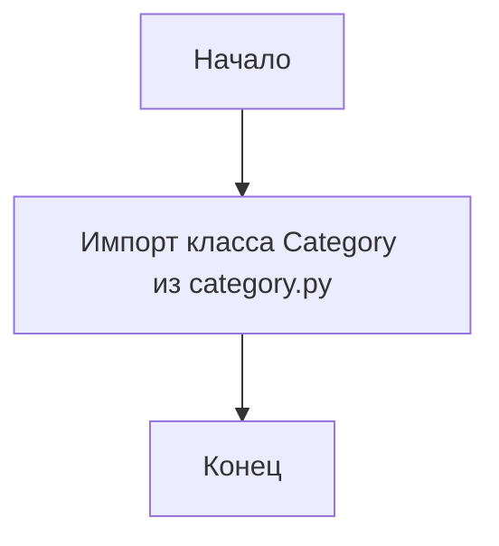
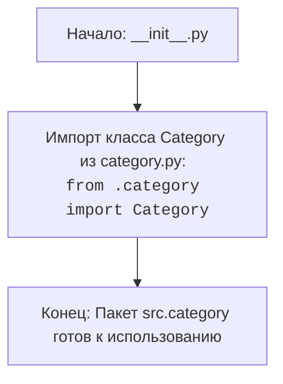

## АНАЛИЗ КОДА: `src/category/__init__.py`

### 1. <алгоритм>

**Описание:**

Файл `__init__.py` в пакете `src.category` служит для инициализации пакета и импорта класса `Category` из модуля `category.py`, находящегося в том же пакете. Это позволяет использовать класс `Category` напрямую через импорт пакета.

**Блок-схема:**

**Примеры:**
1. После запуска,  `from src.category import Category` позволяет использовать `Category` как `src.category.Category`
2.  `from src.category import *` позволяет использовать `Category` как `Category`

### 2. <mermaid>

**Зависимости:**

*   Импортируется класс `Category` из модуля `category.py`, находящегося в том же пакете `src.category`.

### 3. <объяснение>

**Импорты:**

*   `from .category import Category`: Импортирует класс `Category` из модуля `category.py` в текущем пакете `src.category`. Символ `.` означает текущий пакет, таким образом импортируем `Category` из `src/category/category.py`.

**Классы:**

*   В данном файле классы не определяются, но `Category` класс импортируется.

**Функции:**

*   В данном файле функции не определяются.

**Переменные:**

*   В данном файле переменные не используются.

**Потенциальные ошибки и области для улучшения:**

*   Ошибок нет.
*   Области для улучшения: можно добавить документацию для пакета.

**Взаимосвязи с другими частями проекта:**

*   Пакет `src.category` предназначен для управления сущностью категории в рамках проекта.
*   `Category` класс, импортированный из `category.py`, вероятно, используется в других частях проекта, где требуется работа с категориями (например, для организации данных, для привязки к контенту).
*   Импорт `Category` в `__init__.py` позволяет более удобно обращаться к классу, делая его доступным через прямой импорт пакета: `from src.category import Category`.