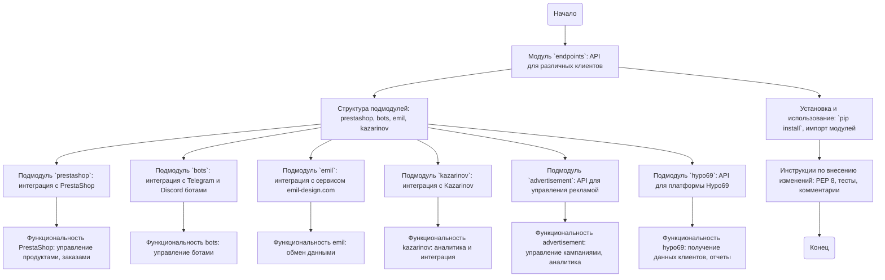
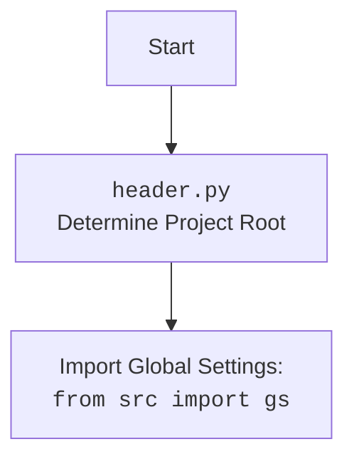

## <алгоритм>

1.  **Начало**: Чтение файла `README.md` из директории `src/endpoints`.
2.  **Раздел "Data Consumer Endpoints Module"**: Общее описание модуля `endpoints`, включая его назначение (предоставление API для различных клиентов).
    *   **Пример**: Описание модуля как набора API для взаимодействия с потребителями данных.
3.  **Раздел "Module Structure"**: Описание структуры модуля, выделение подмодулей для различных потребителей.
    *   **Пример**: Указание на наличие подмодулей `prestashop`, `bots`, `emil` и `kazarinov`.
4.  **Раздел "Final Consumer Endpoints"**: Детальное описание каждого подмодуля.
    *   **Пример**:
        *   `PrestaShop`: Интеграция с PrestaShop API.
        *   `bots`: Управление интеграцией с Telegram и Discord ботами.
        *   `emil`: Интеграция с сервисом `https://emil-design.com`.
        *   `kazarinov`: Интеграция с провайдером данных Kazarinov.
5.  **Раздел "Module Descriptions"**: Детальное описание функциональности каждого модуля.
    *   **Пример**:
        *   `prestashop`: Создание, редактирование и удаление продуктов, управление заказами.
        *   `advertisement`: Управление рекламными кампаниями и аналитикой.
        *   `emil`: Обработка запросов и получение данных из Emil API.
        *   `hypo69`: Получение данных клиентов и работа с отчетами.
        *   `kazarinov`: Интеграция данных между системами, генерация отчетов.
6.  **Раздел "Installation and Usage"**: Описание установки и использования модуля.
    *   **Пример**: Инструкция по установке зависимостей через `pip install -r requirements.txt` и пример импорта модулей `PrestashopAPI` и `AdvertisementAPI`.
7.  **Раздел "Contribution"**: Инструкции для участников по внесению изменений.
    *   **Пример**: Требования следовать PEP 8, добавлять тесты и оставлять комментарии.
8.  **Конец**: Завершение обработки `README.md`.

## <mermaid>

## <объяснение>

### Импорты
В предоставленном фрагменте кода импорты не показаны, но в разделе **Usage** упомянуты примеры импортов:
   -  `from src.endpoints.prestashop import PrestashopAPI`
   -  `from src.endpoints.advertisement import AdvertisementAPI`

   Эти импорты предназначены для использования классов `PrestashopAPI` и `AdvertisementAPI`, которые предположительно находятся в файлах `src/endpoints/prestashop.py` и `src/endpoints/advertisement.py` соответственно. Эти импорты являются частью механизма модульности Python, позволяющего использовать функционал, реализованный в других файлах.

### Классы
Описание в файле `README.md` намекает на наличие классов внутри модулей (например `PrestashopAPI`), но их конкретная реализация и атрибуты не указаны. Предположительно, каждый подмодуль, такой как `prestashop`, `advertisement`, `emil`, `hypo69`, и `kazarinov`, содержит классы, предоставляющие интерфейс для взаимодействия с соответствующими сервисами.
   -  **Роль**: Классы инкапсулируют логику взаимодействия с внешними API или сервисами, предоставляя набор методов для выполнения конкретных операций.
   -  **Атрибуты**: Атрибуты классов могут включать параметры подключения к API, данные конфигурации и другие необходимые переменные для работы.
   -  **Методы**: Методы классов предоставляют API для выполнения CRUD-операций, управления данными и интеграции с внешними сервисами.

### Функции
Конкретные функции в предоставленном фрагменте кода не указаны. Однако, на основании описания модулей можно предположить наличие таких функций:
   -  **В `prestashop`**: Методы для создания, редактирования, удаления продуктов, управления заказами и пользователями.
   -  **В `advertisement`**: Методы для управления рекламными кампаниями и сбора аналитических данных.
   -  **В `emil`**: Методы для отправки запросов к сервису Emil и обработки ответов.
   -  **В `hypo69`**: Методы для получения данных клиентов и работы с пользовательскими отчетами.
   -  **В `kazarinov`**: Методы для интеграции данных и генерации отчетов.

   **Аргументы**: Функции могут принимать аргументы, необходимые для выполнения операций (например, данные продукта для создания или редактирования).
   **Возвращаемые значения**: Функции могут возвращать результаты выполнения операций, данные от API или индикаторы успеха/ошибки.

### Переменные
В `README.md` явно не описаны переменные, но предположительно в коде используются:
   -  **Типы**: Строки для URL, чисел для id объектов, списки или словари для представления данных.
   -  **Использование**: Переменные используются для хранения конфигурационных данных, параметров API запросов, промежуточных результатов и данных, полученных от внешних API.

### Потенциальные ошибки и области для улучшения
   -  **Отсутствие документации классов и функций**: `README.md` дает общее описание модулей, но отсутствуют конкретные детали о классах и функциях.
   -  **Нет примеров использования**: В `README.md` приведены лишь общие импорты, но нет конкретных примеров использования классов и методов.
   -  **Недостаточное освещение ошибок**: В `README.md` есть предупреждения об авторизации, но нет подробностей об обработке ошибок и исключений.
   -  **Общие инструкции**: Описание `Installation and Usage` достаточно общее, не хватает конкретных шагов и параметров.
   -  **Нет деталей о зависимостях**: Хотя `requirements.txt` упоминается, нет деталей о конкретных зависимостях для каждого модуля.

### Цепочка взаимосвязей с другими частями проекта
Модуль `endpoints` является частью более крупной системы, которая, предположительно, также содержит модули для хранения, обработки и представления данных.

   -  **`src`**: Модуль `endpoints` находится в каталоге `src`, что означает его взаимодействие с другими частями проекта.
   -  **`src.api`**: На основе описания, модуль `endpoints` взаимодействует с API внешних сервисов, возможно с использованием внутренних API `src.api`.
   -  **`src.database`**: Модули могут также взаимодействовать с базой данных для сохранения и извлечения информации.
   -  **`src.utils`**: Могут использоваться различные утилиты для общих задач, таких как обработка данных, логирование и т.д.

### Дополнительно:

**Объяснение `header.py`**:

1.  **`Start`**: Начало выполнения скрипта `header.py`.
2.  **`Header`**: Выполняется основная задача скрипта - определение корневой директории проекта. Обычно, это делается путём поиска специального файла или директории (например, `.git`, `setup.py`, или конфигурационный файл).
3.  **`import`**: Импортируются глобальные настройки из `src.gs`, которые могут включать различные переменные, необходимые для работы проекта.
4.  **Конец**: Завершение работы скрипта `header.py`.

Этот скрипт обеспечивает возможность определения пути проекта, что особенно важно при работе с относительными путями в коде.