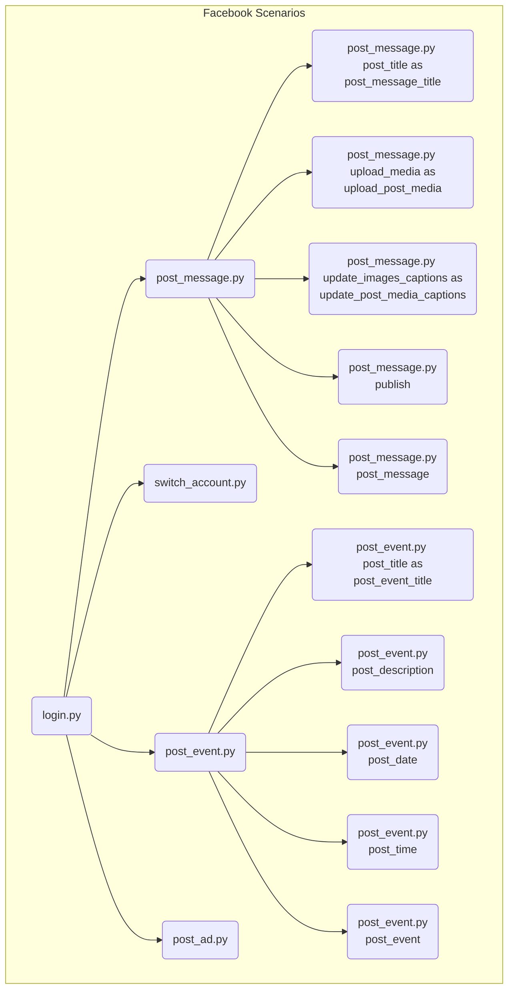

### **Алгоритм**

1.  **Импорт модулей**:
    *   Импортируются различные модули, такие как `login`, `post_message`, `switch_account`, `post_event` и `post_ad`.
    *   Каждый модуль представляет собой отдельный сценарий или набор функций для работы с Facebook.
    *   Примеры:
        *   `login`: отвечает за аутентификацию пользователя.
        *   `post_message`: включает в себя функциональность для создания и публикации сообщений.
        *   `switch_account`: позволяет переключаться между учетными записями.
        *   `post_event`: реализует сценарии для создания и публикации событий.
        *   `post_ad`: предназначен для работы с рекламными объявлениями.
2.  **Импорт функций из модулей**:
    *   Из модуля `post_message` импортируются функции `post_title`, `upload_media`, `update_images_captions`, `publish`, `post_message`, переименованные для удобства использования.
        *   `post_title` импортируется как `post_message_title` - заголовок сообщения.
        *   `upload_media` импортируется как `upload_post_media` - загрузка медиа-файлов для поста.
        *   `update_images_captions` импортируется как `update_post_media_captions` - обновление подписей к изображениям.
        *   `publish` - публикация сообщения.
        *   `post_message` - создание и публикация сообщения.
    *   Из модуля `post_event` импортируются функции `post_title`, `post_description`, `post_date`, `post_time`, `post_event`.
        *   `post_title` импортируется как `post_event_title` - заголовок события.
        *   `post_description` импортируется как `post_event_description` - описание события.
        *   `post_date` - дата события.
        *   `post_time` - время события.
        *   `post_event` - создание и публикация события.
3.  **Организация сценариев**:
    *   Все импортированные модули и функции предоставляют собой набор сценариев для автоматизации различных действий в Facebook.
    *   Сценарии организованы по функциональным группам, таким как аутентификация, публикация сообщений, управление событиями и рекламой.
4.  **Взаимодействие между модулями**:
    *   Некоторые сценарии могут взаимодействовать друг с другом, например, после успешной аутентификации может быть выполнен сценарий публикации сообщения или создания события.
    *   Примеры:
        *   `login` -> `post_message`
        *   `login` -> `post_event`
        *   `switch_account` -> `post_message`

### **Mermaid**

*   **Facebook Scenarios**: Главный контейнер, объединяющий все сценарии Facebook.
*   **login.py**: Сценарий для аутентификации пользователя.
*   **post\_message.py**: Сценарий для создания и публикации сообщений.
*   **switch\_account.py**: Сценарий для переключения между учетными записями.
*   **post\_event.py**: Сценарий для создания и публикации событий.
*   **post\_ad.py**: Сценарий для работы с рекламными объявлениями.
*   **post\_message.py**:
    *   **post\_title as post\_message\_title**: Функция для установки заголовка сообщения.
    *   **upload\_media as upload\_post\_media**: Функция для загрузки медиафайлов в сообщение.
    *   **update\_images\_captions as update\_post\_media\_captions**: Функция для обновления подписей к изображениям в сообщении.
    *   **publish**: Функция для публикации сообщения.
    *   **post\_message**: Функция для создания и публикации сообщения.
*   **post\_event.py**:
    *   **post\_title as post\_event\_title**: Функция для установки заголовка события.
    *   **post\_description as post\_event\_description**: Функция для установки описания события.
    *   **post\_date**: Функция для установки даты события.
    *   **post\_time**: Функция для установки времени события.
    *   **post\_event**: Функция для создания и публикации события.

### **Объяснение**

*   **Импорты**:
    *   `login`: Импортирует сценарий входа в систему Facebook.
    *   `post_message`: Импортирует сценарий публикации сообщений в Facebook.
    *   `switch_account`: Импортирует сценарий переключения между учетными записями Facebook.
    *   `post_message`: Импортирует функции для работы с сообщениями, такие как:
        *   `post_title as post_message_title`: Функция для установки заголовка сообщения.
        *   `upload_media as upload_post_media`: Функция для загрузки медиафайлов в сообщение.
        *   `update_images_captions as update_post_media_captions`: Функция для обновления подписей к изображениям в сообщении.
        *   `publish`: Функция для публикации сообщения.
        *   `post_message`: Функция для создания и публикации сообщения.
    *   `post_event`: Импортирует сценарий публикации событий в Facebook, а также функции для работы с событиями, такие как:
        *   `post_title as post_event_title`: Функция для установки заголовка события.
        *   `post_description as post_event_description`: Функция для установки описания события.
        *   `post_date`: Функция для установки даты события.
        *   `post_time`: Функция для установки времени события.
        *   `post_event`: Функция для создания и публикации события.
    *   `post_ad`: Импортирует сценарий публикации рекламных объявлений в Facebook.
*   **Назначение**:
    *   Файл `__init__.py` используется для организации модулей и сценариев, связанных с Facebook.
    *   Он импортирует различные сценарии и функции, чтобы их можно было легко использовать в других частях проекта.
    *   Переименование функций при импорте позволяет избежать конфликтов имен и сделать код более читаемым.
*   **Потенциальные улучшения**:
    *   Добавить документацию к каждому модулю и функции, чтобы облегчить понимание их назначения и использования.
    *   Реализовать обработку ошибок и логирование для отслеживания работы сценариев и выявления проблем.
*   **Взаимосвязи с другими частями проекта**:
    *   Этот файл является частью модуля `src.endpoints.advertisement.facebook`, который отвечает за взаимодействие с API Facebook для автоматизации различных задач, связанных с рекламой и маркетингом.
    *   Он предоставляет интерфейс для других частей проекта, которые хотят использовать Facebook для достижения своих целей.