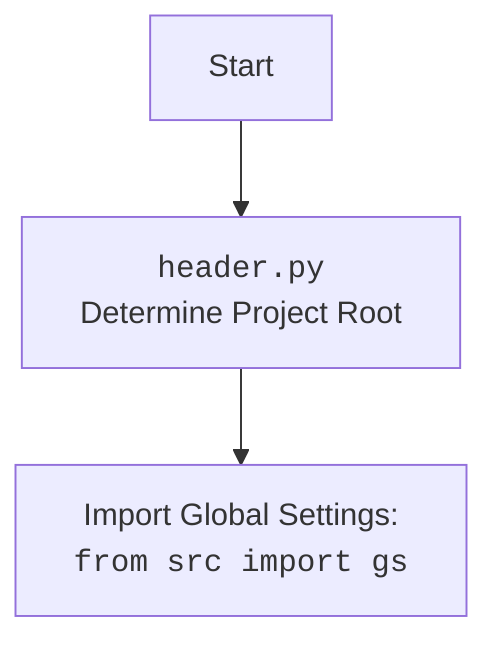

## ИНСТРУКЦИЯ:

Анализируй предоставленный код подробно и объясни его функциональность. Ответ должен включать три раздела:  

1. **<алгоритм>**: Опиши рабочий процесс в виде пошаговой блок-схемы, включая примеры для каждого логического блока, и проиллюстрируй поток данных между функциями, классами или методами.  
2. **<mermaid>**: Напиши код для диаграммы в формате `mermaid`, проанализируй и объясни все зависимости, 
    которые импортируются при создании диаграммы. 
    **ВАЖНО!** Убедитесь, что все имена переменных, используемые в диаграмме `mermaid`, 
    имеют осмысленные и описательные имена. Имена переменных вроде `A`, `B`, `C`, и т.д., не допускаются!  
    
    **Дополнительно**: Если в коде есть импорт `import header`, добавьте блок `mermaid` flowchart, объясняющий `header.py`:\
    ```mermaid
    flowchart TD
        Start --> Header[<code>header.py</code><br> Determine Project Root]
    
        Header --> import[Import Global Settings: <br><code>from src import gs</code>] 
    ```

3. **<объяснение>**: Предоставьте подробные объяснения:  
   - **Импорты**: Их назначение и взаимосвязь с другими пакетами `src.`.  
   - **Классы**: Их роль, атрибуты, методы и взаимодействие с другими компонентами проекта.  
   - **Функции**: Их аргументы, возвращаемые значения, назначение и примеры.  
   - **Переменные**: Их типы и использование.  
   - Выделите потенциальные ошибки или области для улучшения.  

Дополнительно, постройте цепочку взаимосвязей с другими частями проекта (если применимо).  

Это обеспечивает всесторонний и структурированный анализ кода.
## Формат ответа: `.md` (markdown)
**КОНЕЦ ИНСТРУКЦИИ**

## <алгоритм>

1.  **Определение корневой директории проекта (`set_project_root`)**:
    *   Начало: Функция `set_project_root` принимает на вход `marker_files` (кортеж строк, по умолчанию `('__root__', '.git')`).
    *   Инициализация:
        *   `current_path` устанавливается как абсолютный путь к директории, содержащей текущий файл (`header.py`).
        *   `__root__` инициализируется как `current_path`.
    *   Поиск: Происходит перебор от текущей директории до родительских директорий. На каждой итерации проверяется наличие хотя бы одного из файлов или директорий, указанных в `marker_files`.
    *   Обновление корневой директории: Если один из `marker_files` найден в текущей директории, то `__root__` присваивается значение этой директории, и цикл прерывается.
    *   Добавление корневой директории в `sys.path`: Если `__root__` не в `sys.path`, то он добавляется в начало, что позволяет импортировать модули из корневой директории.
    *   Возврат: Функция возвращает путь к корневой директории (`__root__`).

    **Пример:**
    Предположим, структура проекта:
    ```
    project_root/
        __root__
        src/
            endpoints/
                header.py
        .git
    ```
    Если `header.py` выполняется, то:
        *   `current_path` будет `/path/to/project_root/src/endpoints`.
        *   Цикл поиска найдет `__root__` в `/path/to/project_root/` и остановится.
        *   `__root__` будет установлено в `/path/to/project_root/` и добавлено в `sys.path`.
        *   Функция вернет `/path/to/project_root/`.

2.  **Инициализация `__root__`**:
    *   Функция `set_project_root` вызывается для определения корня проекта. Результат сохраняется в глобальной переменной `__root__`.

3.  **Импорт глобальных настроек (`from src import gs`)**:
    *   Импортируется модуль `gs` из пакета `src`. Предполагается, что Модуль содержит глобальные переменные и настройки проекта.

4.  **Загрузка настроек из файла `settings.json`**:
    *   Путь к файлу настроек формируется как `gs.path.root / 'src' / 'settings.json'`.
    *   Файл `settings.json` открывается для чтения.
    *   Содержимое файла (предположительно, словарь JSON) загружается в переменную `settings`.
    *   При возникновении ошибок `FileNotFoundError` или `json.JSONDecodeError` (например, если файл не найден или имеет неправильный формат) используется пустой блок обработки `...`.

    **Пример**:
        *   `settings.json`:
            ```json
            {
                "project_name": "test_project",
                "version": "1.0.0",
                "author": "Test Author"
            }
            ```
        *   После выполнения кода `settings` будет словарем: `{"project_name": "test_project", "version": "1.0.0", "author": "Test Author"}`.
5.  **Чтение документации из файла `README.MD`**:
    *   Путь к файлу `README.MD` формируется как `gs.path.root / 'src' / 'README.MD'`.
    *   Файл открывается для чтения, и его содержимое сохраняется в строку `doc_str`.
    *   При возникновении ошибок `FileNotFoundError` или `json.JSONDecodeError`, используется пустой блок обработки `...`.

6.  **Инициализация глобальных переменных**:
    *   `__project_name__`: Если `settings` загружен, берется значение из ключа `project_name`, иначе устанавливается в `hypotez`.
    *   `__version__`: Если `settings` загружен, берется значение из ключа `version`, иначе устанавливается в пустую строку.
    *   `__doc__`: Если `doc_str` содержит текст, то устанавливается в это значение, иначе устанавливается в пустую строку.
    *   `__details__`: устанавливается в пустую строку.
    *   `__author__`: Если `settings` загружен, берется значение из ключа `author`, иначе устанавливается в пустую строку.
    *   `__copyright__`: Если `settings` загружен, берется значение из ключа `copyrihgnt`, иначе устанавливается в пустую строку.
    *   `__cofee__`: Если `settings` загружен, берется значение из ключа `cofee`, иначе устанавливается в значение по умолчанию.

## <mermaid>
```mermaid
flowchart TD
    Start(Start) --> FindProjectRoot[<code>set_project_root()</code><br>Determine Project Root];
    FindProjectRoot -->|Returns Project Root Path| SetProjectRootVariable[Set <code>__root__</code> Variable];
    SetProjectRootVariable --> ImportGlobalSettings[Import Global Settings: <br><code>from src import gs</code>];
    ImportGlobalSettings --> ReadSettingsFile[Read Settings: <br><code>settings.json</code>];
    ReadSettingsFile -->|Settings Loaded| ReadDocumentationFile[Read Documentation: <br><code>README.MD</code>];
    ReadSettingsFile -->|Settings Not Loaded| ReadDocumentationFile;
    ReadDocumentationFile -->|Documentation Loaded| SetProjectInfoVariables[Set Project Info Variables: <br><code>__project_name__</code>, <code>__version__</code>, etc.];
    ReadDocumentationFile -->|Documentation Not Loaded| SetProjectInfoVariables;    
    SetProjectInfoVariables --> End(End);
    
    style Start fill:#f9f,stroke:#333,stroke-width:2px
    style End fill:#ccf,stroke:#333,stroke-width:2px
```


## <объяснение>

**Импорты:**

*   `sys`: Модуль `sys` используется для работы с системными параметрами и функциями, в частности для модификации `sys.path`. В данном коде используется `sys.path.insert(0, str(__root__))`, чтобы добавить путь к корневой директории проекта в список путей поиска модулей, что позволяет импортировать модули из этого каталога.
*   `json`: Модуль `json` используется для работы с данными в формате JSON. В данном коде используется для чтения файла `settings.json`, который предположительно содержит настройки проекта в формате JSON.
*   `packaging.version.Version`: Импортируется класс `Version` из пакета `packaging.version`, но не используется в текущем коде. Это может быть связано с тем, что этот класс может использоваться для управления версиями проекта в других частях кода.
*   `pathlib.Path`: Класс `Path` из модуля `pathlib` используется для работы с путями к файлам и директориям в объектно-ориентированном стиле. Он обеспечивает более удобный и переносимый способ работы с путями, чем использование обычных строк.

**Функции:**

*   `set_project_root(marker_files=('__root__', '.git')) -> Path`:
    *   Аргументы: `marker_files` (tuple) - кортеж имен файлов или директорий, которые используются для определения корневой директории проекта. По умолчанию `('__root__', '.git')`.
    *   Возвращаемое значение: `Path` - объект, представляющий путь к корневой директории проекта.
    *   Назначение: Функция находит корневую директорию проекта путем поиска вверх по структуре каталогов, пока не будет найдена директория, содержащая один из файлов или директорий, указанных в `marker_files`. Она также добавляет найденную корневую директорию в `sys.path`, чтобы позволить импортировать модули из этой директории.
    *   Пример: Если структура проекта `/home/user/my_project/__root__/.../src/endpoints/header.py`, то эта функция вернет `Path('/home/user/my_project')`.

**Переменные:**

*   `__root__`: Глобальная переменная типа `Path`, которая хранит путь к корневой директории проекта.
*   `settings`: Глобальная переменная типа `dict` (словарь), которая хранит настройки проекта, загруженные из файла `settings.json`.
*   `doc_str`: Глобальная переменная типа `str`, которая хранит строку с документацией проекта, загруженную из файла `README.MD`.
*   `__project_name__`: Глобальная переменная типа `str`, которая хранит имя проекта. Значение берется из файла настроек или устанавливается в значение по умолчанию 'hypotez'.
*   `__version__`: Глобальная переменная типа `str`, которая хранит версию проекта. Значение берется из файла настроек или устанавливается в пустую строку.
*   `__doc__`: Глобальная переменная типа `str`, которая хранит документацию проекта. Значение берется из файла `README.MD` или устанавливается в пустую строку.
*   `__details__`: Глобальная переменная типа `str`, которая не используется и устанавливается в пустую строку.
*   `__author__`: Глобальная переменная типа `str`, которая хранит автора проекта. Значение берется из файла настроек или устанавливается в пустую строку.
*   `__copyright__`: Глобальная переменная типа `str`, которая хранит информацию об авторских правах проекта. Значение берется из файла настроек или устанавливается в пустую строку.
*   `__cofee__`: Глобальная переменная типа `str`, которая хранит сообщение о поддержке проекта. Значение берется из файла настроек или устанавливается в значение по умолчанию.

**Взаимосвязь с другими частями проекта:**

*   Модуль `header.py` является важным компонентом, поскольку он определяет корневую директорию проекта и предоставляет доступ к настройкам и документации.
*   Переменные, определенные в этом модуле, скорее всего используются в других модулях проекта для получения доступа к информации о проекте, например, в логгерах, декораторах и других утилитах.
*   Модуль `gs` из пакета `src` (предположительно) предоставляет доступ к глобальным настройкам проекта и другим путям к файлам, и он используется для поиска файлов настроек и документации.
*   Определение корневой директории позволяет другим частям проекта корректно импортировать модули и работать с файлами, которые находятся в структуре проекта.

**Потенциальные ошибки и области для улучшения:**

*   Обработка ошибок `FileNotFoundError` и `json.JSONDecodeError` в блоках `try...except` выполняется пустым блоком `...`. В случае ошибок (не найден файл или некорректный JSON), переменные settings, doc_str останутся `None`, но при этом не происходит никакого логирования, что затрудняет диагностику проблем. Рекомендуется добавить логирование ошибок или обработку по умолчанию для таких ситуаций.
*   Если файл `settings.json` или `README.MD` не найдены или имеют неверный формат, программа не остановится, но и не сообщит об этом. Желательно явно обрабатывать эти ситуации, чтобы разработчик понимал проблему.
*   `__details__` не используется, это может быть либо неполностью реализованная фича, либо устаревший код который стоит либо удалить либо доработать.
*   В коде есть опечатка в названии переменной `__copyright__` - `copyrihgnt`, ее стоит исправить.
*   Использование `settings.get(...) if settings else ...` для всех переменных является многословным. Можно использовать значения по умолчанию в `dict.get`, чтобы упростить код, например: `__project_name__ = settings.get("project_name", 'hypotez') if settings  else 'hypotez'` -> `__project_name__ = settings.get("project_name", 'hypotez')`.
*   Может быть полезным добавить проверки типов для переменных settings, что бы исключить `KeyError` и другие ошибки.

В целом, этот код выполняет свою задачу по определению корневой директории проекта и загрузке настроек, но требует доработки в плане обработки ошибок и упрощения кода.