# Анализ кода `TEXT.py`

## 1. <алгоритм>

**Блок-схема:**

```mermaid
graph LR
    A[Начало] --> B{Инициализация констант};
    B --> C{Определение `drive_folder_name`};
    C --> D{Определение `MEGA_EMAIL`, `MEGA_PASSWORD`};
    D --> E{Определение строковых констант (сообщения): `START`, `HELP`, `DP_DOWNLOAD`, ...};
    E --> F{Определение логических констант: `DOWN_TWO`, `OPENLOAD`, `DROPBOX`, `MEGA`};
    F --> G{Определение путей: `DOWN_PATH`};
    G --> H{Конец};
    
    subgraph Инициализация констант
    C
    D
    E
    F
    G
    end
    
    style C fill:#f9f,stroke:#333,stroke-width:2px
    style D fill:#f9f,stroke:#333,stroke-width:2px
    style E fill:#f9f,stroke:#333,stroke-width:2px
    style F fill:#f9f,stroke:#333,stroke-width:2px
    style G fill:#f9f,stroke:#333,stroke-width:2px
```

**Примеры для каждого логического блока:**

*   **`A` (Начало):** Начало выполнения скрипта.
*   **`B` (Инициализация констант):**  Загрузка всех констант, необходимых для работы бота.
*   **`C` (Определение `drive_folder_name`):** `drive_folder_name = "GDriveUploaderBot"`  -  определяет имя папки, в которую будут загружаться файлы на Google Drive.
*   **`D` (Определение `MEGA_EMAIL`, `MEGA_PASSWORD`):**  `MEGA_EMAIL = "bearyan8@yandex.com"` и `MEGA_PASSWORD = "bearyan8@yandex.com"` - устанавливает данные для доступа к Mega аккаунту.
*   **`E` (Определение строковых констант):** `START = "Hi {} ..."` - приветственное сообщение для пользователя, `HELP = """ <b>..."""` - справочное сообщение и т.д. Эти константы используются для формирования ответов бота.
*   **`F` (Определение логических констант):**  `DOWN_TWO = True` - указывает на возможность одновременной загрузки, `OPENLOAD = True` - включает поддержку Openload, `DROPBOX = True` - включает поддержку Dropbox, `MEGA = True` - включает поддержку Mega.
*  **`G` (Определение путей):** `DOWN_PATH = "Downloads/"` - задаёт путь для сохранения загружаемых файлов.
*   **`H` (Конец):** Завершение инициализации констант.

```mermaid
flowchart TD
    A[Start] --> B{drive_folder_name};
    B --> C{MEGA_EMAIL};
    C --> D{MEGA_PASSWORD};
    D --> E{START};
    E --> F{HELP};
    F --> G{DP_DOWNLOAD};
    G --> H{OL_DOWNLOAD};
    H --> I{PROCESSING};
     I --> J{DOWN_TWO};
     J --> K{DOWNLOAD};
     K --> L{DOWN_MEGA};
     L --> M{DOWN_COMPLETE};
     M --> N{NOT_AUTH};
     N --> O{REVOKE_FAIL};
     O --> P{AUTH_SUCC};
     P --> Q{ALREADY_AUTH};
     Q --> R{AUTH_URL};
     R --> S{UPLOADING};
    S --> T{REVOKE_TOK};
     T --> U{DOWN_PATH};
     U --> V{DOWNLOAD_URL};
     V --> W{AUTH_ERROR};
     W --> X{OPENLOAD};
      X --> Y{DROPBOX};
      Y --> Z{MEGA};
    Z --> AA{UPDATE};
     AA --> End[End];

    style B fill:#f9f,stroke:#333,stroke-width:2px
     style C fill:#f9f,stroke:#333,stroke-width:2px
     style D fill:#f9f,stroke:#333,stroke-width:2px
      style E fill:#f9f,stroke:#333,stroke-width:2px
     style F fill:#f9f,stroke:#333,stroke-width:2px
    style G fill:#f9f,stroke:#333,stroke-width:2px
    style H fill:#f9f,stroke:#333,stroke-width:2px
    style I fill:#f9f,stroke:#333,stroke-width:2px
    style J fill:#f9f,stroke:#333,stroke-width:2px
    style K fill:#f9f,stroke:#333,stroke-width:2px
    style L fill:#f9f,stroke:#333,stroke-width:2px
    style M fill:#f9f,stroke:#333,stroke-width:2px
    style N fill:#f9f,stroke:#333,stroke-width:2px
    style O fill:#f9f,stroke:#333,stroke-width:2px
    style P fill:#f9f,stroke:#333,stroke-width:2px
    style Q fill:#f9f,stroke:#333,stroke-width:2px
    style R fill:#f9f,stroke:#333,stroke-width:2px
    style S fill:#f9f,stroke:#333,stroke-width:2px
    style T fill:#f9f,stroke:#333,stroke-width:2px
    style U fill:#f9f,stroke:#333,stroke-width:2px
    style V fill:#f9f,stroke:#333,stroke-width:2px
    style W fill:#f9f,stroke:#333,stroke-width:2px
     style X fill:#f9f,stroke:#333,stroke-width:2px
     style Y fill:#f9f,stroke:#333,stroke-width:2px
     style Z fill:#f9f,stroke:#333,stroke-width:2px
    style AA fill:#f9f,stroke:#333,stroke-width:2px
```

## 2. <mermaid>



**Объяснение зависимостей:**

В этом файле нет явных импортов других модулей. Зависимости ограничиваются только объявленными переменными и константами, которые используются для конфигурации и отображения текста в боте. Все переменные и константы, представленные на диаграмме `mermaid`, представляют собой настройки, строки сообщений и логические флаги для управления поведением бота.

## 3. <объяснение>

### Импорты

В данном файле отсутствуют импорты внешних модулей. Этот файл содержит только определения констант и переменных, используемых для настройки и работы бота.

### Классы

В этом файле нет определения классов.

### Функции

В этом файле нет определения функций.

### Переменные

*   **`drive_folder_name`**: Строка, определяющая имя папки на Google Drive, куда будут загружаться файлы.
    *   Тип: `str`
    *   Использование: Задается имя папки, в которую бот будет сохранять загруженные файлы.
*  **`MEGA_EMAIL`**: Строка, содержащая электронную почту для доступа к аккаунту MEGA.
    *   Тип: `str`
    *   Использование: Используется для авторизации в сервисе MEGA для загрузки файлов.
*   **`MEGA_PASSWORD`**: Строка, содержащая пароль для доступа к аккаунту MEGA.
    *   Тип: `str`
    *   Использование: Используется для авторизации в сервисе MEGA для загрузки файлов.
*   **`START`**: Строка, содержащая приветственное сообщение бота.
    *   Тип: `str`
    *   Использование: Выводится при первом обращении к боту.
*   **`HELP`**: Многострочная строка, содержащая справочную информацию о командах и возможностях бота.
    *   Тип: `str`
    *   Использование: Выводится при запросе помощи (/help).
*   **`DP_DOWNLOAD`**: Строка, содержащая сообщение о начале загрузки с Dropbox.
    *   Тип: `str`
    *   Использование: Выводится при старте загрузки файла с Dropbox.
*   **`OL_DOWNLOAD`**: Строка, содержащая сообщение о начале загрузки с Openload.
    *   Тип: `str`
    *   Использование: Выводится при старте загрузки файла с Openload.
*   **`PROCESSING`**: Строка, содержащая сообщение о начале обработки запроса.
    *   Тип: `str`
    *   Использование: Выводится при получении запроса от пользователя.
*   **`DOWN_TWO`**: Логическое значение, которое, вероятно, указывает на возможность параллельной загрузки.
    *   Тип: `bool`
    *   Использование: Управляет возможностью параллельной загрузки.
*   **`DOWNLOAD`**: Строка, содержащая сообщение о начале загрузки.
    *   Тип: `str`
    *   Использование: Выводится при начале загрузки файла.
*   **`DOWN_MEGA`**: Строка, содержащая сообщение о начале загрузки с Mega.
    *   Тип: `str`
    *   Использование: Выводится при начале загрузки файла с Mega.
*   **`DOWN_COMPLETE`**: Строка, содержащая сообщение об успешном завершении загрузки.
    *   Тип: `str`
    *   Использование: Выводится после завершения загрузки файла.
*   **`NOT_AUTH`**: Строка, содержащая сообщение об отсутствии авторизации пользователя.
    *   Тип: `str`
    *   Использование: Выводится, если пользователь не авторизован.
*   **`REVOKE_FAIL`**: Строка, содержащая сообщение о неудачном отзыве токена.
    *   Тип: `str`
    *   Использование: Выводится при попытке отзыва токена, когда пользователь уже не авторизован.
*   **`AUTH_SUCC`**: Строка, содержащая сообщение об успешной авторизации.
    *   Тип: `str`
    *   Использование: Выводится после успешной авторизации.
*   **`ALREADY_AUTH`**: Строка, содержащая сообщение о том, что пользователь уже авторизован.
    *   Тип: `str`
    *   Использование: Выводится, если пользователь пытается авторизоваться повторно.
*   **`AUTH_URL`**: Строка, содержащая HTML-ссылку на страницу авторизации Google Drive.
    *   Тип: `str`
    *   Использование: Выводится для получения токена авторизации Google Drive.
*   **`UPLOADING`**: Строка, содержащая сообщение о начале загрузки файла на Google Drive.
    *   Тип: `str`
    *   Использование: Выводится перед загрузкой файла на Google Drive.
*   **`REVOKE_TOK`**: Строка, содержащая сообщение об успешном отзыве токена.
    *   Тип: `str`
    *   Использование: Выводится после отзыва токена авторизации.
*  **`DOWN_PATH`**: Строка, содержащая путь к папке для сохранения загруженных файлов.
    *   Тип: `str`
    *   Использование: Определяет директорию для загружаемых файлов.
*   **`DOWNLOAD_URL`**: Строка, содержащая сообщение об успешной загрузке файла с информацией о файле и ссылкой.
    *   Тип: `str`
    *   Использование: Выводится после успешной загрузки файла на Google Drive.
*   **`AUTH_ERROR`**: Строка, содержащая сообщение об ошибке авторизации.
    *   Тип: `str`
    *   Использование: Выводится при ошибке авторизации.
*   **`OPENLOAD`**: Логическое значение, включающее или отключающее поддержку загрузки с Openload.
    *   Тип: `bool`
    *   Использование: Управляет поддержкой Openload.
*   **`DROPBOX`**: Логическое значение, включающее или отключающее поддержку загрузки с Dropbox.
    *   Тип: `bool`
    *   Использование: Управляет поддержкой Dropbox.
*   **`MEGA`**: Логическое значение, включающее или отключающее поддержку загрузки с Mega.
    *   Тип: `bool`
    *   Использование: Управляет поддержкой Mega.
*   **`UPDATE`**: Многострочная строка, содержащая информацию об обновлениях бота.
    *   Тип: `str`
    *   Использование: Выводится для информирования пользователей об обновлениях.

### Потенциальные ошибки и области для улучшения

*   **Безопасность пароля**: Хранение логина и пароля `MEGA_EMAIL` и `MEGA_PASSWORD` в открытом виде является небезопасным. Рекомендуется использовать более защищённые методы, например, переменные среды или файл конфигурации с ограниченным доступом.
*   **Зависимость от констант**: Код сильно зависит от строковых констант. Для лучшей поддержки разных языков и гибкости можно использовать словари или внешние файлы для хранения сообщений.
*   **Обработка ошибок**: Не предусмотрена детальная обработка ошибок. Следует добавить более точную обработку исключений для повышения надежности бота.
*   **Отсутствие логики**: Код не содержит никакой логики. Файл является лишь хранилищем переменных.

### Взаимосвязь с другими частями проекта

Этот файл, вероятно, используется как файл конфигурации и хранения строковых констант для бота, взаимодействующего с Google Drive, Mega, Dropbox и Openload. Он является неотъемлемой частью проекта, предоставляя текстовые сообщения для бота и настройки подключения к Mega. Другие модули, вероятно, используют эти константы для формирования ответов бота и взаимодействия с сервисами загрузки.