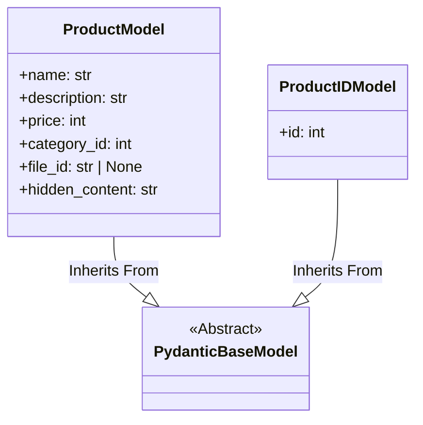

## АНАЛИЗ КОДА: `hypotez/src/endpoints/bots/telegram/digital_market/bot/admin/schemas.py`

### 1. <алгоритм>

**`ProductIDModel`**

1.  **Создание объекта**: Пользователь создает объект `ProductIDModel`, передавая идентификатор продукта (`id`).
2.  **Валидация**: Pydantic проверяет, что переданный `id` является целым числом (`int`).
3.  **Возвращение объекта**: В случае успешной валидации возвращается объект `ProductIDModel` с установленным атрибутом `id`.

*Пример:*
```python
product_id = ProductIDModel(id=123)
print(product_id.id) # Выведет: 123
```

**`ProductModel`**

1.  **Создание объекта**: Пользователь создает объект `ProductModel`, передавая `name`, `description`, `price`, `category_id` и опционально `file_id`, `hidden_content`.
2.  **Валидация**: Pydantic выполняет следующие проверки:
    *   `name`: Строка (string), длина не менее 5 символов.
    *   `description`: Строка (string), длина не менее 5 символов.
    *   `price`: Целое число (int), строго больше 0.
    *   `category_id`: Целое число (int), строго больше 0.
    *   `file_id`: Строка (string) или `None`.
	*   `hidden_content`: Строка (string), длина не менее 5 символов.
3.  **Возвращение объекта**: В случае успешной валидации возвращается объект `ProductModel` с установленными атрибутами.

*Пример:*
```python
product = ProductModel(
    name="Клавиатура",
    description="Удобная клавиатура для работы",
    price=100,
    category_id=1,
	hidden_content = "Секретная информация"
)
print(product.name) # Выведет: Клавиатура
print(product.price) # Выведет: 100
print(product.hidden_content) # Выведет: Секретная информация
```

### 2. <mermaid>



**Объяснение зависимостей `mermaid`:**

*   **`ProductIDModel` и `ProductModel`**: Оба класса наследуются от абстрактного класса `PydanticBaseModel`.
*   **`PydanticBaseModel`**: Представляет собой базовую модель Pydantic, обеспечивающую валидацию данных и преобразование типов.

### 3. <объяснение>

#### Импорты:

*   **`from pydantic import BaseModel, ConfigDict, Field`**:
    *   `BaseModel`: Базовый класс для создания моделей Pydantic. Модели Pydantic используются для валидации и преобразования данных.
    *   `Field`: Используется для определения дополнительных параметров для полей модели, таких как минимальная длина строки (`min_length`) или минимальное значение числа (`gt`).

#### Классы:

*   **`ProductIDModel`**:
    *   **Роль**: Представляет модель для идентификатора продукта.
    *   **Атрибуты**:
        *   `id: int`: Обязательный идентификатор продукта. Должен быть целым числом.
    *   **Методы**: Нет явных методов, так как это модель данных.
    *   **Взаимодействие**: Используется для передачи и проверки идентификатора продукта, например, при запросах к базе данных.
*   **`ProductModel`**:
    *   **Роль**: Представляет модель для данных продукта.
    *   **Атрибуты**:
        *   `name: str`: Обязательное название продукта. Должно быть строкой с длиной не менее 5 символов.
        *   `description: str`: Обязательное описание продукта. Должно быть строкой с длиной не менее 5 символов.
        *   `price: int`: Обязательная цена продукта. Должна быть целым числом больше 0.
        *   `category_id: int`: Обязательный идентификатор категории продукта. Должен быть целым числом больше 0.
        *   `file_id: str | None`: Необязательный идентификатор файла, связанного с продуктом. Может быть строкой или `None`.
        *    `hidden_content: str`: Обязательная скрытая информация продукта. Должна быть строкой с длиной не менее 5 символов.
    *   **Методы**: Нет явных методов, так как это модель данных.
    *   **Взаимодействие**: Используется для валидации и передачи данных о продукте, например, при создании нового продукта или при его редактировании.

#### Переменные:

*   **`id` (в `ProductIDModel`)**: Целочисленный идентификатор продукта.
*   **`name` (в `ProductModel`)**: Строковое название продукта.
*   **`description` (в `ProductModel`)**: Строковое описание продукта.
*   **`price` (в `ProductModel`)**: Целочисленная цена продукта.
*   **`category_id` (в `ProductModel`)**: Целочисленный идентификатор категории продукта.
*   **`file_id` (в `ProductModel`)**: Строковый идентификатор файла или `None`.
*    **`hidden_content` (в `ProductModel`)**: Строковая скрытая информация продукта.

#### Потенциальные ошибки и области для улучшения:

*   **Отсутствие обработки ошибок валидации:** Код не содержит явной обработки ошибок, возникающих при валидации данных Pydantic. Необходимо предусмотреть обработку `ValidationError` для корректной работы с пользовательским вводом.
*   **Неявная зависимость от Pydantic:**  Код зависит от Pydantic. В случае изменения или отказа от Pydantic потребуется рефакторинг. Можно рассмотреть абстракцию моделей данных, чтобы уменьшить зависимость.
*   **Отсутствие кастомных валидаторов:** Можно добавить кастомные валидаторы Pydantic, если требуются более сложные проверки данных.
*   **Поле `file_id`**: Тип `str | None` может быть недостаточен. Возможно, потребуется дополнительная валидация на стороне бэкенда или использование другого типа, например `UUID`.

#### Цепочка взаимосвязей с другими частями проекта:

1.  **`src.endpoints.bots.telegram.digital_market.bot.admin.handlers`**: Модели `ProductIDModel` и `ProductModel`, вероятно, используются в обработчиках команд администратора для обработки данных, связанных с продуктами.
2.  **`src.database`**:  Модели используются для валидации данных перед сохранением в базе данных.
3.  **`src.api`**: Эти модели могут использоваться при передаче данных через API, например при запросах от внешних сервисов.
4.  **`src.utils`**: Вспомогательные функции для работы с моделями.

**Дополнительно:**

*   Модели Pydantic обеспечивают валидацию и преобразование типов данных, что повышает надежность и качество кода.
*   Использование Pydantic упрощает работу с данными и снижает вероятность ошибок, связанных с некорректными типами или значениями.