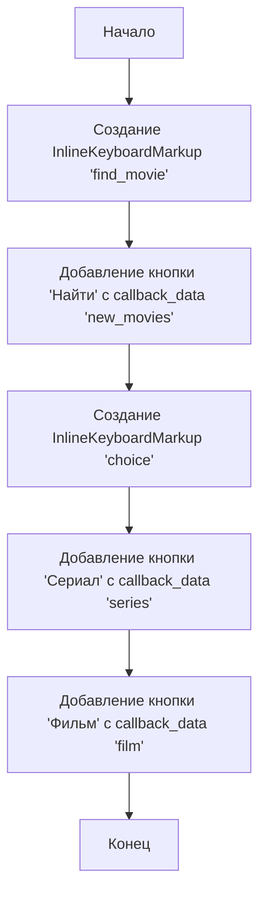
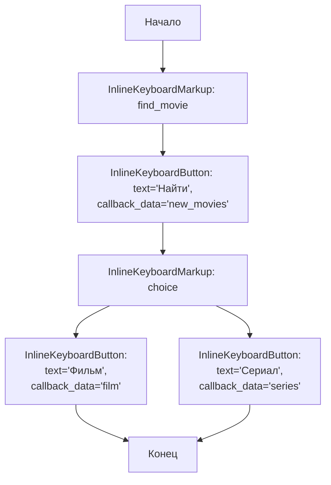

## АНАЛИЗ КОДА: `hypotez/src/endpoints/bots/telegram/movie_bot-main/apps/keyboard.py`

### 1. <алгоритм>

**Блок-схема:**

**Примеры:**

1. **`find_movie`:**
   - Создается объект `InlineKeyboardMarkup`.
   - В этот объект добавляется список, содержащий еще один список.
   - Внутренний список содержит объект `InlineKeyboardButton`.
   - Текст кнопки: "Найти".
   - `callback_data`: "new_movies" (это данные, которые отправятся боту, когда пользователь нажмет эту кнопку).

2. **`choice`:**
   - Создается объект `InlineKeyboardMarkup`.
   - В этот объект добавляется список, содержащий два объекта `InlineKeyboardButton`.
     - Первый объект:
       - Текст кнопки: "Сериал".
       - `callback_data`: "series".
     - Второй объект:
       - Текст кнопки: "Фильм".
       - `callback_data`: "film".

### 2. <mermaid>

**Объяснение:**

1.  **`Start`:** Начальная точка выполнения скрипта.
2.  **`InlineKeyboardMarkup_find_movie`:** Создается объект `InlineKeyboardMarkup` с именем `find_movie`.
3.  **`InlineKeyboardButton_find_movie`:** Внутри `InlineKeyboardMarkup_find_movie` создается кнопка, которая имеет текст "Найти" и `callback_data` "new_movies".
4.  **`InlineKeyboardMarkup_choice`:** Создается объект `InlineKeyboardMarkup` с именем `choice`.
5.  **`InlineKeyboardButton_series`:** Внутри `InlineKeyboardMarkup_choice` создается кнопка с текстом "Сериал" и `callback_data` "series".
6.  **`InlineKeyboardButton_film`:** Внутри `InlineKeyboardMarkup_choice` создается кнопка с текстом "Фильм" и `callback_data` "film".
7.  **`End`:** Конечная точка скрипта после создания кнопок.

**Зависимости (импорт):**

Импортируется `InlineKeyboardButton` и `InlineKeyboardMarkup` из `aiogram.types`. Эти классы необходимы для создания клавиатур в Telegram ботах. `aiogram` - это библиотека для создания Telegram ботов.

### 3. <объяснение>

**Импорты:**

-   `from aiogram.types import InlineKeyboardButton, InlineKeyboardMarkup`:
    -   `aiogram.types` - это модуль, который предоставляет типы данных для работы с Telegram API в библиотеке `aiogram`.
    -   `InlineKeyboardButton` - класс для создания кнопок, которые прикрепляются к сообщениям. Эти кнопки отображаются прямо под сообщением и не зависят от клавиатуры устройства пользователя.
    -   `InlineKeyboardMarkup` - класс для создания клавиатуры из `InlineKeyboardButton`. Эта клавиатура отображается под сообщением и не заменяет основную клавиатуру пользователя.
    -   Импорт этих классов позволяет создавать пользовательские клавиатуры для Telegram бота.

**Классы:**

-   `InlineKeyboardMarkup`:
    -   Роль: Контейнер для `InlineKeyboardButton`. Позволяет сгруппировать несколько кнопок в одну клавиатуру.
    -   Атрибут: `inline_keyboard` - список списков `InlineKeyboardButton`.
    -   Метод: В данном случае явно не используется какой-то конкретный метод, так как создание экземпляра класса и инициализация его атрибута достаточно.
    -   Взаимодействие:  Используется для отправки клавиатур пользователю через API Telegram.

-   `InlineKeyboardButton`:
    -   Роль: Представляет собой кнопку в инлайн клавиатуре.
    -   Атрибуты: `text` - текст, отображаемый на кнопке, `callback_data` - данные, которые отправляются боту при нажатии на кнопку.
    -   Метод:  В данном случае явно не используется какой-то конкретный метод, так как создание экземпляра класса и инициализация его атрибутов достаточно.
    -   Взаимодействие: Кнопки передаются в `InlineKeyboardMarkup` для формирования клавиатуры.

**Функции:**

В данном коде нет отдельных функций, код состоит из создания и инициализации переменных с  объектами классов.

**Переменные:**

-   `find_movie`:
    -   Тип: `InlineKeyboardMarkup`.
    -   Назначение: Клавиатура с одной кнопкой "Найти" для начала поиска фильмов.
    -   Использование: Используется для отправки сообщения пользователю с кнопкой, и когда пользователь нажимает эту кнопку, боту отправляются данные `callback_data='new_movies'`.
-   `choice`:
    -   Тип: `InlineKeyboardMarkup`.
    -   Назначение: Клавиатура с двумя кнопками "Сериал" и "Фильм" для выбора типа контента.
    -   Использование: Используется для отправки сообщения пользователю с возможностью выбора, и когда пользователь нажимает на кнопку "Сериал", боту отправляются данные `callback_data='series'`, а на кнопку "Фильм"  `callback_data='film'`.

**Потенциальные ошибки и области для улучшения:**

-   **Отсутствие обработки `callback_data`**: Код создает клавиатуры, но не обрабатывает `callback_data`, которые отправляются при нажатии на кнопки. В других частях проекта должна быть логика для приема и обработки этих `callback_data`.
-   **Статическая клавиатура**: Клавиатуры созданы статически, что означает, что они не могут быть динамически изменены в зависимости от контекста. В более сложных случаях может потребоваться создавать клавиатуры динамически.
-   **Жестко закодированный текст**: Тексты кнопок "Найти", "Сериал" и "Фильм" заданы жестко. Было бы хорошо вынести их в настройки или использовать механизм локализации для поддержки разных языков.

**Взаимосвязь с другими частями проекта:**

Данный код является частью Telegram бота. Клавиатуры, созданные в этом модуле, будут использоваться в других частях проекта, где обрабатываются сообщения от пользователя и отправляются ему сообщения с нужными клавиатурами. Например, в обработчике сообщений, где пользователь может нажать кнопку "Найти", или в обработчике колбеков при выборе типа контента ("Сериал" или "Фильм"). Код является модулем, и его задача - подготовить кнопочные интерфейсы, которые будут в дальнейшем использоваться другими компонентами.