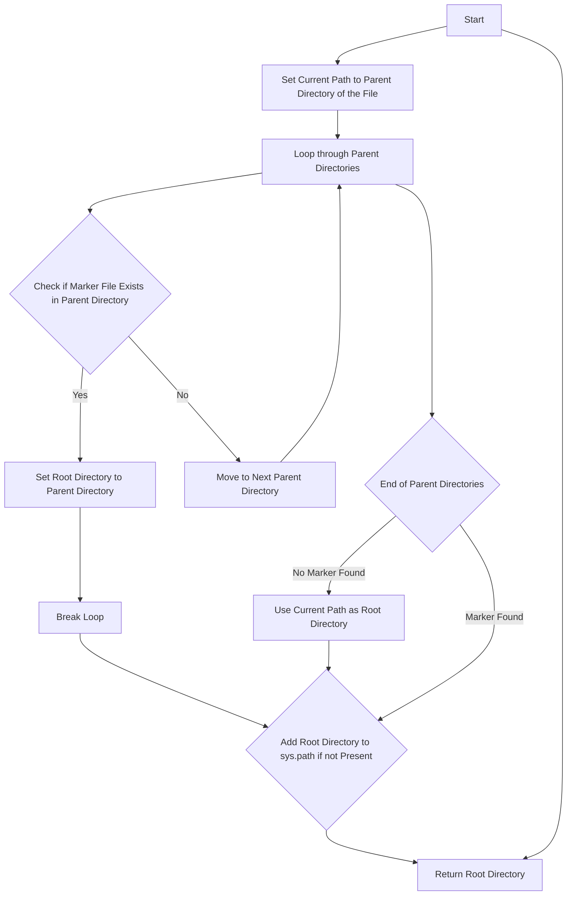

### **Анализ кода `hypotez/src/endpoints/emil/scenarios/header.py`**

#### **1. <алгоритм>**:

1.  **`set_project_root(marker_files=('__root__', '.git'))`**:
    *   Начало: Функция `set_project_root` вызывается с аргументом `marker_files`, который указывает на файлы или директории, используемые для определения корневого каталога проекта.
    *   Определение начального пути: Устанавливается текущий путь (`current_path`) как родительский каталог текущего файла.
        *   Пример: Если файл находится в `/path/to/project/src/module/file.py`, то `current_path` будет `/path/to/project/src/module`.
    *   Поиск корневого каталога:
        *   Перебираются все родительские каталоги от текущего до корневого.
        *   На каждой итерации проверяется, существует ли в текущем родительском каталоге хотя бы один из файлов-маркеров (например, `__root__` или `.git`).
        *   Если маркер найден, текущий родительский каталог устанавливается как корневой (`__root__`), и цикл прерывается.
    *   Добавление корневого каталога в `sys.path`: Если корневой каталог (`__root__`) не содержится в `sys.path`, он добавляется в начало списка путей. Это позволяет импортировать модули из корневого каталога.
    *   Возврат: Функция возвращает путь к корневому каталогу (`__root__`).
2.  **`__root__: Path = set_project_root()`**:
    *   Вызов функции: Функция `set_project_root()` вызывается без аргументов, используя значения по умолчанию для `marker_files`.
    *   Сохранение результата: Возвращаемое значение (путь к корневому каталогу) сохраняется в глобальной переменной `__root__`.
3.  Конец: `__root__` содержит путь к корневому каталогу проекта.

#### **2. <mermaid>**:



**Объяснение зависимостей:**

*   `sys`: Используется для модификации `sys.path`, что позволяет добавлять корневой каталог проекта в список путей поиска модулей. Это необходимо для правильной работы импортов внутри проекта.
*   `json`: Не используется.
*   `packaging.version`: Не используется.
*   `pathlib.Path`: Используется для работы с путями к файлам и директориям. Предоставляет удобные методы для определения родительских каталогов, проверки существования файлов и т.д.

#### **3. <объяснение>**:

*   **Импорты**:
    *   `sys`: Модуль `sys` предоставляет доступ к некоторым переменным и функциям, взаимодействующим с интерпретатором Python. Здесь он используется для изменения `sys.path`, чтобы добавить корневой каталог проекта в список путей, по которым Python ищет модули для импорта.
    *   `json`: Модуль `json` предназначен для работы с данными в формате JSON. В данном коде он не используется, но импортирован.
    *   `packaging.version`: Модуль `packaging.version` используется для работы с версиями пакетов. В данном коде он не используется, но импортирован.
    *   `pathlib`: Модуль `pathlib` предоставляет классы для представления путей файловой системы с семантикой, подходящей для разных операционных систем. Здесь он используется для работы с путями к директориям и файлам, определения родительских каталогов и проверки существования файлов.

*   **Классы**:
    *   Классы в явном виде не определены.

*   **Функции**:
    *   `set_project_root(marker_files: tuple = ('__root__', '.git')) -> Path`:
        *   Аргументы:
            *   `marker_files` (tuple): Кортеж имен файлов или директорий, которые используются для определения корневого каталога проекта. По умолчанию `('__root__', '.git')`.
        *   Возвращаемое значение:
            *   `Path`: Путь к корневому каталогу проекта.
        *   Назначение:
            *   Функция определяет корневой каталог проекта, начиная поиск от текущего файла и двигаясь вверх по дереву каталогов. Поиск останавливается, когда найден каталог, содержащий хотя бы один из файлов-маркеров.
        *   Примеры:
            ```python
            from pathlib import Path
            
            # Пример использования функции
            root_path = set_project_root()
            print(f"Root path: {root_path}")
            
            # Пример с указанием других marker_files
            root_path = set_project_root(marker_files=('setup.py',))
            print(f"Root path: {root_path}")
            ```

*   **Переменные**:
    *   `__root__`:
        *   Тип: `Path`
        *   Использование: Глобальная переменная, содержащая путь к корневому каталогу проекта.
    *   `current_path`:
        *   Тип: `Path`
        *   Использование: Локальная переменная, содержащая путь к текущему каталогу.

*   **Потенциальные ошибки и области для улучшения**:
    *   Импорты `json` и `packaging.version` не используются в коде. Их можно удалить, чтобы уменьшить размер модуля и избежать ненужных зависимостей.
    *   Функция `set_project_root` может возвращать неверный путь, если ни один из `marker_files` не найден. В этом случае возвращается каталог, где расположен скрипт, что может быть не всегда корректно. Можно добавить обработку этого случая, например, выбрасывать исключение или возвращать `None`.

*   **Взаимосвязи с другими частями проекта**:
    *   Данный модуль устанавливает корневой каталог проекта, который затем используется другими модулями для построения путей к файлам и каталогам. Например, модуль `src.logger` может использовать `__root__` для определения пути к файлу логов.

```mermaid
flowchart TD
    Start --> Header[<code>header.py</code><br> Determine Project Root]

    Header --> import[Import Global Settings: <br><code>from src import gs</code>]