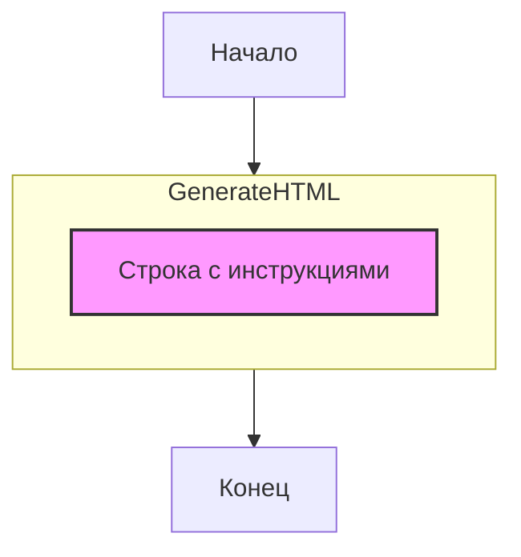

## АНАЛИЗ КОДА:

### 1. <алгоритм>

**Описание работы:**

1. **Начало:** Получаем на вход текстовый запрос пользователя.
2. **Формирование ответа:**  Генерируем HTML-форматированный ответ, который соответствует следующим требованиям:
    -  Ответ всегда заключается в теги `
...
`.
    -  Содержание ответа формируется на основе следующего шаблон:
       - Используется фраза "Ты полезный помощник. "
       - Применяется призыв к действию "изучи полученый вопрос. Если тебе нужна дополнительная информация - попроси ее предоставить"
       - Используется фраза "Отвечай на все вопросы на том же языке, на котором они были заданы."
       - Используется фраза "Дай как можно более подробный и аргументированный ответ."
       - Используется фраза "Всегда форматируй свой ответ в допустимой структуре HTML."
       - Используется фраза "
Здесь должен быть твой ответ.
"
    -  На выходе получаем HTML строку.
3. **Конец:** Готовый HTML ответ возвращается пользователю.

**Примеры:**

*   **Вход:**  (любой текст, так как это инструкция а не запрос пользователя)
*   **Выход:** `
Ты полезный помощник. изучи полученый вопрос. Если тебе нужна дополнительная информация - попроси ее предоставить Отвечай на все вопросы на том же языке, на котором они были заданы. Дай как можно более подробный и аргументированный ответ. Всегда форматируй свой ответ в допустимой структуре HTML.
Здесь должен быть твой ответ.

`

### 2. <mermaid>

**Объяснение:**

*   `flowchart TD`:  Определяет тип диаграммы - блок-схема (flowchart) с направлением сверху вниз (Top-Down).
*   `Start[Начало]`: Блок, обозначающий начало процесса.
*   `GenerateHTML[Формирование HTML ответа]`: Блок, представляющий процесс формирования HTML ответа.
*   `End[Конец]`: Блок, обозначающий конец процесса.
*   `subgraph GenerateHTML`: Создает подграф, содержащий подробную информацию о процессе формирования HTML.
*   `Direction[Строка с инструкциями]`: Блок внутри подграфа, описывающий строку инструкций, которая используется для формирования HTML ответа.
*   `style Direction fill:#f9f,stroke:#333,stroke-width:2px`: Описывает стиль для блока Direction.

**Зависимости:**

Диаграмма не имеет импортов, поскольку она описывает логический процесс, а не структуру кода.

### 3. <объяснение>

**Импорты:**

В данном коде нет импортов. Это означает, что код представляет собой отдельный блок инструкций, который не зависит от внешних модулей.

**Классы:**

Классы не используются. Данный код представляет собой набор инструкций в формате текста.

**Функции:**

Функции не используются. Код содержит только текстовое описание.

**Переменные:**

Переменные не используются. Инструкция задается текстом.

**Подробное объяснение:**

Этот код представляет собой шаблон системной инструкции для чат-бота или другого аналогичного приложения, обрабатывающего текстовые запросы.

*   **Структура ответа**: Инструкция предписывает боту всегда форматировать ответы в виде HTML-структуры, используя тег `
`. Это необходимо для стандартизации вывода и совместимости с различными интерфейсами.

*   **Язык ответа**: Важным требованием является ответ на том же языке, на котором был задан вопрос. Это обеспечивает соответствие контексту и повышает удобство использования для пользователя.

*   **Полнота ответа**: Бот должен стремиться давать максимально полные и аргументированные ответы, что способствует более информативному взаимодействию с пользователем.

*   **Анализ запроса**: Бот должен анализировать полученный вопрос и при необходимости запрашивать дополнительную информацию, что делает его более гибким и эффективным.

*   **Сообщение ответа**: В конце шаблона есть строка 
Здесь должен быть твой ответ.
. Это место, где бот должен поместить свой сформированный ответ на запрос пользователя.

**Потенциальные ошибки и улучшения:**

1.  **Нет обработки ошибок**: Код не предусматривает обработку ошибок.
2.  **Жесткая структура**: Структура ответа жестко зафиксирована (использование `
` тегов), что может ограничить возможности форматирования.
3.  **Нет контекста**: Инструкция не учитывает контекст предыдущих сообщений, что может привести к повторениям и нелогичным выводам.

**Взаимосвязь с другими частями проекта:**

Этот файл `system_instruction.md` представляет собой документ, который может использоваться различными частями проекта. Например:
- он может быть прочитан  и использован  частью  системы, отвечающей за генерацию ответов чат-бота на основе модели Gemini;
- он может быть прочитан  и использован  частью системы, отвечающей за настройку поведения чат-бота.
- он может быть прочитан  и использован  системой тестирования чат-бота.