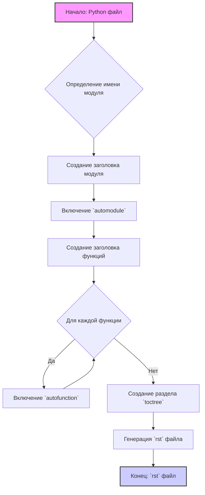

## ИНСТРУКЦИЯ:

Анализируй предоставленный код подробно и объясни его функциональность. Ответ должен включать три раздела:

1.  **<алгоритм>**: Опиши рабочий процесс в виде пошаговой блок-схемы, включая примеры для каждого логического блока, и проиллюстрируй поток данных между функциями, классами или методами.
2.  **<mermaid>**: Напиши код для диаграммы в формате `mermaid`, проанализируй и объясни все зависимости,
    которые импортируются при создании диаграммы.
    **ВАЖНО!** Убедитесь, что все имена переменных, используемые в диаграмме `mermaid`,
    имеют осмысленные и описательные имена. Имена переменных вроде `A`, `B`, `C`, и т.д., не допускаются!

    **Дополнительно**: Если в коде есть импорт `import header`, добавьте блок `mermaid` flowchart, объясняющий `header.py`:
    ```mermaid
    flowchart TD
        Start --> Header[<code>header.py</code><br> Determine Project Root]

        Header --> import[Import Global Settings: <br><code>from src import gs</code>]
    ```

3.  **<объяснение>**: Предоставьте подробные объяснения:
    *   **Импорты**: Их назначение и взаимосвязь с другими пакетами `src.`.
    *   **Классы**: Их роль, атрибуты, методы и взаимодействие с другими компонентами проекта.
    *   **Функции**: Их аргументы, возвращаемые значения, назначение и примеры.
    *   **Переменные**: Их типы и использование.
    *   Выделите потенциальные ошибки или области для улучшения.

Дополнительно, постройте цепочку взаимосвязей с другими частями проекта (если применимо).

Это обеспечивает всесторонний и структурированный анализ кода.
## Формат ответа: `.md` (markdown)
**КОНЕЦ ИНСТРУКЦИИ**

## <алгоритм>
Представленный код описывает процесс генерации документации в формате `rst` (reStructuredText) для Python файлов, с последующей компиляцией с помощью Sphinx. Алгоритм можно представить в виде следующих шагов:

1.  **Инициализация**:
    *   Получение на вход Python файла.
    *   Определение имени модуля из имени файла.

2.  **Создание заголовка**:
    *   Генерация заголовка первого уровня (`=`) с названием модуля.
    *   Пример:
    ```rst
    module_name
    ===========
    ```

3.  **Включение `automodule`**:
    *   Включение директивы Sphinx `automodule` для автоматического создания документации из модуля.
    *   Добавление опций `:members:`, `:undoc-members:`, `:show-inheritance:` для включения всех публичных членов, недокументированных членов и информации о наследовании.
    *   Пример:
    ```rst
    .. automodule:: module_name
        :members:
        :undoc-members:
        :show-inheritance:
    ```

4.  **Создание заголовка функций**:
    *   Генерация заголовка второго уровня (`-`) для секции функций.
    *   Пример:
    ```rst
    Функции
    --------
    ```

5.  **Включение `autofunction`**:
    *   Для каждой функции в модуле, включение директивы Sphinx `autofunction` для генерации документации функции.
    *   Указание полного имени функции (модуль + имя функции)
    *    Пример:
    ```rst
    .. autofunction:: module_name.function_name
    ```

6.  **Обработка комментариев**:
    *   Анализ docstring функций и методов для генерации документации.
    *   Использование формата reStructuredText для docstring (параметры, возвращаемое значение, исключения).

7.  **Генерация `toctree`**:
    *   Генерация раздела `toctree` для построения дерева содержания в `index.rst`.
    *   Включение ссылок на документации всех модулей.

8.  **Использование корректных заголовков**:
    *   Использование `rst` заголовков разных уровней (`=`, `-`, `~`, `^`).

## <mermaid>



**Разбор диаграммы `mermaid`:**

*   `A[Начало: Python файл]`: Начальный этап, представляющий собой входной Python-файл.
*   `B{Определение имени модуля}`: Логический блок, определяющий имя модуля из имени файла.
*   `C[Создание заголовка модуля]`: Блок, генерирующий заголовок первого уровня в `rst` файле.
*   `D[Включение automodule]`: Блок, включающий директиву `automodule` для автоматического документирования модуля.
*   `E[Создание заголовка функций]`: Блок, создающий заголовок второго уровня для секции функций.
*   `F{Для каждой функции}`: Логический блок, циклически обрабатывающий каждую функцию в модуле.
*   `G[Включение autofunction]`: Блок, включающий директиву `autofunction` для документирования конкретной функции.
*   `H[Создание раздела toctree]`: Блок, создающий раздел `toctree` для организации содержания.
*   `I[Генерация rst файла]`: Блок, генерирующий результирующий `rst` файл.
*  `J[Конец: rst файл]`: Конечный этап, результирующий `rst` файл.

## <объяснение>

**Общее описание:**

Представленные инструкции описывают процесс автоматической генерации документации в формате reStructuredText (`rst`) для Python-модулей с использованием инструментов Sphinx. Основная цель - автоматизировать создание хорошо структурированной и полной документации, используя docstrings и директивы Sphinx.

**Импорты:**

В предоставленном тексте нет никаких импортов. Это говорит о том, что данная инструкция описывает процесс в общих чертах, и предполагается, что все необходимые функции для преобразования Python кода в `rst` код уже реализованы.

**Классы:**

В предоставленном тексте нет классов.

**Функции:**

В предоставленном тексте описывается процесс генерации `rst` документа, в том числе для функций, но не описана никакая конкретная функция. Ожидается, что функции, использующие данное описание, будут выполнять следующие задачи:

*   **Генерация заголовков:**
    *   Функция, которая генерирует заголовок первого уровня (`=`) с названием модуля.
    *   Функция, которая генерирует заголовок второго уровня (`-`) для секции функций.
*   **Включение директив Sphinx**:
    *   Функция, которая добавляет директиву `automodule` с необходимыми опциями.
    *   Функция, которая добавляет директиву `autofunction` для каждой функции.
*   **Генерация TOC**:
    *   Функция, генерирующая `toctree` в `index.rst`.
*   **Обработка комментариев**:
    *   Функция, парсящая `docstring` в формате reStructuredText для функций.

**Переменные:**

В тексте не используются переменные в явном виде. Ожидается, что переменные будут использоваться для:

*   `module_name`: Имя модуля, полученное из имени файла.
*   `function_name`: Имя функции.
*   `param`, `param1`: Параметры функций.

**Потенциальные ошибки и области для улучшения:**

1.  **Отсутствие обработки исключений**: В примере docstring используется `ex:` вместо `e:`.
2.  **Обработка исключений:** В докстринге описана обработка исключений `SomeError`, которая, возможно, не будет использоваться при обработке реального кода.
3.  **Автоматическое определение функций**: Код должен автоматически находить все функции в модуле и добавлять `autofunction` для каждой из них.
4.  **Обработка классов**: В тексте не описана обработка классов.
5.  **Автоматическое определение классов**: Неясно, как будет определен список классов, которые также должны быть включены в `rst` документацию.
6.  **Гибкость**: Не рассмотрена обработка других директив `rst`, которые могут потребоваться.

**Взаимосвязи с другими частями проекта:**

1.  **Интеграция со Sphinx**: Этот код непосредственно предназначен для использования со Sphinx, поэтому он зависит от возможностей Sphinx и его директив.
2.  **Интеграция с парсером Python**: Код предполагает использование парсера, который может анализировать код Python и выделять docstring, имена модулей и функций.
3.  **Система сборки**: Сгенерированные `rst` файлы должны быть включены в систему сборки проекта, использующую Sphinx для генерации финальной документации.

Этот анализ дает подробное понимание процесса создания документации в формате `rst` на основе Python кода.