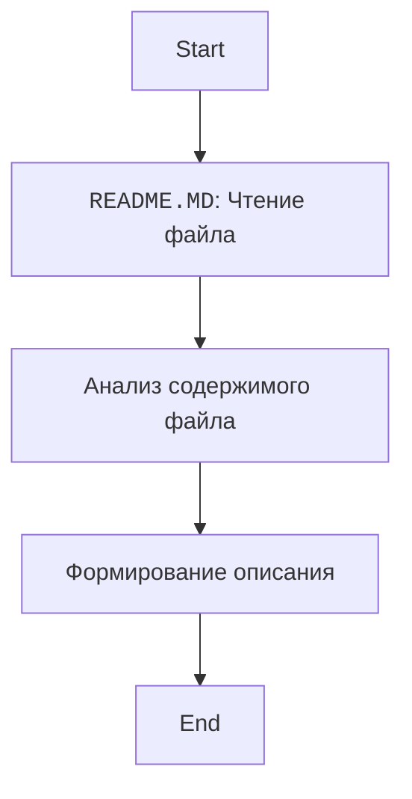

## ИНСТРУКЦИЯ:

Анализ содержимого файла `README.MD` в директории `hypotez/src/endpoints/kazarinov/instructions/`.

### <алгоритм>

1.  **Чтение файла:** Файл `README.MD` открывается и его содержимое читается как строка.
2.  **Анализ содержимого:** Строка анализируется на предмет наличия ключевых слов и их контекста.
3.  **Описание:** На основе анализа составляется описание содержимого файла.

Пример:
В данном случае, файл описывает содержимое директории `instructions` и перечисляет два файла - `system_instruction_mexiron.md` и `command_instruction_mexiron.md` и дает их краткое описание.

### <mermaid>

**Объяснение зависимостей `mermaid`:**
-   `flowchart TD` - определяет тип диаграммы - блок-схема, и направление сверху вниз.
-   `Start`, `ReadFile`, `AnalyzeContent`, `DescribeContent`, `End` - узлы диаграммы, каждый из которых представляет шаг алгоритма. Текст в квадратных скобках  ` `  добавляет перевод на руский язык.
-   `-->` - указывает поток данных и последовательность шагов в алгоритме.

### <объяснение>

**Импорты:**

В данном файле `README.MD` нет импортов кода Python, так как это текстовый файл с описанием.

**Классы:**

В данном файле `README.MD` нет классов, так как это текстовый файл с описанием.

**Функции:**

В данном файле `README.MD` нет функций, так как это текстовый файл с описанием.

**Переменные:**

В данном файле `README.MD` нет переменных, так как это текстовый файл с описанием.

**Объяснение содержимого файла:**

Файл `README.MD` в директории `hypotez/src/endpoints/kazarinov/instructions/` служит для описания содержимого этой директории. В нем указано, что в директории находятся инструкции и системные запросы для модели ИИ.  В частности, описаны два файла:

1.  `system_instruction_mexiron.md` -  описывает поведение модели ИИ при инициализации.
2.  `command_instruction_mexiron.md` -  описывает шаблон ответа модели.

**Взаимосвязь с другими частями проекта:**

Эта директория и файлы в ней являются частью проекта `hypotez`. Они используются для настройки поведения модели ИИ, возможно, для конкретных задач или модулей. В частности, директория `hypotez/src/endpoints/kazarinov`  указывает, что эти инструкции относятся к конкретному разделу или модулю проекта, связанному с пользователем или разработчиком "Kazarinov". Эти файлы определяют как модель будет работать и отвечать в контексте данного модуля.

**Потенциальные ошибки или области для улучшения:**

-   Файл `README.MD` является хорошим начальным описанием, но может быть улучшен для более подробного описания каждого файла, например, может быть добавлен  пример контента каждого файла, или описано,  какие компоненты системы используют эти файлы.

**Заключение:**

Файл `README.MD` является информационным файлом для разработчиков, использующих проект. Он предоставляет важную информацию о назначении файлов, содержащихся в директории, и их роли в системе.