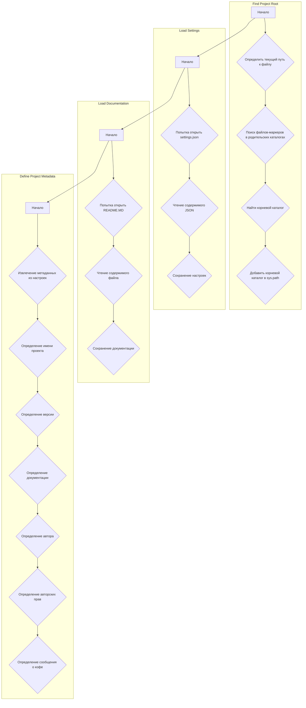
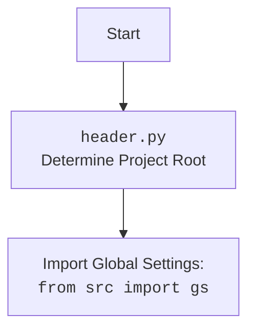

### **Анализ кода `hypotez/src/endpoints/kazarinov/report_generator/header.py`**

=========================================================================================

#### **1. <алгоритм>**:

1.  **`set_project_root(marker_files=('__root__', '.git'))`**:
    *   Начинает поиск корневого каталога проекта от текущего файла.
    *   Перебирает родительские каталоги, пока не найдет каталог, содержащий один из файлов-маркеров (`'__root__'` или `'.git'`).
    *   Если такой каталог найден, он устанавливается как корневой.
    *   Добавляет корневой каталог в `sys.path`, если его там еще нет.

    ```python
    current_path = Path(__file__).resolve().parent
    __root__ = current_path
    for parent in [current_path] + list(current_path.parents):
        if any((parent / marker).exists() for marker in marker_files):
            __root__ = parent
            break
    if __root__ not in sys.path:
        sys.path.insert(0, str(__root__))
    ```

2.  **Определение `__root__`**:
    *   Вызывает функцию `set_project_root()` для определения корневого каталога проекта.
    *   Сохраняет путь к корневому каталогу в переменной `__root__`.

    ```python
    __root__ = set_project_root()
    ```

3.  **Импорт `gs`**:
    *   Импортирует модуль `gs` из пакета `src`.

    ```python
    from src import gs
    ```

4.  **Чтение `settings.json`**:
    *   Пытается прочитать файл `settings.json` из каталога `src` в корневом каталоге проекта.
    *   Если файл найден и успешно прочитан, его содержимое сохраняется в переменной `settings`.
    *   Обрабатывает исключения `FileNotFoundError` и `json.JSONDecodeError`, если файл не найден или содержит невалидный JSON.

    ```python
    try:
        with open(gs.path.root / 'src' /  'settings.json', 'r') as settings_file:
            settings = json.load(settings_file)
    except (FileNotFoundError, json.JSONDecodeError):
        ...
    ```

5.  **Чтение `README.MD`**:
    *   Пытается прочитать файл `README.MD` из каталога `src` в корневом каталоге проекта.
    *   Если файл найден и успешно прочитан, его содержимое сохраняется в переменной `doc_str`.
    *   Обрабатывает исключения `FileNotFoundError` и `json.JSONDecodeError`, если файл не найден или не может быть прочитан.

    ```python
    try:
        with open(gs.path.root / 'src' /  'README.MD', 'r') as settings_file:
        doc_str = settings_file.read()
    except (FileNotFoundError, json.JSONDecodeError):
        ...
    ```

6.  **Определение метаданных проекта**:
    *   Извлекает метаданные проекта (имя, версию, описание, автора, авторские права и сообщение о кофе) из `settings`, если `settings` существует, иначе устанавливает значения по умолчанию.

    ```python
    __project_name__ = settings.get("project_name", 'hypotez') if settings  else 'hypotez'
    __version__: str = settings.get("version", '')  if settings  else ''
    __doc__: str = doc_str if doc_str else ''
    __details__: str = ''
    __author__: str = settings.get("author", '')  if settings  else ''
    __copyright__: str = settings.get("copyrihgnt", '')  if settings  else ''
    __cofee__: str = settings.get("cofee", "Treat the developer to a cup of coffee for boosting enthusiasm in development: https://boosty.to/hypo69")  if settings  else "Treat the developer to a cup of coffee for boosting enthusiasm in development: https://boosty.to/hypo69"
    ```

#### 2. **<mermaid>**:



**Объяснение зависимостей `mermaid`**:

*   `pathlib`: Используется для манипулирования путями к файлам и каталогам.
*   `sys`: Используется для работы с путями к модулям и добавления корневого каталога проекта в `sys.path`.
*   `json`: Используется для чтения данных из `settings.json`.
*   `src`: Используется для импорта глобальных настроек (`gs`).



#### 3. **<объяснение>**:

*   **Импорты**:
    *   `sys`: Этот модуль предоставляет доступ к некоторым переменным и функциям, взаимодействующим с интерпретатором Python. Здесь используется для добавления корневого каталога проекта в `sys.path`.
    *   `json`: Используется для работы с данными в формате JSON, в частности для чтения файла `settings.json`.
    *   `pathlib`: Предоставляет классы для представления путей файловой системы с семантикой, подходящей для разных операционных систем.
    *   `src.gs`: `gs` (global settings) используется для доступа к глобальным настройкам проекта, включая пути к различным каталогам. Этот модуль обеспечивает централизованное управление настройками и путями в проекте.

*   **Функции**:
    *   `set_project_root(marker_files=('__root__', '.git')) -> Path`:
        *   **Аргументы**:
            *   `marker_files (tuple)`: Список файлов или каталогов, которые используются для определения корневого каталога проекта. По умолчанию используются `'__root__'` и `'.git'`.
        *   **Возвращаемое значение**:
            *   `Path`: Путь к корневому каталогу проекта.
        *   **Назначение**:
            *   Функция `set_project_root` используется для определения корневого каталога проекта. Она ищет в родительских каталогах файлы-маркеры (`'__root__'` или `'.git'`). Как только один из этих файлов найден, каталог, содержащий его, считается корневым.
        *   **Пример**:

        ```python
        root_path = set_project_root()
        print(root_path)
        ```

*   **Переменные**:
    *   `__root__`: Содержит путь к корневому каталогу проекта.
    *   `settings`: Содержит словарь с настройками проекта, прочитанными из файла `settings.json`.
    *   `doc_str`: Содержит строку с содержимым файла `README.MD`.
    *   `__project_name__`: Содержит имя проекта, считанное из `settings.json` или значение по умолчанию `'hypotez'`.
    *   `__version__`: Содержит версию проекта, считанную из `settings.json` или пустую строку.
    *   `__doc__`: Содержит описание проекта, взятое из `README.MD` или пустую строку.
    *   `__details__`: Содержит дополнительные детали проекта (в данном коде всегда пустая строка).
    *   `__author__`: Содержит имя автора проекта, считанное из `settings.json` или пустую строку.
    *   `__copyright__`: Содержит информацию об авторских правах, считанную из `settings.json` или пустую строку.
    *   `__cofee__`: Содержит сообщение с предложением угостить разработчика кофе, считанное из `settings.json` или сообщение по умолчанию.

*   **Потенциальные ошибки и области для улучшения**:
    *   Обработка исключений: В блоках `try...except` для чтения `settings.json` и `README.MD` используется `...` в блоке `except`. Рекомендуется добавить логирование ошибок с использованием `logger.error` для более информативной отладки.
    *   Использование `j_loads` или `j_loads_ns`: Для чтения `settings.json` следует использовать `j_loads` или `j_loads_ns` вместо стандартных `open` и `json.load`.
    *   Кодировка файлов: Явно указывать кодировку при открытии файлов, например `encoding='utf-8'`.

*   **Взаимосвязи с другими частями проекта**:
    *   Этот файл отвечает за определение метаданных проекта и загрузку настроек из `settings.json`. Эти метаданные могут использоваться в других частях проекта, например, при генерации отчетов или в пользовательском интерфейсе.
    *   Функция `set_project_root` важна для определения абсолютных путей к файлам и каталогам в проекте, что необходимо для правильной работы с ресурсами.
    *   Модуль `gs` предоставляет доступ к глобальным настройкам проекта, что позволяет другим модулям получать доступ к общим параметрам конфигурации.