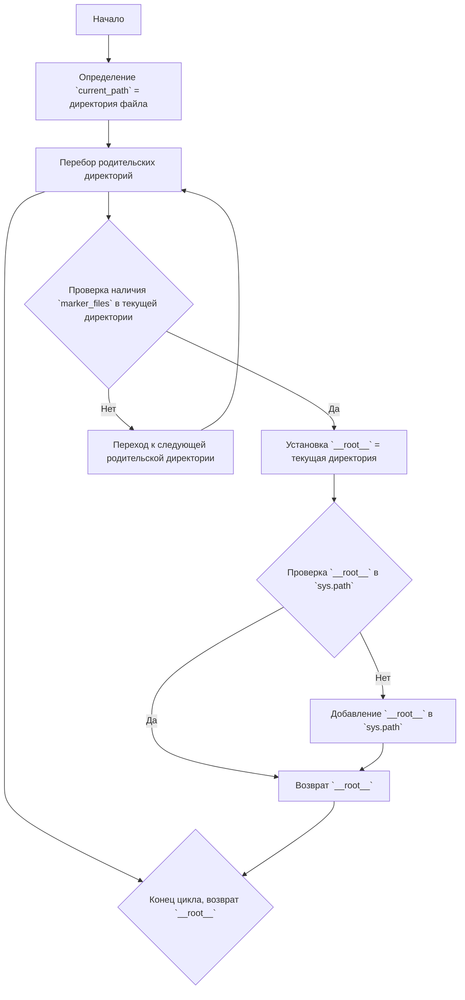

### **Анализ кода `header.py`**

#### **1. <алгоритм>**:
1. **Начало**: Функция `set_project_root` вызывается без аргументов, используя значения по умолчанию для `marker_files` (`'__root__'`, `'.git'`).
2. **Определение начальной директории**:
   - `current_path` устанавливается в директорию, содержащую файл `header.py`.
   - Пример: Если `header.py` находится в `/path/to/project/src/endpoints/kazarinov/scenarios/`, то `current_path` будет `/path/to/project/src/endpoints/kazarinov/scenarios/`.
3. **Поиск корневой директории**:
   - Перебираются директории от `current_path` до корневой директории файловой системы.
   - Для каждой директории проверяется наличие хотя бы одного файла или директории из `marker_files`.
   - Если один из `marker_files` найден, текущая директория устанавливается как корневая (`__root__`) и поиск прекращается.
   - Пример: Если в `/path/to/project/` есть файл `.git`, то `/path/to/project/` будет установлена как корневая директория.
4. **Добавление корневой директории в `sys.path`**:
   - Проверяется, что корневая директория (`__root__`) отсутствует в `sys.path`.
   - Если отсутствует, корневая директория добавляется в начало `sys.path`. Это нужно для правильной работы импортов.
5. **Возврат корневой директории**:
   - Функция возвращает объект `Path`, представляющий корневую директорию проекта.

#### **2. <mermaid>**:



**Объяснение зависимостей в `mermaid`**:

- `pathlib`: Используется для работы с путями к файлам и директориям. `Path` позволяет абстрагироваться от операционной системы при работе с файловой системой.
- `sys`: Используется для модификации `sys.path`, что необходимо для добавления корневой директории проекта в пути поиска модулей.

#### **3. <объяснение>**:

- **Импорты**:
  - `sys`: Модуль `sys` предоставляет доступ к некоторым переменным и функциям, взаимодействующим с интерпретатором Python. Здесь он используется для изменения `sys.path`, чтобы добавить корневую директорию проекта в список путей поиска модулей.
  - `pathlib`: Модуль `pathlib` предоставляет классы для представления путей файловой системы с семантикой, подходящей для разных операционных систем. Класс `Path` используется для представления и манипулирования путями к файлам и директориям.

- **Классы**:
  - Нет классов в данном коде.

- **Функции**:
  - `set_project_root(marker_files: tuple = ('__root__', '.git')) -> Path`:
    - **Аргументы**:
      - `marker_files` (tuple): Кортеж имен файлов или директорий, которые используются для определения корневой директории проекта. По умолчанию (`'__root__'`, `'.git'`).
    - **Возвращаемое значение**:
      - `Path`: Объект `Path`, представляющий корневую директорию проекта.
    - **Назначение**:
      - Функция ищет корневую директорию проекта, начиная с директории, содержащей текущий файл, и двигаясь вверх по дереву директорий. Поиск останавливается, когда найдена директория, содержащая один из `marker_files`. Если ни один из маркеров не найден, возвращается директория, в которой находится скрипт. После этого корневая директория добавляется в `sys.path`, если её там ещё нет.
    - **Пример**:
      ```python
      from pathlib import Path
      import sys
      
      # Создаем структуру директорий и файлы для теста
      Path("./test_project/__root__").mkdir(parents=True, exist_ok=True)
      Path("./test_project/src").mkdir(parents=True, exist_ok=True)
      
      # Создаем фиктивный файл __file__ для имитации работы функции
      __file__ = "./test_project/src/test.py"
      
      def set_project_root(marker_files: tuple = ('__root__', '.git')) -> Path:
          current_path: Path = Path(__file__).resolve().parent
          __root__ = current_path
          for parent in [current_path] + list(current_path.parents):
              if any((parent / marker).exists() for marker in marker_files):
                  __root__ = parent
                  break
          if __root__ not in sys.path:
              sys.path.insert(0, str(__root__))
          return __root__
      
      # Вызываем функцию
      root_path = set_project_root()
      
      # Проверяем результат
      print(f"Root path: {root_path}")
      
      # Output:
      # Root path: test_project
      ```

- **Переменные**:
  - `__root__` (Path): Объект `Path`, представляющий корневую директорию проекта.
  - `current_path` (Path): Объект `Path`, представляющий директорию, в которой находится текущий файл.

- **Потенциальные ошибки и области для улучшения**:
  - Функция может не найти корневую директорию, если ни один из `marker_files` не существует в дереве директорий. В этом случае будет возвращена директория, содержащая скрипт.
  - Отсутствует обработка исключений, если при работе с файловой системой возникают ошибки (например, нет прав доступа).

- **Взаимосвязи с другими частями проекта**:
  - Эта функция важна для определения корневой директории проекта, что необходимо для правильной работы импортов. Она используется в других модулях проекта для получения доступа к файлам и ресурсам, расположенным в корневой директории.