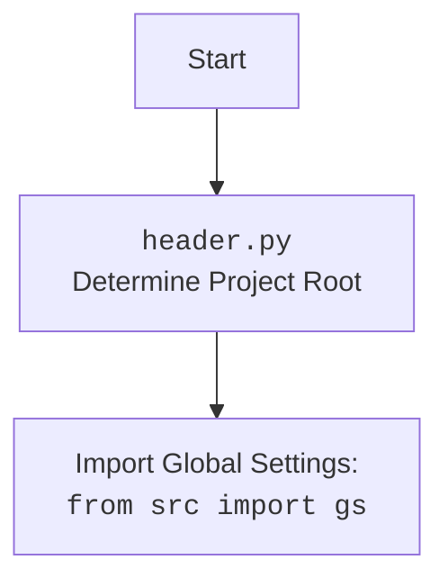

# Проект `hypotez`
# Роль `code explainer`
## АНАЛИЗ КОДА: `hypotez/src/endpoints/kazarinov/scenarios/scenario.py`

### 1. <алгоритм>

#### `fetch_target_urls_onetab`
1.  **Начало**: Функция принимает URL OneTab (`one_tab_url`) в качестве входных данных.
2.  **Запрос к OneTab**: Отправляет HTTP-запрос GET по указанному URL с таймаутом в 10 секунд.
    *   Пример: `requests.get('http://example.com/onetab', timeout=10)`
3.  **Обработка ответа**: Проверяет статус ответа; если статус не 200, вызывает исключение.
    *   Пример: `response.raise_for_status()`
4.  **Извлечение данных**: Использует BeautifulSoup для парсинга HTML-контента ответа.
    *   Извлекает все URL-адреса из элементов `<a>` с классом `tabLink`.
        *   Пример: `[a['href'] for a in soup.find_all('a', class_='tabLink')]`
    *   Извлекает текст из элемента `<div>` с классом `tabGroupLabel`. Если элемент не найден, `data` устанавливается в `None`.
        *   Пример: `element = soup.find('div', class_='tabGroupLabel'); data = element.get_text() if element else None`
5.  **Разбор данных**: Если `data` не равно `None`, разделяет его на `price` и `mexiron_name`.
    *   Если первая часть `data` является числом, она устанавливается как `price`; в противном случае `price` остается пустой строкой.
        *   Пример: `parts = data.split(maxsplit=1); price = int(parts[0]) if parts[0].isdigit() else ""`
    *   Оставшаяся часть `data` устанавливается как `mexiron_name`. Если частей больше одной, используется вторая часть; в противном случае используется текущее время из `gs.now`.
        *   Пример: `mexiron_name = parts[1] if len(parts) > 1 else gs.now`
6.  **Возврат результатов**: Возвращает кортеж, содержащий `price`, `mexiron_name` и список `urls`.
    *   Пример: `return price, mexiron_name, urls`
7.  **Обработка исключений**: Если во время HTTP-запроса возникает исключение, регистрирует ошибку с помощью `logger.error` и возвращает `False, False, False`.
    *   Пример:

```python
    except requests.exceptions.RequestException as ex:
        logger.error(f"Ошибка при выполнении запроса: {one_tab_url=}", ex)
        ...
        return False, False, False
```

#### `Scenario.run_scenario_async`
1.  **Начало**: Функция принимает список URL-адресов (`urls`), цену (`price`), имя (`mexiron_name`), объект бота (`bot`) и идентификатор чата (`chat_id`) в качестве входных данных.
2.  **Инициализация**: Инициализирует пустой список `products_list` для хранения данных о продуктах.
3.  **Итерация по URL-адресам**: Перебирает каждый URL в списке `urls`.
    *   Инициализирует пустой словарь `kwards`.
    *   Получает граббер (`Graber`) для текущего URL с помощью `get_graber_by_supplier_url`.
        *   Пример: `graber = get_graber_by_supplier_url(self.driver, url, lang_index, **kwards)`
    *   Если граббер не найден, регистрирует ошибку и переходит к следующему URL.
        *   Пример:

```python
            if not graber:
                logger.error(f"Нет грабера для: {url}")
                bot.send_message(chat_id, f"Нет грабера для: {url}")
                ...
                continue
```

    *   Пытается получить поля продукта, используя `graber.grab_page_async`.
        *   Пример: `f = await graber.grab_page_async(*self.required_fields)`
    *   Если получение полей продукта не удалось, регистрирует ошибку и переходит к следующему URL.
        *   Пример:

```python
            except Exception as ex:
                logger.error(f"Failed... Ошибка получения полей товара {url}:", ex)
                if bot: bot.send_message(chat_id, f"Failed... Ошибка получения полей товара {url}\n{ex}")
                continue
```

    *   Преобразует поля продукта в формат данных продукта, используя `self.convert_product_fields`.
        *   Пример: `product_data = self.convert_product_fields(f)`
    *   Если преобразование не удалось, регистрирует ошибку и переходит к следующему URL.
        *   Пример:

```python
            if not product_data:
                logger.error(f"Failed to convert product fields: {product_data}")
                if bot: bot.send_message(chat_id, f"Failed to convert product fields {url} \n {product_data}")
                continue
```

    *   Сохраняет данные о продукте, используя `self.save_product_data`.
        *   Пример: `await self.save_product_data(product_data)`
    *   Добавляет данные о продукте в список `products_list`.
        *   Пример: `products_list.append(product_data)`
4.  **AI Processing**:
    *   Определяет список языков (`langs_list`) для AI обработки.
    *   Перебирает каждый язык в списке `langs_list`.
        *   Выполняет AI обработку списка продуктов, используя `self.process_ai_async`.
            *   Пример: `data = await self.process_ai_async(products_list, lang)`
        *   Если AI обработка не удалась, регистрирует исключение и переходит к следующему языку.
            *   Пример:

```python
            except Exception as ex:
                logger.exception(f"AI processing failed for {lang=}")
                if bot: bot.send_message(chat_id, f"AI processing failed for {lang=}: {ex}")
                continue
```

5.  **Создание отчета**:
    *   Извлекает данные для текущего языка из результата AI обработки.
        *   Пример: `data = data[lang]`
    *   Добавляет цену и валюту в данные.
        *   Пример:

```python
            data["price"] = price
            data["currency"] = getattr(self.translations.currency, lang, "ש''ח")
```

    *   Сохраняет данные в JSON-файл, используя `j_dumps`.
        *   Пример: `j_dumps(data, self.export_path / f'{self.mexiron_name}_{lang}.json')`
    *   Создает отчеты, используя `ReportGenerator.create_reports_async`.
        *   Пример:

```python
            reporter = ReportGenerator(if_need_docx=False)
            await reporter.create_reports_async(bot = bot,
                                chat_id = chat_id,
                                data = data,
                                lang = lang,
                                mexiron_name = self.mexiron_name
                                    )
```

6.  **Завершение**: Возвращает `True` после завершения сценария.

### 2. <mermaid>

```mermaid
flowchart TD
    subgraph fetch_target_urls_onetab
        A[Начало: Принимает one_tab_url] --> B{HTTP запрос GET к one_tab_url}
        B --> C{Обработка ответа}
        C --> D{Извлечение URL из tabLink}
        D --> E{Извлечение данных из tabGroupLabel}
        E --> F{Разбор данных на цену и имя}
        F --> G{Возврат price, mexiron_name, urls}
        C --> H{Обработка исключений}
        H --> I[Логирование ошибки и возврат False, False, False]
    end

    subgraph Scenario.run_scenario_async
        J[Начало: Принимает urls, price, mexiron_name, bot, chat_id] --> K{Инициализация products_list}
        K --> L{Итерация по urls}
        L --> M{Получение граббера для URL}
        M --> N{Проверка граббера}
        N -- Нет граббера --> O[Логирование ошибки и переход к следующему URL]
        N -- Есть граббер --> P{Получение полей продукта}
        P --> Q{Обработка ошибок получения полей}
        Q -- Ошибка --> R[Логирование ошибки и переход к следующему URL]
        Q -- Нет ошибки --> S{Преобразование полей продукта}
        S --> T{Проверка преобразования}
        T -- Ошибка --> U[Логирование ошибки и переход к следующему URL]
        T -- Нет ошибки --> V{Сохранение данных о продукте}
        V --> W{Добавление данных в products_list}
        W --> L
        L --> X{AI Processing}
        X --> Y{Итерация по языкам (langs_list)}
        Y --> Z{Выполнение AI обработки}
        Z --> AA{Обработка ошибок AI обработки}
        AA -- Ошибка --> AB[Логирование ошибки и переход к следующему языку]
        AA -- Нет ошибки --> AC{Создание отчета}
        AC --> AD{Извлечение данных для языка}
        AD --> AE{Добавление цены и валюты}
        AE --> AF{Сохранение данных в JSON}
        AF --> AG{Создание отчетов (ReportGenerator)}
        AG --> Y
        Y --> AH[Завершение: Возврат True]
    end

    fetch_target_urls_onetab --> Scenario.run_scenario_async
```

**Объяснение диаграммы:**

Диаграмма `mermaid` отображает поток управления в функциях `fetch_target_urls_onetab` и `Scenario.run_scenario_async`.

*   `fetch_target_urls_onetab` извлекает данные из URL OneTab, обрабатывает ответ, извлекает URL-адреса и метаданные, а затем возвращает извлеченные данные.
*   `Scenario.run_scenario_async` перебирает список URL-адресов, получает данные о продуктах, обрабатывает их с помощью AI и генерирует отчеты.



### 3. <объяснение>

#### Импорты:

*   `bs4.BeautifulSoup`: Используется для парсинга HTML-контента.
*   `requests`: Используется для выполнения HTTP-запросов.
*   `telebot`: Используется для взаимодействия с Telegram ботом.
*   `asyncio`: Используется для поддержки асинхронного программирования.
*   `pathlib.Path`: Используется для работы с путями к файлам и каталогам.
*   `typing.Optional`, `typing.List`: Используется для аннотации типов.
*   `header`: Определяет корень проекта.
*   `src.gs`: Глобальные настройки проекта.
*   `src.webdriver.driver.Driver`: Класс для управления веб-драйвером.
*   `src.webdriver.firefox.Firefox`: Класс для управления Firefox веб-драйвером.
*   `src.webdriver.playwright.Playwrid`: Класс для управления Playwright веб-драйвером.
*   `src.ai.gemini.GoogleGenerativeAI`: Класс для интеграции с Google Gemini AI.
*   `src.endpoints.kazarinov.report_generator.report_generator.ReportGenerator`: Класс для генерации отчетов.
*   `src.endpoints.kazarinov.scenarios.quotation_builder.QuotationBuilder`: Базовый класс для создания сценариев.
*   `src.endpoints.prestashop.product_fields.product_fields.ProductFields`: Класс для работы с полями продукта PrestaShop.
*   `src.suppliers.get_graber_by_supplier.get_graber_by_supplier_url`: Функция для получения граббера по URL поставщика.
*   `src.utils.jjson.j_dumps`: Функция для записи данных в JSON-файл.
*   `src.logger.logger.logger`: Модуль для логирования.

#### Классы:

*   `Scenario(QuotationBuilder)`: Класс для выполнения сценария парсинга и обработки данных для Казаринова.
    *   Атрибуты:
        *   `driver`: Экземпляр веб-драйвера (`Firefox` или `Playwrid`).
        *   `mexiron_name`: Имя для идентификации сценария.
    *   Методы:
        *   `__init__(self, mexiron_name: str = gs.now, driver: Firefox | Playwrid | str = None, **kwards)`: Инициализирует экземпляр класса, настраивает веб-драйвер и вызывает конструктор родительского класса `QuotationBuilder`.
        *   `async run_scenario_async(self, urls: List[str], price: str = '', mexiron_name: str = gs.now, bot: telebot.TeleBot = None, chat_id: int = 0, attempts: int = 3) -> bool`: Выполняет сценарий: парсит продукты, обрабатывает их с помощью AI и сохраняет данные.

#### Функции:

*   `fetch_target_urls_onetab(one_tab_url: str) -> tuple[str, str, list[str]] | bool`: Извлекает целевые URL-адреса из OneTab URL.
    *   Аргументы:
        *   `one_tab_url (str)`: URL OneTab.
    *   Возвращаемое значение:
        *   `tuple[str, str, list[str]] | bool`: Кортеж, содержащий цену, имя и список URL-адресов, или `False` в случае ошибки.
    *   Пример:

```python
    price, mexiron_name, urls = fetch_target_urls_onetab("http://example.com/onetab")
```

*   `run_sample_scenario() -> None`: Запускает пример сценария.
    *   Создает экземпляр класса `Scenario` и запускает метод `run_scenario_async` с предопределенными URL-адресами.
*   `if __name__ == '__main__':`: Запускает `run_sample_scenario()`, если скрипт запущен как основной.

#### Переменные:

*   `ENDPOINT (str)`: Константа, определяющая endpoint "kazarinov".
*   `urls_list (List[str])`: Список URL-адресов для парсинга в `run_sample_scenario`.

#### Потенциальные ошибки и области для улучшения:

*   Обработка исключений в `fetch_target_urls_onetab` возвращает `False, False, False`, что может быть неинформативно. Лучше возвращать `None` или поднимать исключение.
*   В `Scenario.run_scenario_async` много повторяющегося кода для обработки ошибок и отправки сообщений боту. Можно вынести эту логику в отдельную функцию.
*   Отсутствует обработка ошибок при создании отчетов.
*   В `run_sample_scenario` можно добавить параметры для настройки сценария через аргументы командной строки.

#### Взаимосвязи с другими частями проекта:

*   `Scenario` использует `QuotationBuilder` для создания предложений.
*   `Scenario` использует `Driver`, `Firefox` и `Playwrid` для управления веб-драйверами.
*   `Scenario` использует `GoogleGenerativeAI` для обработки данных с помощью AI.
*   `Scenario` использует `ReportGenerator` для создания отчетов.
*   `Scenario` использует `get_graber_by_supplier_url` для получения грабберов для разных поставщиков.
*   `Scenario` использует `j_dumps` для сохранения данных в JSON-файл.
*   `Scenario` использует `logger` для логирования.
*   `Scenario` использует `gs` для получения глобальных настроек.

```