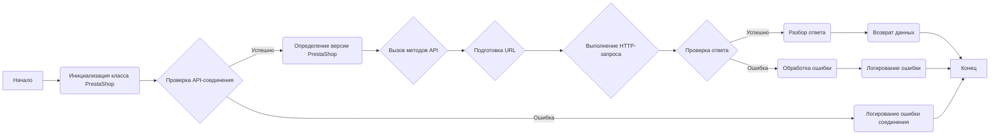
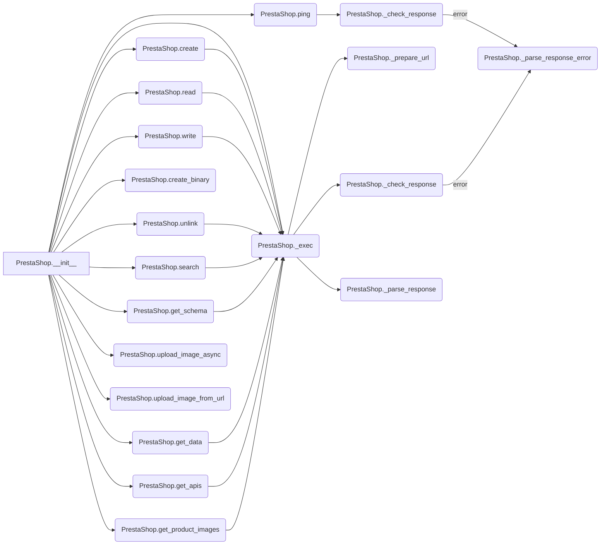
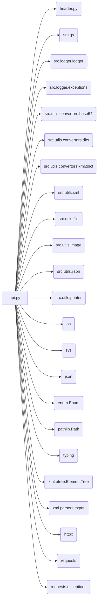
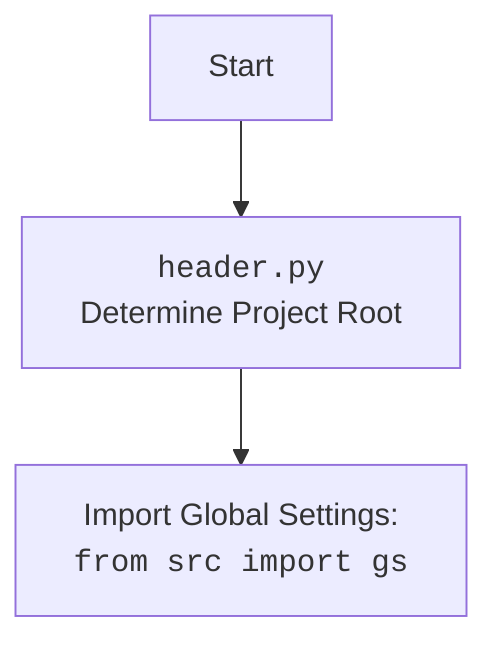

## Анализ кода модуля `api.py`

### 1. <алгоритм>

#### Обзор
Модуль `api.py` предоставляет класс `PrestaShop` для взаимодействия с API PrestaShop. Он поддерживает основные операции CRUD (Create, Read, Update, Delete), поиск и загрузку изображений. Класс использует HTTP-запросы для взаимодействия с API, поддерживает форматы данных JSON и XML, обрабатывает ошибки и предоставляет различные методы для работы с ресурсами PrestaShop.

#### Блок-схема работы класса `PrestaShop`



1.  **Начало**: Начало работы с классом `PrestaShop`.
2.  **Инициализация класса PrestaShop**: Инициализация объекта класса `PrestaShop` с параметрами `api_key`, `api_domain`, `data_format`, `default_lang` и `debug`.
    *   Пример:

    ```python
    api = PrestaShop(
        api_domain='https://your-prestashop-domain.com',
        api_key='your_api_key',
        default_lang=1,
        debug=True,
        data_format='JSON',
    )
    ```
3.  **Проверка API-соединения**: Проверка доступности API PrestaShop путем отправки `HEAD`-запроса.
4.  **Определение версии PrestaShop**: Получение версии PrestaShop из заголовков ответа.
5.  **Логирование ошибки соединения**: В случае ошибки соединения, запись информации об ошибке в лог.
6.  **Вызов методов API**: Вызов различных методов API (`create`, `read`, `write`, `unlink`, `search`, `create_binary`, `get_schema`, `get_data`, `get_apis`, `upload_image_async`, `upload_image_from_url`, `get_product_images`).
7.  **Подготовка URL**: Формирование полного URL для запроса к API с учетом параметров, фильтров и идентификаторов ресурсов.
    *   Пример:

    ```python
    url = self._prepare_url(
        f'{self.api_domain}{resource}/{resource_id}' if resource_id else f'{self.api_domain}{resource}',
        {
            'filter': search_filter,
            'display': display,
            'schema': schema,
            'sort': sort,
            'limit': limit,
            'language': language,
            'output_format': data_format
        }
    )
    ```
8.  **Выполнение HTTP-запроса**: Отправка HTTP-запроса (GET, POST, PUT, DELETE) к API PrestaShop.
9.  **Проверка ответа**: Проверка статуса HTTP-ответа. Если статус код 200 или 201, то ответ считается успешным.
10. **Разбор ответа**: Разбор ответа API в формате JSON или XML в структуру данных Python (словарь).
    *   Пример:

    ```python
    data = response.json() if self.data_format == 'JSON' else xml2dict(response.text)
    ```
11. **Обработка ошибки**: В случае ошибки, разбор сообщения об ошибке из ответа API.
12. **Логирование ошибки**: Запись информации об ошибке в лог.
13. **Возврат данных**: Возврат полученных данных из API.
14. **Конец**: Завершение работы с классом `PrestaShop`.

#### Взаимодействие методов



### 2. <mermaid>

#### Диаграмма зависимостей



#### Объяснение зависимостей

*   `api.py`: Основной модуль, предоставляющий класс `PrestaShop` для взаимодействия с API PrestaShop.
*   `header.py`: Модуль, определяющий корневой каталог проекта. Используется для настройки путей и импорта глобальных настроек.
*   `src.gs`: Модуль, содержащий глобальные настройки проекта.
*   `src.logger.logger`: Модуль логирования для записи информации о работе программы и ошибок.
*   `src.logger.exceptions`: Модуль, содержащий пользовательские исключения для обработки ошибок API PrestaShop.
*   `src.utils.convertors.base64`: Модуль для работы с кодированием Base64.
*   `src.utils.convertors.dict`: Модуль для преобразования данных в формат словаря.
*   `src.utils.convertors.xml2dict`: Модуль для преобразования XML в словарь Python.
*   `src.utils.xml`: Модуль для работы с XML-документами, включая сохранение XML в файл.
*   `src.utils.file`: Модуль для работы с файлами, включая сохранение текста в файл.
*   `src.utils.image`: Модуль для работы с изображениями, включая асинхронную загрузку и сохранение изображений из URL.
*   `src.utils.jjson`: Модуль для работы с JSON, включая форматирование и загрузку JSON-данных.
*   `src.utils.printer`: Модуль для красивой печати данных.
*   `os`: Модуль для взаимодействия с операционной системой.
*   `sys`: Модуль для доступа к некоторым переменным и функциям, взаимодействующим с интерпретатором Python.
*   `json`: Модуль для работы с JSON-данными.
*   `enum.Enum`: Модуль для создания перечислений.
*   `pathlib.Path`: Модуль для работы с путями к файлам и каталогам.
*   `typing`: Модуль для аннотации типов.
*   `xml.etree.ElementTree`: Модуль для работы с XML-данными.
*   `xml.parsers.expat`: Модуль для парсинга XML-данных.
*   `httpx`: HTTP-клиент нового поколения для Python.
*   `requests`: Библиотека для отправки HTTP-запросов.
*   `requests.exceptions`: Модуль, содержащий исключения, которые могут возникнуть при отправке HTTP-запросов.

#### `header.py` flowchart



### 3. <объяснение>

#### Импорты

*   `os`: Используется для взаимодействия с операционной системой, например, для работы с путями к файлам.
*   `sys`: Используется для доступа к некоторым переменным и функциям, взаимодействующим с интерпретатором Python.
*   `json`: Используется для работы с JSON-данными, например, для сериализации и десериализации данных при взаимодействии с API.
*   `enum.Enum`: Используется для создания перечислений, что может быть полезно для определения констант или типов данных.
*   `pathlib.Path`: Используется для работы с путями к файлам и каталогам, упрощая операции с файловой системой.
*   `typing`: Используется для аннотации типов, что помогает улучшить читаемость кода и облегчает отладку.
*   `xml.etree.ElementTree`: Используется для работы с XML-данными, например, для разбора XML-ответов от API.
*   `xml.parsers.expat`: Используется для парсинга XML-данных.
*   `httpx`: HTTP-клиент нового поколения для Python.
*   `requests`: Используется для отправки HTTP-запросов к API PrestaShop.
*   `requests.exceptions`: Используется для обработки исключений, которые могут возникнуть при отправке HTTP-запросов.
*   `header`: Предположительно, используется для определения корневого каталога проекта.
*   `src.gs`: Используется для импорта глобальных настроек проекта.
*   `src.logger.logger`: Используется для логирования событий и ошибок.
*   `src.logger.exceptions`: Используется для обработки специфичных исключений PrestaShop API.
*   `src.utils.convertors.base64`: Используется для кодирования и декодирования данных в формате Base64.
*   `src.utils.convertors.dict`: Используется для преобразования данных в формат словаря.
*   `src.utils.convertors.xml2dict`: Используется для преобразования XML-данных в словарь Python.
*   `src.utils.xml`: Используется для работы с XML-документами, включая сохранение XML в файл.
*   `src.utils.file`: Используется для работы с файлами, включая сохранение текста в файл.
*   `src.utils.image`: Используется для работы с изображениями, включая асинхронную загрузку и сохранение изображений из URL.
*   `src.utils.jjson`: Используется для работы с JSON, включая форматирование и загрузку JSON-данных.
*   `src.utils.printer`: Используется для красивой печати данных.

#### Классы

*   `PrestaShop`: Основной класс для взаимодействия с API PrestaShop.
    *   Атрибуты:
        *   `client`: HTTP-клиент для отправки запросов.
        *   `debug`: Флаг для включения/выключения режима отладки.
        *   `language`: ID языка по умолчанию.
        *   `data_format`: Формат данных по умолчанию (JSON или XML).
        *   `ps_version`: Версия PrestaShop.
        *   `api_domain`: Домен API PrestaShop.
        *   `api_key`: Ключ API.
    *   Методы:
        *   `__init__`: Инициализирует объект класса `PrestaShop`.
        *   `ping`: Проверяет доступность API.
        *   `_check_response`: Проверяет статус HTTP-ответа и обрабатывает ошибки.
        *   `_parse_response_error`: Разбирает сообщение об ошибке из ответа API.
        *   `_prepare_url`: Формирует URL для запроса к API.
        *   `_exec`: Выполняет HTTP-запрос к API.
        *   `_parse_response`: Разбирает ответ API в формате JSON или XML.
        *   `create`: Создает новый ресурс в API.
        *   `read`: Читает ресурс из API.
        *   `write`: Обновляет существующий ресурс в API.
        *   `unlink`: Удаляет ресурс из API.
        *   `search`: Поиск ресурсов в API.
        *   `create_binary`: Загружает бинарный файл (например, изображение) в API.
        *   `get_schema`: Получает схему ресурса из API.
        *   `get_data`: Получает данные из API.
        *   `get_apis`: Получает список доступных API.
        *   `upload_image_async`: Асинхронно загружает изображение в API.
        *   `upload_image_from_url`: Загружает изображение в API.
        *   `get_product_images`: Получает изображения продукта.

#### Функции

*   `PrestaShop.__init__`: Инициализирует экземпляр класса `PrestaShop` с заданными параметрами.
    *   Аргументы:
        *   `api_key` (str): Ключ API PrestaShop.
        *   `api_domain` (str): Домен API PrestaShop.
        *   `data_format` (str, optional): Формат данных (JSON или XML). По умолчанию 'JSON'.
        *   `default_lang` (int, optional): ID языка по умолчанию. По умолчанию 1.
        *   `debug` (bool, optional): Флаг отладки. По умолчанию False.
    *   Возвращаемое значение: `None`
    *   Назначение: Инициализация соединения с API PrestaShop, установка параметров соединения, проверка соединения и получение версии PrestaShop.
*   `PrestaShop.ping`: Проверяет соединение с API PrestaShop.
    *   Аргументы: Нет.
    *   Возвращаемое значение: `bool`
    *   Назначение: Проверка доступности API PrestaShop путем отправки `HEAD`-запроса.
*   `PrestaShop._check_response`: Проверяет статус ответа HTTP.
    *   Аргументы:
        *   `status_code` (int): Код статуса HTTP.
        *   `response`: Объект ответа HTTP.
        *   `method` (str, optional): HTTP-метод запроса.
        *   `url` (str, optional): URL запроса.
        *   `headers` (dict, optional): Заголовки запроса.
        *   `data` (dict, optional): Данные запроса.
    *   Возвращаемое значение: `bool`
    *   Назначение: Проверка, был ли HTTP-запрос успешным, и обработка ошибок в случае неудачи.
*   `PrestaShop._parse_response_error`: Разбирает ответ об ошибке от API PrestaShop.
    *   Аргументы:
        *   `response`: Объект ответа HTTP.
        *   `method` (str, optional): HTTP-метод запроса.
        *   `url` (str, optional): URL запроса.
        *   `headers` (dict, optional): Заголовки запроса.
        *   `data` (dict, optional): Данные запроса.
    *   Возвращаемое значение: `requests.Response`
    *   Назначение: Извлечение и логирование информации об ошибках, возвращенных API PrestaShop.
*   `PrestaShop._prepare_url`: Подготавливает URL для запроса.
    *   Аргументы:
        *   `url` (str): Базовый URL.
        *   `params` (dict): Параметры запроса.
    *   Возвращаемое значение: `str`
    *   Назначение: Добавление параметров к URL запроса.
*   `PrestaShop._exec`: Выполняет HTTP-запрос к API PrestaShop.
    *   Аргументы:
        *   `resource` (str): API ресурс (например, 'products').
        *   `resource_id` (int | str, optional): ID ресурса.
        *   `method` (str, optional): HTTP-метод (GET, POST, PUT, DELETE). По умолчанию 'GET'.
        *   `data` (dict, optional): Данные для отправки.
        *   `headers` (dict, optional): Дополнительные заголовки.
        *   `search_filter` (str | dict, optional): Фильтр для поиска.
        *   `display` (str | list, optional): Что отображать в ответе.
        *   `schema` (str, optional): Схема ресурса.
        *   `sort` (str, optional): Параметр сортировки.
        *   `limit` (str, optional): Лимит количества возвращаемых записей.
        *   `language` (int, optional): ID языка.
        *   `data_format` (str, optional): Формат данных (JSON или XML). По умолчанию 'JSON'.
    *   Возвращаемое значение: `dict`
    *   Назначение: Формирование и выполнение HTTP-запроса, обработка ответа и возврат данных.
*   `PrestaShop._parse_response`: Разбирает ответ от API PrestaShop.
    *   Аргументы:
        *   `response` (Response): Объект ответа HTTP.
        *   `data_format` (str, optional): Формат данных (JSON или XML). По умолчанию 'JSON'.
    *   Возвращаемое значение: `dict | None`
    *   Назначение: Разбор ответа API в формате JSON или XML в структуру данных Python.
*   `PrestaShop.create`: Создает новый ресурс в API PrestaShop.
    *   Аргументы:
        *   `resource` (str): API ресурс (например, 'products').
        *   `data` (dict): Данные для создания ресурса.
        *   `*args`: Произвольные позиционные аргументы.
        *   `**kwards`: Произвольные именованные аргументы.
    *   Возвращаемое значение: `dict | None`
    *   Назначение: Создание нового ресурса в API PrestaShop.
*   `PrestaShop.read`: Читает ресурс из API PrestaShop.
    *   Аргументы:
        *   `resource` (str): API ресурс (например, 'products').
        *   `resource_id` (int | str): ID ресурса.
        *   `**kwargs`: Произвольные именованные аргументы.
    *   Возвращаемое значение: `dict | None`
    *   Назначение: Чтение ресурса из API PrestaShop.
*   `PrestaShop.write`: Обновляет существующий ресурс в API PrestaShop.
    *   Аргументы:
        *   `resource` (str): API ресурс (например, 'products').
        *   `data` (dict): Данные для обновления ресурса.
    *   Возвращаемое значение: `dict | None`
    *   Назначение: Обновление существующего ресурса в API PrestaShop.
*   `PrestaShop.unlink`: Удаляет ресурс из API PrestaShop.
    *   Аргументы:
        *   `resource` (str): API ресурс (например, 'products').
        *   `resource_id` (int | str): ID ресурса.
    *   Возвращаемое значение: `bool`
    *   Назначение: Удаление ресурса из API PrestaShop.
*   `PrestaShop.search`: Поиск ресурсов в API PrestaShop.
    *   Аргументы:
        *   `resource` (str): API ресурс (например, 'products').
        *   `filter` (str | dict, optional): Фильтр для поиска.
        *   `**kwargs`: Произвольные именованные аргументы.
    *   Возвращаемое значение: `List[dict]`
    *   Назначение: Поиск ресурсов в API PrestaShop.
*   `PrestaShop.create_binary`: Загружает бинарный файл в API PrestaShop.
    *   Аргументы:
        *   `resource` (str): API ресурс (например, 'images/products/22').
        *   `file_path` (str): Путь к файлу.
        *   `file_name` (str): Имя файла.
    *   Возвращаемое значение: `dict`
    *   Назначение: Загрузка бинарного файла в API PrestaShop.
*   `PrestaShop.get_schema`: Получает схему ресурса из API PrestaShop.
    *   Аргументы:
        *   `resource` (str, optional): Имя ресурса.
        *   `resource_id` (int, optional): ID ресурса.
        *   `schema` (str, optional): Тип схемы.
        *   `**kwards`: Произвольные именованные аргументы.
    *   Возвращаемое значение: `dict | None`
    *   Назначение: Получение схемы ресурса из API PrestaShop.
*   `PrestaShop.get_data`: Получает данные из API PrestaShop.
    *   Аргументы:
        *   `resource` (str): API ресурс (например, 'products').
        *   `**kwargs`: Произвольные именованные аргументы.
    *   Возвращаемое значение: `dict | None`
    *   Назначение: Получение данных из API PrestaShop.
*   `PrestaShop.get_apis`: Получает список доступных API из PrestaShop.
    *   Аргументы: Нет.
    *   Возвращаемое значение: `dict`
    *   Назначение: Получение списка доступных API.
*   `PrestaShop.upload_image_async`: Асинхронно загружает изображение в API PrestaShop.
    *   Аргументы:
        *   `resource` (str): API ресурс (например, 'images/products/22').
        *   `resource_id` (int): ID ресурса.
        *   `img_url` (str): URL изображения.
        *   `img_name` (str, optional): Имя изображения.
    *   Возвращаемое значение: `dict | None`
    *   Назначение: Асинхронная загрузка изображения в API PrestaShop.
*   `PrestaShop.upload_image_from_url`: Загружает изображение в API PrestaShop.
    *   Аргументы:
        *   `resource` (str): API ресурс (например, 'images/products/22').
        *   `resource_id` (int): ID ресурса.
        *   `img_url` (str): URL изображения.
        *   `img_name` (str, optional): Имя изображения.
    *   Возвращаемое значение: `dict | None`
    *   Назначение: Загрузка изображения в API PrestaShop.
*   `PrestaShop.get_product_images`: Получает изображения продукта из API PrestaShop.
    *   Аргументы:
        *   `product_id` (int): ID продукта.
    *   Возвращаемое значение: `dict | None`
    *   Назначение: Получение изображений продукта.

#### Переменные

*   `PrestaShop.client`: HTTP-клиент для выполнения запросов к API PrestaShop.
*   `PrestaShop.debug`: Флаг, указывающий, включен ли режим отладки.
*   `PrestaShop.language`: ID языка, используемый по умолчанию.
*   `PrestaShop.data_format`: Формат данных, используемый для обмена данными с API (JSON или XML).
*   `PrestaShop.ps_version`: Версия PrestaShop, с которой взаимодействует API.
*   `PrestaShop.api_domain`: Доменное имя API PrestaShop.
*   `PrestaShop.api_key`: Ключ API для аутентификации.

#### Потенциальные ошибки и области для улучшения

*   Отсутствует обработка ошибок при инициализации класса `PrestaShop`, таких как неверный формат `api_domain`.
*   Метод `_parse_response_error` содержит `j_dumps(response.json(), )` без указания параметров, что может привести к непредсказуемому поведению. Необходимо указать параметры для `j_dumps`.
*   В методе `_exec` дублируется код установки заголовков `Content-Type` и `Accept`. Можно вынести этот код в отдельный метод или переменную.
*   В методах `upload_image_async` и `upload_image_from_url` используется `save_image_from_url`, но не указано, откуда он импортируется.
*   В методах `upload_image_async` и `upload_image_from_url` переменная `url_without_extension` не используется и может быть удалена.
*   В методах `upload_image_async` и `upload_image_from_url` после загрузки изображения вызывается `self.remove_file(png_file_path)`, но метод `remove_file` не определен в классе `PrestaShop`.

#### Цепочка взаимосвязей с другими частями проекта

Класс `PrestaShop` взаимодействует с другими частями проекта следующим образом:

1.  Использует `header` и `src.gs` для получения глобальных настроек проекта.
2.  Использует `src.logger.logger` для логирования событий и ошибок.
3.  Использует `src.logger.exceptions` для обработки специфичных исключений PrestaShop API.
4.  Использует модули из `src.utils.convertors` для преобразования данных между различными форматами (JSON, XML, dict).
5.  Использует `src.utils.xml` и `src.utils.file` для работы с XML-документами и файлами.
6.  Использует `src.utils.image` для работы с изображениями.
7.  Использует `src.utils.jjson` для работы с JSON-данными.
8.  Использует `src.utils.printer` для красивой печати данных.

Этот класс является центральным звеном для взаимодействия с API PrestaShop и предоставляет унифицированный интерфейс для выполнения различных операций.