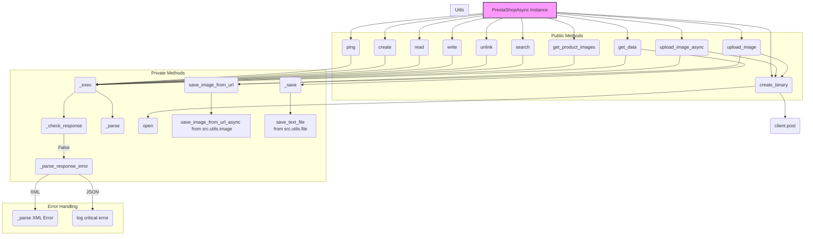
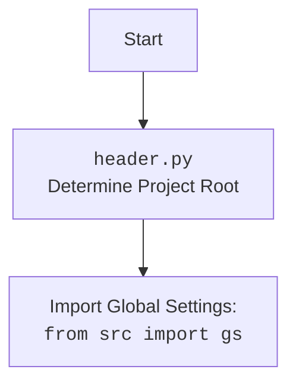

# Проект `hypotez`
# Роль `code explainer`
## АНАЛИЗ КОДА: `hypotez/src/endpoints/prestashop/api/api_async.py`

### 1. <алгоритм>

1.  **Инициализация `PrestaShopAsync`**:
    *   При создании экземпляра `PrestaShopAsync` происходит инициализация основных параметров, таких как `API_DOMAIN`, `API_KEY`, `debug` и `data_format`.
    *   Создается асинхронная сессия `aiohttp.ClientSession` с базовой аутентификацией, используя `API_KEY`.

    ```python
    self.client = ClientSession(
        auth=aiohttp.BasicAuth(self.API_KEY, ''),
        timeout=ClientTimeout(total=60)
    )
    ```

2.  **Выполнение запроса `_exec`**:

    *   Функция `_exec` является центральной для выполнения HTTP-запросов к API PrestaShop.
    *   Она принимает параметры, такие как `resource`, `resource_id`, `method`, `data`, `headers` и другие, чтобы сформировать и выполнить запрос.
    *   В зависимости от `method` (GET, POST, PUT, DELETE) и `io_format` (JSON, XML), формируется URL и данные запроса.
    *   Используется `aiohttp.ClientSession` для выполнения асинхронного HTTP-запроса.
    *   Проверяется статус ответа с помощью `_check_response`.
    *   Возвращается результат в формате JSON или XML.

    ```python
    with self.client.request(
        method=method,
        url=prepared_url,
        data=request_data,
        headers=headers,
    ) as response:
        if not self._check_response(response.status, response, method, prepared_url, headers, request_data):
            return False

        if io_format == 'JSON':
            return response.json()
        else:
            return self._parse(await response.text())
    ```

3.  **Обработка ответа `_check_response`**:

    *   Функция `_check_response` проверяет статус код ответа HTTP.
    *   Если статус код находится в диапазоне 200-201, то возвращается `True`.
    *   В противном случае вызывается `_parse_response_error` для обработки ошибок и возвращается `False`.

    ```python
    if status_code in (200, 201):
        return True
    else:
        self._parse_response_error(response, method, url, headers, data)
        return False
    ```

4.  **Обработка ошибок `_parse_response_error`**:

    *   Функция `_parse_response_error` анализирует ответ от API PrestaShop при возникновении ошибки.
    *   В зависимости от формата данных (`JSON` или `XML`), извлекаются код ошибки и сообщение.
    *   Используется модуль `logger` для записи информации об ошибке.

    ```python
    if self.data_format == 'JSON':
        status_code = response.status
        if not status_code in (200, 201):
            text = response.text()
            logger.critical(f"""response status code: {status_code}\n
                url: {response.request_info.url}\n
                --------------\n
                headers: {response.headers}\n
                --------------\n
                response text: {text}""")
        return response
    ```

5.  **Методы CRUD (create, read, write, unlink)**:

    *   Методы `create`, `read`, `write` и `unlink` предоставляют интерфейс для выполнения основных операций CRUD с ресурсами API PrestaShop.
    *   Каждый из этих методов вызывает функцию `_exec` с соответствующими параметрами (`resource`, `resource_id`, `method`, `data`).

    ```python
    async def create(self, resource: str, data: dict) -> Optional[dict]:
        return await self._exec(resource=resource, method='POST', data=data, io_format=self.data_format)
    ```

6.  **Поиск ресурсов `search`**:

    *   Метод `search` позволяет искать ресурсы в API PrestaShop с использованием фильтров и параметров.
    *   Он вызывает функцию `_exec` с параметрами фильтрации (`search_filter`) и другими опциями.

    ```python
    async def search(self, resource: str, filter: Optional[Union[str, dict]] = None, **kwargs) -> List[dict]:
        return await self._exec(resource=resource, search_filter=filter, method='GET', io_format=self.data_format, **kwargs)
    ```

7.  **Загрузка бинарных файлов `create_binary`**:

    *   Метод `create_binary` используется для загрузки бинарных файлов (например, изображений) в API PrestaShop.
    *   Он открывает файл, устанавливает заголовок `Content-Type` и отправляет данные файла в теле запроса.

    ```python
    with open(file_path, 'rb') as file:
        headers = {'Content-Type': 'application/octet-stream'}
        async with self.client.post(
            url=f'{self.API_DOMAIN}{resource}',
            headers=headers,
            data=file.read()
        ) as response:
           return response.json()
    ```

8.  **Загрузка изображений `upload_image_async` и `upload_image`**:

    *   Методы `upload_image_async` и `upload_image` используются для загрузки изображений по URL в API PrestaShop.
    *   Они скачивают изображение, сохраняют его во временный файл, а затем используют `create_binary` для загрузки файла.

    ```python
    png_file_path = await save_image_from_url(img_url, filename)
    response = await self.create_binary(resource, png_file_path, img_name)
    self.remove_file(png_file_path)
    return response
    ```

9.  **Получение данных и сохранение `get_data`**:

    *   Метод `get_data` используется для получения данных из API и сохранения их в файл.
    *   Он вызывает `_exec` для получения данных, а затем использует `_save` для сохранения данных в формате JSON.

    ```python
    data = await self._exec(resource=resource, method='GET', io_format=self.data_format, **kwargs)
    if data:
        self._save(f'{resource}.json', data)
        return data
    return False
    ```

### 2. <mermaid>



**Объяснение зависимостей:**

*   `PrestaShopAsync` является центральным классом, который предоставляет интерфейс для взаимодействия с API PrestaShop.
*   Public Methods: `ping`, `create`, `read`, `write`, `unlink`, `search`, `create_binary`, `get_data`, `upload_image_async`, `upload_image`, `get_product_images` - это методы, которые предоставляет класс `PrestaShopAsync` для работы с API.
*   Private Methods: `_exec`, `_check_response`, `_parse`, `_parse_response_error`, `_save` - это вспомогательные методы, которые используются внутри класса `PrestaShopAsync`.
*   `_exec` использует `_check_response` для проверки статуса ответа и `_parse` для разбора данных ответа.
*   `create_binary` использует `client.post` для отправки POST-запроса.
*   `upload_image_async` и `upload_image` используют `save_image_from_url` для сохранения изображения из URL и `create_binary` для загрузки изображения в API.
*   `get_data` использует `_exec` для получения данных и `_save` для сохранения данных в файл.
*   `save_image_from_url_async` берется из `src.utils.image`, а `save_text_file` из `src.utils.file`.
*   В случае ошибок, `_parse_response_error` используется для разбора ответа об ошибке.

**Дополнительно: `header.py`**



### 3. <объяснение>

**Импорты:**

*   `os`, `sys`, `enum`, `http.client`, `pathlib`, `typing`, `xml.etree.ElementTree`, `xml.parsers.expat`: стандартные библиотеки Python для работы с операционной системой, типами данных, HTTP-запросами и XML.
*   `requests`, `requests.models`: библиотеки для упрощения HTTP-запросов.
*   `header`: модуль, определяющий корень проекта.
*   `src`: внутренний пакет, содержащий модули:
    *   `gs`: глобальные настройки проекта.
    *   `src.logger.exceptions`: собственные исключения для обработки ошибок PrestaShop API.
    *   `src.logger.logger`: модуль для логирования.
    *   `src.utils.convertors.base64`: модуль для работы с base64.
    *   `src.utils.convertors.dict`: модуль для преобразования словарей в XML.
    *   `src.utils.convertors.xml2dict`: модуль для преобразования XML в словари.
    *   `src.utils.file`: модуль для работы с файлами.
    *   `src.utils.image`: модуль для работы с изображениями.
    *   `src.utils.jjson`: модуль для работы с JSON.
    *   `src.utils.printer`: модуль для красивого вывода данных.
*   `asyncio`, `aiohttp`: библиотеки для асинхронного программирования.

**Классы:**

*   `Format(Enum)`:
    *   Представляет формат данных для API (JSON или XML).
    *   Используется для указания формата запросов и ответов.
*   `PrestaShopAsync`:
    *   Основной класс для взаимодействия с API PrestaShop.
    *   Атрибуты:
        *   `client`: асинхронная сессия `aiohttp.ClientSession` для выполнения HTTP-запросов.
        *   `debug`: флаг для включения режима отладки.
        *   `lang_index`: индекс языка.
        *   `data_format`: формат данных (JSON или XML).
        *   `ps_version`: версия PrestaShop.
        *   `API_DOMAIN`: домен API PrestaShop.
        *   `API_KEY`: ключ API PrestaShop.
    *   Методы:
        *   `__init__`: инициализирует класс, устанавливает параметры и создает асинхронную сессию.
        *   `ping`: проверяет доступность API.
        *   `_check_response`: проверяет статус код ответа и обрабатывает ошибки.
        *   `_parse_response_error`: разбирает ответ об ошибке от API.
        *   `_prepare`: подготавливает URL для запроса.
        *   `_exec`: выполняет HTTP-запрос к API.
        *   `_parse`: разбирает ответ от API (JSON или XML).
        *   `create`, `read`, `write`, `unlink`: методы для выполнения операций CRUD.
        *   `search`: метод для поиска ресурсов.
        *   `create_binary`: метод для загрузки бинарных файлов.
        *   `_save`: метод для сохранения данных в файл.
        *   `get_data`: метод для получения данных и сохранения их в файл.
        *   `remove_file`: метод для удаления файла.
        *   `get_apis`: метод для получения списка доступных API.
        *   `get_languages_schema`: метод для получения схемы языков.
        *   `upload_image_async`, `upload_image`: методы для загрузки изображений.
        *   `get_product_images`: метод для получения изображений продукта.

**Функции:**

Большинство функций являются методами класса `PrestaShopAsync` и описаны выше.

**Переменные:**

*   Переменные класса `PrestaShopAsync` используются для хранения параметров подключения к API, формата данных и других настроек.
*   Локальные переменные используются внутри методов для хранения временных данных и результатов операций.

**Потенциальные ошибки и области для улучшения:**

*   Обработка ошибок:
    *   В методе `_parse_response_error` обработка ошибок для XML может быть улучшена.
    *   В методе `get_languages_schema` обработка исключений может быть более общей.
*   Отладка:
    *   В методе `_exec` есть закомментированный код для отладки, который можно пересмотреть и улучшить.
*   Асинхронность:
    *   Убедиться, что все операции ввода-вывода выполняются асинхронно для максимальной производительности.
*   Обработка `...` в коде:
    *   В методе `_exec` есть `...`, который указывает на пропущенный код. Этот код следует реализовать или удалить.

**Взаимосвязи с другими частями проекта:**

*   `header.py`: определяет корень проекта и используется для импорта других модулей.
*   `src.logger.logger`: используется для логирования ошибок и отладочной информации.
*   `src.utils.jjson`: используется для работы с JSON данными.
*   `src.utils.file`: используется для сохранения данных в файлы.
*   `src.utils.image`: используется для работы с изображениями.