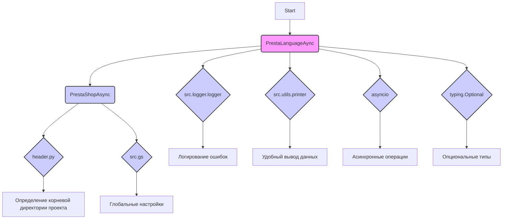
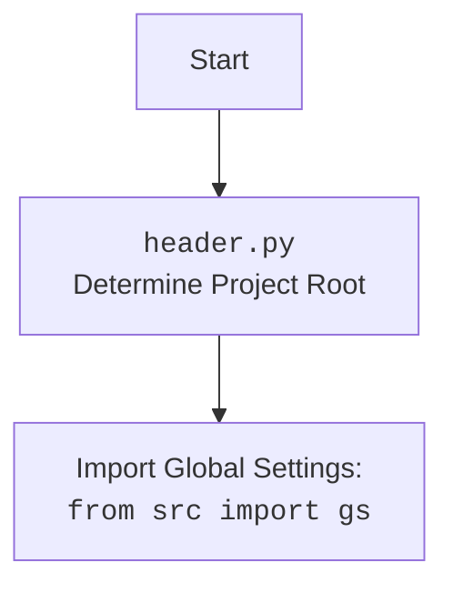

## Анализ кода `hypotez/src/endpoints/prestashop/language_async.py`

### 1. <алгоритм>

#### Общее описание
Код предоставляет асинхронный интерфейс для взаимодействия с языками в PrestaShop. Класс `PrestaLanguageAync` наследуется от `PrestaShopAsync` и предоставляет методы для получения информации о языках PrestaShop.

#### Блок-схема
```mermaid
graph LR
    A[Начало] --> B{Инициализация PrestaLanguageAync}
    B --> C{Вызов get_languages_schema()}
    C --> D{Вызов super().get_languages_schema()}
    D --> E{Вывод lang_dict}
    E --> F[Конец]
```

1.  **Начало**: Начало выполнения скрипта.
2.  **Инициализация PrestaLanguageAync**: Создание экземпляра класса `PrestaLanguageAync`.
3.  **Вызов `get_languages_schema()`**: Вызов метода `get_languages_schema()` для получения схемы языков.
4.  **Вызов `super().get_languages_schema()`**: Вызов метода `get_languages_schema()` родительского класса `PrestaShopAsync`.
5.  **Вывод `lang_dict`**: Вывод полученного словаря `lang_dict`, содержащего схему языков.
6.  **Конец**: Завершение выполнения скрипта.

### 2. <mermaid>



#### Объяснение зависимостей:

*   **`PrestaLanguageAync`**: Класс для работы с языками PrestaShop.
*   **`PrestaShopAsync`**: Базовый класс для асинхронного взаимодействия с PrestaShop API.
*    **`header.py`**: Определяет корневую директорию проекта.
*   **`src.gs`**: Глобальные настройки проекта.
*   **`src.logger.logger`**: Модуль логирования для записи ошибок и отладочной информации.
*   **`src.utils.printer`**: Модуль для удобного вывода данных.
*   **`asyncio`**: Модуль для поддержки асинхронного программирования.
*   **`typing.Optional`**:  Используется для указания опциональных типов.



### 3. <объяснение>

#### Импорты:

*   `import asyncio`: Используется для асинхронного выполнения кода.
*   `from types import SimpleNamespace`:  Используется для создания простых объектов с атрибутами.
*   `import header`: Содержит функции для определения местоположения проекта.
*   `from src import gs`: Импортирует глобальные настройки проекта.
*   `from src.endpoints.prestashop.api import PrestaShopAsync`: Импортирует асинхронный класс для взаимодействия с PrestaShop API.
*   `from src.logger.exceptions import PrestaShopException`: Импортирует класс исключений для PrestaShop.
*   `from src.utils.printer import pprint as print`: Импортирует функцию для удобной печати данных.
*   `from src.logger.logger import logger`: Используется для логирования событий и ошибок.
*   `from typing import Optional`: Используется для указания опциональных типов.

#### Классы:

*   `PrestaLanguageAync(PrestaShopAsync)`:
    *   **Роль**: Предоставляет интерфейс для работы с языками в PrestaShop.
    *   **Атрибуты**: Наследуются от `PrestaShopAsync`.
    *   **Методы**:
        *   `__init__(self, *args, **kwards)`: Конструктор класса.
        *   `async get_lang_name_by_index(self, lang_index: int | str) -> str`: Возвращает имя языка по его индексу.
        *   `async get_languages_schema(self) -> dict`: Возвращает схему языков.

#### Функции:

*   `async def get_lang_name_by_index(self, lang_index: int | str) -> str`
    *   **Аргументы**:
        *   `lang_index (int | str)`: Индекс языка в PrestaShop.
    *   **Возвращаемое значение**:
        *   `str`: Имя языка в формате ISO.
    *   **Назначение**: Получение имени языка по его индексу.
    *   **Пример**:
        ```python
        lang_name = await self.get_lang_name_by_index(1)
        print(lang_name)
        ```
*   `async def get_languages_schema(self) -> dict`
    *   **Аргументы**: Нет.
    *   **Возвращаемое значение**:
        *   `dict`: Схема языков.
    *   **Назначение**: Получение схемы языков.
    *   **Пример**:
        ```python
        languages_schema = await self.get_languages_schema()
        print(languages_schema)
        ```
*   `async def main()`:
    *   **Назначение**: Асинхронная функция для демонстрации работы класса `PrestaLanguageAync`.

#### Переменные:

*   `lang_class`: Экземпляр класса `PrestaLanguageAync`.
*   `languagas_schema`: Результат вызова `lang_class.get_languages_schema()`.

#### Потенциальные ошибки и области для улучшения:

*   В методе `get_lang_name_by_index` перехватывается исключение, но возвращается пустая строка. Возможно, стоит возвращать `None` или поднимать исключение выше.
*   В классе `PrestaLanguageAync` отсутствует обработка аргументов `*args` и `**kwards` в методе `__init__`.
*   В коде есть `...` как заполнители, которые следует заменить реальной логикой.

#### Связи с другими частями проекта:

*   Класс `PrestaLanguageAync` использует `PrestaShopAsync` для взаимодействия с API PrestaShop.
*   Используется модуль `logger` для логирования ошибок и событий.
*   Используются глобальные настройки из `src.gs`.