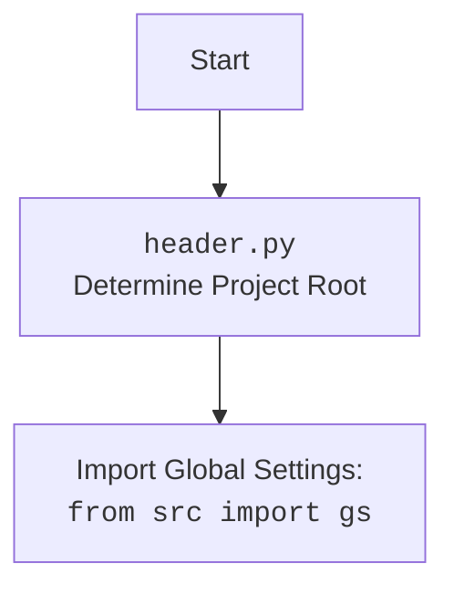

# Анализ кода `hypotez`

## Расположение файла: `hypotez/src/endpoints/prestashop/product_async.py`

### 1. **<алгоритм>**

1.  **Инициализация `PrestaProductAsync`**:
    *   Создается экземпляр класса `PrestaProductAsync`, который наследуется от `PrestaShopAsync`. В конструкторе вызывается конструктор родительского класса и создается экземпляр `PrestaCategoryAsync`.

2.  **Добавление нового продукта (`add_new_product_async`)**:

    *   Принимает объект `ProductFields` (f), содержащий информацию о продукте.
    *   Получает список родительских категорий продукта, используя `self.presta_category_async.get_parent_categories_list(f.id_category_default)`.
    *   Преобразует объект `ProductFields` в словарь `presta_product_dict`.
        *   Пример:

            ```python
            product_fields = ProductFields(
                lang_index = 1,
                name='Test Product Async',
                price=19.99,
                description='This is an asynchronous test product.',
            )
            product_dict = product_fields.to_dict()
            ```
    *   Использует метод `self.create('products', presta_product_dict)` для создания нового продукта в PrestaShop. Результат сохраняется в `new_f`.
    *   Если `new_f` не создан (ошибка при создании продукта), логируется ошибка и функция возвращает `None`.
    *   Загружает изображение продукта, используя `self.create_binary(f'images/products/{new_f.id_product}', f.local_image_path, new_f.id_product)`. Путь к изображению формируется динамически.
    *   Если загрузка изображения прошла успешно, возвращает `True`, иначе логирует ошибку и возвращает `None`.

3.  **Пример использования в `main`**:

    *   Создается экземпляр `ProductAsync`.
    *   Создается экземпляр `ProductFields` с данными тестового продукта.
    *   Вызывается метод `Product.get_parent_categories(id_category=3)` (статический метод), и результат выводится в консоль.
    *   Вызывается `product.add_new_product(product_fields)` для добавления нового продукта.
    *   Если продукт успешно добавлен, выводится его `id_product`, иначе выводится сообщение об ошибке.
    *   Вызывается `product.fetch_data_async()`.

### 2. **<mermaid>**

```mermaid
flowchart TD
    subgraph Product Creation Workflow
        A[Start] --> B{Get Parent Categories}
        B --> C[Convert ProductFields to Dict]
        C --> D{Create Product in PrestaShop}
        D -- Success --> E{Upload Image}
        D -- Fail --> F[Log Error and Return None]
        E -- Success --> G[Return True]
        E -- Fail --> H[Log Error and Return None]
    end

    subgraph PrestaShopAsync
        P[PrestaShopAsync Class] --> PA[create(endpoint, data)]
        P --> PB[create_binary(path, image_path, product_id)]
    end

    subgraph PrestaCategoryAsync
        PC[PrestaCategoryAsync Class] --> PD[get_parent_categories_list(id_category_default)]
    end

    A --> PC
    B --> PD
    D --> PA
    E --> PA

    style A fill:#f9f,stroke:#333,stroke-width:2px
    style G fill:#9f9,stroke:#333,stroke-width:2px
    style F fill:#f66,stroke:#333,stroke-width:2px
    style H fill:#f66,stroke:#333,stroke-width:2px
```

**Объяснение `mermaid`:**

*   **Product Creation Workflow**: Описывает основной процесс создания продукта.
    *   `Start`: Начало процесса.
    *   `Get Parent Categories`: Получение списка родительских категорий продукта.
    *   `Convert ProductFields to Dict`: Преобразование объекта `ProductFields` в словарь для отправки в API PrestaShop.
    *   `Create Product in PrestaShop`: Создание продукта в PrestaShop через API.
    *   `Upload Image`: Загрузка изображения продукта.
    *   `Log Error and Return None`: Обработка ошибок при создании продукта или загрузке изображения.
    *   `Return True`: Возврат успешного результата.
*   **PrestaShopAsync**: Класс для взаимодействия с API PrestaShop.
    *   `create(endpoint, data)`: Метод для создания данных через API (например, продукта).
    *   `create_binary(path, image_path, product_id)`: Метод для загрузки бинарных данных (изображений) через API.
*   **PrestaCategoryAsync**: Класс для работы с категориями PrestaShop.
    *   `get_parent_categories_list(id_category_default)`: Метод для получения списка родительских категорий.



### 3. **<объяснение>**

**Импорты:**

*   `asyncio`: Для асинхронного программирования.
*   `dataclasses`: Для создания классов данных (`ProductFields`).
*   `typing`: Для аннотации типов.
*   `header`: Определяет корень проекта.
*   `src`:
    *   `gs`: Глобальные настройки проекта.
    *   `src.endpoints.prestashop.api.PrestaShopAsync`: Базовый класс для взаимодействия с API PrestaShop.
    *   `src.endpoints.prestashop.category_async.PrestaCategoryAsync`: Класс для работы с категориями PrestaShop.
    *   `src.endpoints.prestashop.product_fields.ProductFields`: Класс данных, представляющий поля продукта.
    *   `src.utils.convertors.any.any2dict`: Функция для преобразования любого объекта в словарь.
    *   `src.utils.jjson.j_dumps, j_loads, j_loads_ns`: Функции для работы с JSON.
    *   `src.utils.printer.pprint`: Функция для красивой печати.
    *   `src.logger.logger`: Модуль для логирования.

**Классы:**

*   `PrestaProductAsync(PrestaShopAsync)`:
    *   Наследуется от `PrestaShopAsync` и предоставляет методы для работы с продуктами в PrestaShop.
    *   Атрибуты:
        *   `presta_category_async`: Экземпляр класса `PrestaCategoryAsync` для работы с категориями.
    *   Методы:
        *   `__init__(self, *args, **kwargs)`: Инициализирует объект класса, вызывая конструктор родительского класса и создавая экземпляр `PrestaCategoryAsync`.
        *   `add_new_product_async(self, f: ProductFields) -> ProductFields | None`: Добавляет новый продукт в PrestaShop.

**Функции:**

*   `add_new_product_async(self, f: ProductFields) -> ProductFields | None`:
    *   Аргументы:
        *   `f (ProductFields)`: Объект класса `ProductFields`, содержащий информацию о продукте.
    *   Возвращаемое значение:
        *   `ProductFields | None`: Возвращает объект `ProductFields` с установленным `id_product`, если продукт был успешно добавлен, иначе `None`.
    *   Назначение:
        *   Добавляет новый продукт в PrestaShop, используя API.

**Переменные:**

*   `f (ProductFields)`: Объект класса `ProductFields`, содержащий информацию о продукте.
*   `presta_product_dict (dict)`: Словарь, содержащий информацию о продукте для отправки в API PrestaShop.
*   `new_f (ProductFields)`: Объект класса `ProductFields`, возвращенный после создания продукта в PrestaShop.

**Потенциальные ошибки и области для улучшения:**

*   Обработка ошибок: В коде есть места, где логируются ошибки, но не всегда обрабатываются исключения.
*   `...`: В коде есть участки, обозначенные `...`, которые требуют доработки.
*   Типизация: Не все переменные имеют аннотации типов.

**Взаимосвязи с другими частями проекта:**

*   `PrestaProductAsync` использует `PrestaShopAsync` для взаимодействия с API PrestaShop.
*   `PrestaProductAsync` использует `PrestaCategoryAsync` для работы с категориями PrestaShop.
*   `ProductFields` используется для представления данных продукта.
*   `j_loads` используется для загрузки JSON данных.
*   `logger` используется для логирования.