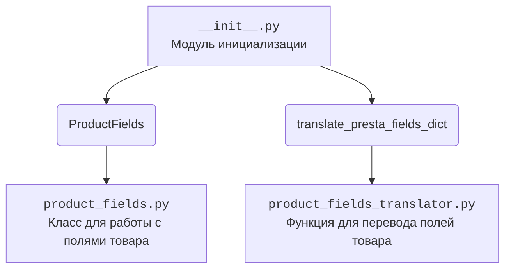

## Анализ кода модуля `hypotez/src/endpoints/prestashop/product_fields/__init__.py`

### 1. Алгоритм
1. **Импорт `ProductFields`**: Импортирует класс `ProductFields` из модуля `product_fields.py`. Этот класс, вероятно, определяет структуру и функциональность для работы с полями товара.
2. **Импорт `translate_presta_fields_dict`**: Импортирует функцию `translate_presta_fields_dict` из модуля `product_fields_translator.py`. Эта функция, вероятно, используется для перевода или преобразования словаря полей товара из формата PrestaShop в другой формат.

### 2. mermaid

**Объяснение зависимостей:**

- `__init__.py`: Файл инициализации пакета `product_fields`. Он импортирует `ProductFields` и `translate_presta_fields_dict` для предоставления их в пакете.
- `ProductFields`: Класс, определенный в `product_fields.py`, который предоставляет структуру и методы для работы с полями товара.
- `translate_presta_fields_dict`: Функция, определенная в `product_fields_translator.py`, которая используется для перевода или преобразования словаря полей товара.

### 3. Объяснение

**Импорты:**

- `from .product_fields import ProductFields`: Импортирует класс `ProductFields` из модуля `product_fields.py`, находящегося в той же директории. `ProductFields` предположительно предоставляет методы и атрибуты для работы с полями товара PrestaShop.
- `from .product_fields_translator import translate_presta_fields_dict`: Импортирует функцию `translate_presta_fields_dict` из модуля `product_fields_translator.py`, находящегося в той же директории. Эта функция, вероятно, используется для преобразования структуры данных, содержащей поля товара PrestaShop, в другую структуру.

**Классы:**

- `ProductFields`: Этот класс, вероятно, содержит методы для работы с полями товара, например, для извлечения, проверки или обновления данных.

**Функции:**

- `translate_presta_fields_dict`: Функция, которая, вероятно, преобразует словарь полей товара PrestaShop в другой формат. Это может быть полезно для интеграции с другими системами или для упрощения обработки данных.

**Переменные:**

- В данном коде переменные явно не определены, но импортированные имена (`ProductFields`, `translate_presta_fields_dict`) могут использоваться как переменные для доступа к соответствующим классам и функциям.

**Потенциальные ошибки и области для улучшения:**

- Отсутствие документации внутри модулей `product_fields.py` и `product_fields_translator.py` затрудняет понимание их функциональности.
- Недостаточно информации о том, какие типы данных принимает и возвращает функция `translate_presta_fields_dict`.

**Взаимосвязи с другими частями проекта:**

- Этот модуль, вероятно, используется в других частях проекта для обработки данных о товарах PrestaShop. Например, он может использоваться для синхронизации данных между PrestaShop и другими системами, для создания отчетов о товарах или для автоматизации задач, связанных с управлением товарами.