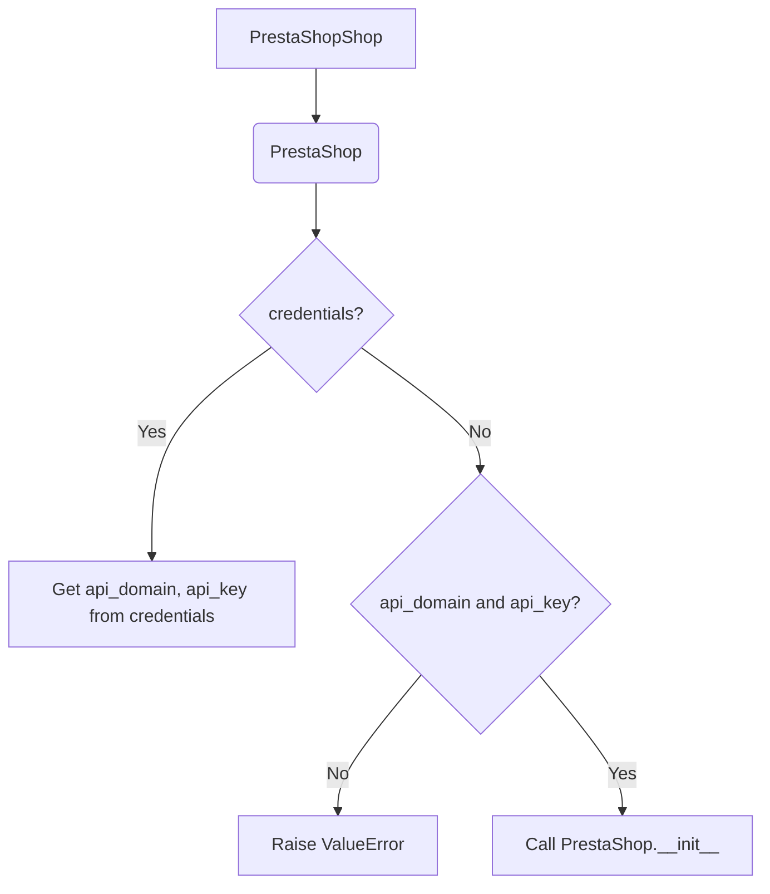
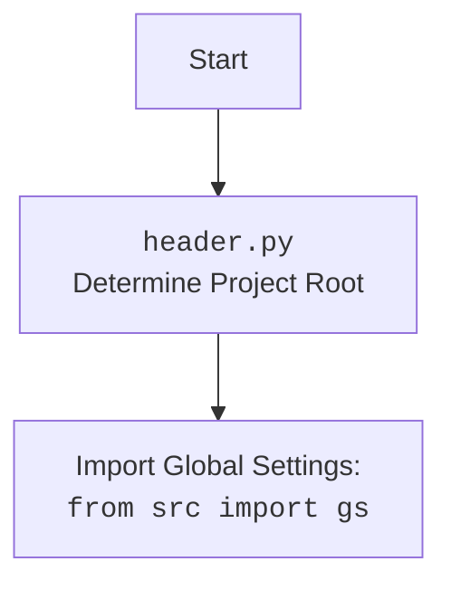

### **Анализ кода `hypotez/src/endpoints/prestashop/shop.py`**

#### 1. **<алгоритм>**:

1.  **Инициализация класса `PrestaShopShop`**:
    *   При создании экземпляра класса `PrestaShopShop` происходит инициализация с использованием переданных `credentials`, `api_domain` и `api_key`.
    *   Если `credentials` предоставлены, из них извлекаются `api_domain` и `api_key`.
    *   Проверяется наличие обоих параметров `api_domain` и `api_key`, и в случае их отсутствия вызывается исключение `ValueError`.
    *   Вызывается конструктор родительского класса `PrestaShop` с переданными параметрами.

    ```python
    # Пример инициализации
    shop = PrestaShopShop(api_domain='example.com', api_key='12345')
    ```

2.  **Использование родительского класса `PrestaShop`**:
    *   Класс `PrestaShopShop` наследует функциональность от класса `PrestaShop`.
    *   Это позволяет использовать методы и атрибуты, определенные в классе `PrestaShop`, для работы с магазином PrestaShop.

    ```python
    # Пример вызова метода родительского класса
    shop.get_products()
    ```

#### 2. **<mermaid>**:



**Объяснение `mermaid`**:

*   `PrestaShopShop` наследуется от `PrestaShop`.
*   Проверяется наличие `credentials`. Если они есть, `api_domain` и `api_key` извлекаются из них.
*   Если `credentials` отсутствуют, проверяется наличие `api_domain` и `api_key`. Если их нет, вызывается исключение `ValueError`.
*   В конце вызывается конструктор `PrestaShop` с переданными параметрами.



#### 3. **<объяснение>**:

*   **Импорты**:
    *   `types.SimpleNamespace`: Используется для создания объектов, к атрибутам которых можно обращаться как к обычным атрибутам объектов.
    *   `typing.Optional`: Используется для указания, что переменная может быть `None`.
    *   `header`: Определяет корень проекта.
    *   `src.gs`: Содержит глобальные настройки проекта.
    *   `src.logger.logger`: Используется для логирования событий.
    *   `src.utils.jjson`: Содержит функции для работы с JSON, такие как `j_loads`.
    *   `.api.PrestaShop`: Родительский класс для работы с API PrestaShop.
    *   `src.logger.exceptions.PrestaShopException`: Пользовательское исключение для PrestaShop.
    *   `pathlib.Path`: Используется для работы с путями к файлам и каталогам.
    *   `attr.attr`, `attr.attrs`: Библиотека `attrs` используется для определения классов с меньшим объемом кода.
    *   `sys`: Предоставляет доступ к некоторым переменным и функциям, взаимодействующим с интерпретатором Python.
    *   `os`: Предоставляет способ использования зависящих от операционной системы функций.
*   **Класс `PrestaShopShop`**:
    *   **Роль**: Предназначен для работы с магазинами PrestaShop.
    *   **Атрибуты**: Отсутствуют, наследуются от `PrestaShop`.
    *   **Методы**:
        *   `__init__`: Инициализирует экземпляр класса, принимает `credentials`, `api_domain` и `api_key`.
    *   **Взаимодействие**: Наследуется от класса `PrestaShop` и использует его методы для работы с API PrestaShop.
*   **Функции**:
    *   `__init__`:
        *   **Аргументы**:
            *   `credentials` (Optional[dict | SimpleNamespace], optional): Словарь или объект `SimpleNamespace` с параметрами `api_domain` и `api_key`.
            *   `api_domain` (Optional[str], optional): Домен API.
            *   `api_key` (Optional[str], optional): Ключ API.
            *   `*args`, `**kwards`: Произвольные позиционные и именованные аргументы.
        *   **Возвращаемое значение**: Отсутствует.
        *   **Назначение**: Инициализация магазина PrestaShop.
        *   **Пример**:

        ```python
        shop = PrestaShopShop(api_domain='example.com', api_key='12345')
        ```
*   **Переменные**:
    *   `credentials` (Optional[dict | SimpleNamespace]): Словарь или объект `SimpleNamespace` с параметрами аутентификации.
    *   `api_domain` (Optional[str]): Домен API.
    *   `api_key` (Optional[str]): Ключ API.

**Потенциальные ошибки и области для улучшения**:

*   **Обработка исключений**:
    *   В случае возникновения ошибки при инициализации класса, вызывается исключение `ValueError`. Рекомендуется добавить более детальную обработку исключений, чтобы предоставлять более информативные сообщения об ошибках.

**Цепочка взаимосвязей с другими частями проекта**:

*   Класс `PrestaShopShop` использует класс `PrestaShop` из модуля `.api` для работы с API PrestaShop.
*   Использует модуль `src.logger.logger` для логирования событий.
*   Использует модуль `src.utils.jjson` для работы с JSON.