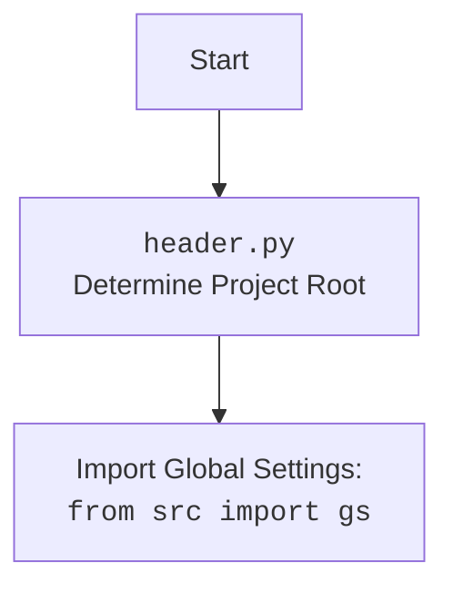

# Анализ кода `src.fast_api.main.py`

## 1. <алгоритм>

### Блок-схема работы `main.py`

```mermaid
graph TD
    A[Начало] --> B{Цикл: пока True};
    B -- True --> C[Вывод меню команд: display_menu()];
    C --> D[Ввод команды от пользователя];
    D --> E{Команда не пустая?};
    E -- False --> B;
    E -- True --> F[Разделение команды на части];
    F --> G{Обработка команды};

    subgraph Обработка команды
        G --> H{start};
        H -- True --> I[Запуск сервера: command_handler.start_server()];
        H -- False --> J{status};
        J -- True --> K[Вывод статуса серверов: command_handler.status_servers()];
        J -- False --> L{routes};
        L -- True --> M[Вывод списка маршрутов: command_handler.get_routes()];
	L -- False --> N{stop};
        N -- True --> O[Остановка сервера: command_handler.stop_server()];
	N -- False --> P{stop_all};
        P -- True --> Q[Остановка всех серверов: command_handler.stop_all_servers()];
        P -- False --> R{add_route};
        R -- True --> S[Добавление нового маршрута: command_handler.add_new_route()];
        R -- False --> T{shutdown};
        T -- True --> U[Остановка всех серверов и выход: sys.exit(0)];
        T -- False --> V{help};
        V -- True --> C;
        V -- False --> W{exit};
        W -- True --> X[Выход: sys.exit(0)];
        W -- False --> Y[Неизвестная команда];
        Y --> C;
    end

    I --> B;
    K --> B;
    M --> B;
    O --> B;
    Q --> B;
    S --> B;
    U --> End;
    X --> End;
    G -- Ошибка --> Z[Обработка исключения];
    Z --> B;
    End[Конец];
```

### Примеры логических блоков:

1.  **Вывод меню команд:** Функция `display_menu()` выводит список доступных команд.

    ```python
    def display_menu():
        """Выводит меню с доступными командами."""
        print("\nAvailable commands:")
        print("  start <port>        - Start server on the specified port")
        print("  status              - Show all served ports status")
        print("  routes              - Show all registered routes")
        print("  stop <port>         - Stop server on the specified port")
        print("  stop_all            - Stop all servers")
        print("  add_route <path>    - Add a new route to the server")
        print("  shutdown            - Stop all servers and exit")
        print("  help                - Show this help menu")
        print("  exit                - Exit the program")
    ```

2.  **Ввод команды от пользователя:** Используется функция `input()` для получения команды от пользователя.

    ```python
    command_line = input("Enter command: ").strip().lower()
    ```

3.  **Запуск сервера:** Метод `start_server()` класса `CommandHandler` запускает сервер на указанном порту и хосте.

    ```python
    command_handler.start_server(port=port, host=host)
    ```

4.  **Остановка всех серверов и выход:**

    ```python
    elif command == "shutdown":
        command_handler.stop_all_servers()
        print("Shutting down all servers.")
        sys.exit(0)
    ```

## 2. <mermaid>

```mermaid
flowchart TD
    Start --> Main[<code>main.py</code><br>Основная функция управления сервером]
    Main --> CommandHandler[<code>src.fast_api.fast_api.py</code><br>Управление командами сервера]
    CommandHandler --> Logger[<code>src.logger.logger.py</code><br>Логирование событий]
    Main --> Header[<code>header.py</code><br>Определение корневой директории проекта]
    Header --> ImportGS[Импорт глобальных настроек: <br><code>from src import gs</code>]
    ImportGS --> GlobalSettings[<code>src/settings.py</code><br>Глобальные настройки проекта]
    Main --> Sys[<code>sys</code><br>Системные функции]
    Main --> DisplayMenu[<code>display_menu()</code><br>Вывод меню команд]
    DisplayMenu --> Print[<code>print()</code><br>Вывод в консоль]
    Main --> Input[<code>input()</code><br>Получение ввода от пользователя]
    Main --> ValueErrorHandler[Обработка <br><code>ValueError</code>]
    Main --> ExceptionHandler[Обработка <br><code>Exception</code>]
    CommandHandler --> FastApi[<code>fastapi</code><br>FastAPI instance]

    style Start fill:#f9f,stroke:#333,stroke-width:2px
    style End fill:#ccf,stroke:#333,stroke-width:2px
```

### Объяснение зависимостей:

*   `src.fast_api.main.py`: Основной модуль, управляющий сервером.
*   `src.fast_api.fast_api.py`: Обработчик команд сервера, содержащий класс `CommandHandler`.
*   `src.logger.logger.py`: Модуль логирования, используемый для записи ошибок и других событий.
*   `header.py`: Модуль, определяющий корневую директорию проекта.
*   `src/settings.py`: Модуль, содержащий глобальные настройки проекта.
*   `sys`: Стандартный модуль Python для доступа к системным функциям.
*    `fastapi`: Модуль, используемый для создания экземпляра FastAPI.



## 3. <объяснение>

### Импорты:

*   `import sys`: Используется для доступа к системным функциям, таким как `sys.exit()`.
*   `import header`:  Модуль `header.py` предназначен для определения корневой директории проекта. Это позволяет корректно определять пути к файлам и ресурсам, независимо от того, где был запущен скрипт.
*   `from src.fast_api.fast_api import CommandHandler, logger`: Импортирует класс `CommandHandler` и объект `logger` из модуля `src.fast_api.fast_api`. `CommandHandler` управляет командами сервера, а `logger` используется для логирования.

### Классы:

*   `CommandHandler`:
    *   **Роль:** Обрабатывает команды, вводимые пользователем, такие как запуск, остановка и получение статуса серверов.
    *   **Методы:**
        *   `start_server(port: int, host: str)`: Запускает сервер на указанном порту и хосте.
        *   `status_servers()`: Выводит статус всех запущенных серверов.
        *   `get_routes()`:  Выводит список всех зарегистрированных маршрутов.
        *   `stop_server(port: int)`: Останавливает сервер на указанном порту.
        *   `stop_all_servers()`: Останавливает все запущенные серверы.
        *   `add_new_route(path: str, func: str, methods: list[str])`: Добавляет новый маршрут к серверу.

### Функции:

*   `display_menu() -> None`:
    *   **Аргументы:** Нет.
    *   **Возвращаемое значение:** Нет.
    *   **Назначение:** Выводит меню с доступными командами.

*   `main() -> None`:
    *   **Аргументы:** Нет.
    *   **Возвращаемое значение:** Нет.
    *   **Назначение:** Основная функция, управляющая сервером.
    *   **Пример:**

    ```python
    def main():
        """Основная функция управления сервером."""
        command_handler = CommandHandler()
        while True:
            display_menu()
            try:
                command_line = input("Enter command: ").strip().lower()
                if not command_line:
                    continue

                parts = command_line.split()
                command = parts[0]

                if command == "start":
                    if len(parts) != 2:
                        print("Usage: start <port>")
                        continue
                    try:
                        port = int(parts[1])
                        host = input("Enter host address (default: 127.0.0.1): ").strip() or "127.0.0.1"
                        command_handler.start_server(port=port, host=host)
                    except ValueError:
                        print("Invalid port number.")
                    except Exception as ex:
                      logger.error(f"An error occurred:", ex, exc_info=True)

            except Exception as ex:
                logger.error(f"An error occurred:", ex, exc_info=True)


    if __name__ == "__main__":
        main()
    ```

### Переменные:

*   `command_handler`: Экземпляр класса `CommandHandler`, используемый для управления сервером.
*   `command_line`: Строка, содержащая команду, введенную пользователем.
*   `parts`: Список строк, полученный разделением `command_line` по пробелам.
*   `command`: Первая строка из списка `parts`, представляющая команду.
*   `port`: Целое число, представляющее номер порта.
*   `host`: Строка, представляющая адрес хоста.
*   `path`: Строка, представляющая путь для нового маршрута.
*   `methods`: Список строк, представляющих HTTP методы для нового маршрута.

### Потенциальные ошибки и области для улучшения:

1.  **Обработка ошибок:**
    *   Обрабатываются исключения `ValueError` при преобразовании порта в целое число и общие исключения `Exception`. Логирование ошибок с использованием `logger.error` помогает в отладке.
2.  **Безопасность:**
    *   При добавлении маршрута используется `func="lambda: {\\"message\\": \\"Hello from the new route\\"}"`, что небезопасно, так как позволяет выполнять произвольный код.

### Взаимосвязи с другими частями проекта:

*   Модуль `src.fast_api.fast_api` предоставляет функциональность для управления сервером, включая запуск, остановку и добавление маршрутов.
*   Модуль `src.logger.logger` используется для логирования ошибок и других событий.
*   Модуль `header` используется для определения корневой директории проекта, что позволяет правильно определять пути к файлам конфигурации и другим ресурсам.