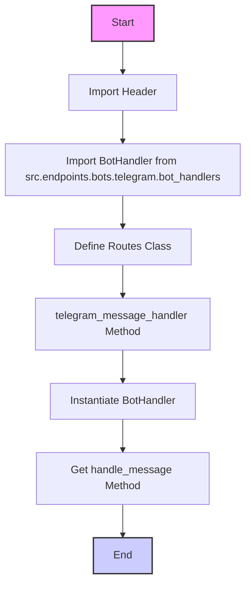
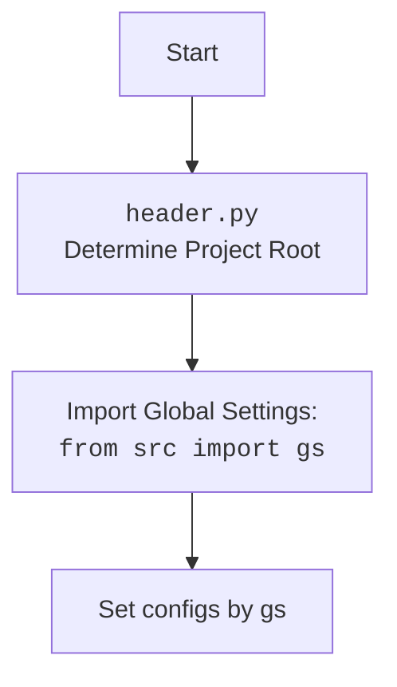

### Анализ кода `hypotez/src/fast_api/routes.py`

#### 1. **<алгоритм>**:

1.  **Импорт модуля `header`**:
    -   Импортируется модуль `header`, который предположительно содержит общие настройки или функции для проекта.
    -   *Пример*: `import header`
2.  **Импорт класса `BotHandler`**:
    -   Импортируется класс `BotHandler` из модуля `src.endpoints.bots.telegram.bot_handlers`, который отвечает за обработку сообщений от Telegram бота.
    -   *Пример*: `from src.endpoints.bots.telegram.bot_handlers import BotHandler`
3.  **Определение класса `Routes`**:
    -   Определяется класс `Routes`, который предназначен для манипулирования маршрутами в сервере.
    -   *Пример*: `class Routes:`
4.  **Метод `telegram_message_handler`**:
    -   В классе `Routes` определяется метод `telegram_message_handler`, который инициализирует экземпляр класса `BotHandler` и получает метод `handle_message` для обработки сообщений Telegram.
    -   *Пример*:
        ```python
        def tegram_message_handler(self):
            bot_nahdlers = BotHandler()
            telega_message_handler = bot_nahdlers.handle_message
        ```

#### 2. **<mermaid>**:





**Объяснение зависимостей `mermaid`**:

-   `Import Header`: Импортирует модуль `header`, который, вероятно, содержит общие настройки проекта.
-   `Import BotHandler from src.endpoints.bots.telegram.bot_handlers`: Импортирует класс `BotHandler`, отвечающий за обработку сообщений от Telegram бота.
-   `Define Routes Class`: Определяет класс `Routes`, который управляет маршрутами сервера.
-   `TelegramMessageHandler Method`: Определяет метод `telegram_message_handler` в классе `Routes`.
-   `Instantiate BotHandler`: Создает экземпляр класса `BotHandler`.
-   `Get handle_message Method`: Получает метод `handle_message` из экземпляра `BotHandler` для обработки сообщений Telegram.

#### 3. **<объяснение>**:

**Импорты**:

-   `import header`: Импортирует модуль `header`. Этот модуль может содержать общие настройки проекта, такие как определение корневой директории проекта.
-   `from src.endpoints.bots.telegram.bot_handlers import BotHandler`: Импортирует класс `BotHandler` из модуля `src.endpoints.bots.telegram.bot_handlers`. Этот класс отвечает за обработку входящих сообщений от Telegram бота.

**Классы**:

-   `class Routes`: Класс предназначен для управления маршрутами в сервере.
    -   Метод `telegram_message_handler`:
        -   Создает экземпляр класса `BotHandler`.
        -   Получает метод `handle_message` из экземпляра `BotHandler` и присваивает его переменной `telega_message_handler`.

**Функции**:

-   `telegram_message_handler(self)`:
    -   Аргументы: `self` (ссылка на экземпляр класса).
    -   Возвращаемое значение: Отсутствует (None).
    -   Назначение: Инициализирует обработчик сообщений Telegram.

**Переменные**:

-   `bot_nahdlers`: Экземпляр класса `BotHandler`.
-   `telega_message_handler`: Ссылка на метод `handle_message` класса `BotHandler`.

**Потенциальные ошибки и области для улучшения**:

1.  **Опечатка в имени переменной**:
    -   `bot_nahdlers` вместо `bot_handlers`. Следует исправить опечатку.
2.  **Неиспользуемая переменная**:
    -   `telega_message_handler` присваивается метод, но нигде не используется. Это может быть упущением, и её следует использовать для обработки сообщений.
3.  **Отсутствие обработки ошибок**:
    -   В коде отсутствует обработка возможных исключений, которые могут возникнуть при создании экземпляра `BotHandler` или вызове его методов.

**Взаимосвязи с другими частями проекта**:

-   Модуль `header` предположительно предоставляет общие настройки для проекта.
-   Класс `BotHandler` обрабатывает сообщения от Telegram бота, что связывает этот модуль с функциональностью Telegram бота.