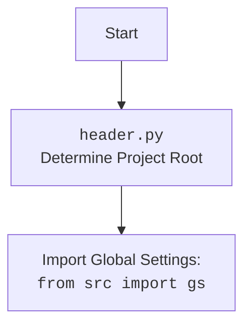

## <алгоритм>

1.  **`add_context_menu_item()`**:
    *   Определяется путь в реестре (`key_path`), где будет создан пункт контекстного меню.
        *   Пример: `r"Directory\\Background\\shell\\hypo_AI_assistant"`.
    *   Создается раздел реестра по `key_path`.
    *   Устанавливается значение по умолчанию для созданного раздела `hypo AI assistant`, которое будет отображаться в контекстном меню.
        *   Пример: `reg.SetValue(key, "", reg.REG_SZ, "hypo AI assistant")`.
    *   Формируется путь к подразделу `command_key`, который отвечает за команду, выполняемую при выборе пункта меню.
        *   Пример: `rf"{key_path}\\command"`.
    *   Создается раздел реестра по `command_key`.
    *   Формируется путь до исполняемого файла Python (`command_path`).
        *   Пример: `gs.path.src / 'gui' / 'context_menu' / 'main.py'`.
    *   Проверяется, существует ли файл по `command_path`. Если нет, выводится сообщение об ошибке.
        *   Пример: `if not os.path.exists(command_path): ...`
    *   Устанавливается значение для созданного подраздела, указывающее на запуск Python скрипта с передачей пути к выбранному файлу/папке через `%1`.
        *   Пример: `reg.SetValue(command, "", reg.REG_SZ, f"python \"{command_path}\" \"%1\"")`
    *   Выводится сообщение об успешном добавлении пункта меню.
        *   Пример: `messagebox.showinfo("Успех", "Пункт меню успешно добавлен!")`
    *   В случае ошибки, выводится сообщение об ошибке.
        *   Пример: `messagebox.showerror("Ошибка", f"Ошибка: {ex}")`

2.  **`remove_context_menu_item()`**:
    *   Определяется путь в реестре (`key_path`), где находится пункт контекстного меню.
        *   Пример: `r"Directory\\Background\\shell\\hypo_AI_assistant"`.
    *   Удаляется раздел реестра по `key_path`.
        *   Пример: `reg.DeleteKey(reg.HKEY_CLASSES_ROOT, key_path)`.
    *   Выводится сообщение об успешном удалении пункта меню.
        *   Пример: `messagebox.showinfo("Успех", "Пункт меню успешно удален!")`
    *   Если раздел не найден, выводится предупреждение.
        *   Пример: `messagebox.showwarning("Предупреждение", "Пункт меню не найден.")`
    *   В случае любой другой ошибки, выводится сообщение об ошибке.
        *   Пример: `messagebox.showerror("Ошибка", f"Ошибка: {e}")`.

3.  **`create_gui()`**:
    *   Создается главное окно `tkinter`.
        *   Пример: `root = tk.Tk()`.
    *   Устанавливается заголовок окна.
        *   Пример: `root.title("Управление контекстным меню")`.
    *   Создается кнопка для добавления пункта меню и связывается с функцией `add_context_menu_item`.
        *   Пример: `add_button = tk.Button(root, text="Добавить пункт меню", command=add_context_menu_item)`.
    *   Создается кнопка для удаления пункта меню и связывается с функцией `remove_context_menu_item`.
        *   Пример: `remove_button = tk.Button(root, text="Удалить пункт меню", command=remove_context_menu_item)`.
    *   Создается кнопка для выхода из программы.
        *   Пример: `exit_button = tk.Button(root, text="Выход", command=root.quit)`.
    *   Все кнопки добавляются в окно.
    *   Запускается главный цикл `tkinter`.
        *   Пример: `root.mainloop()`.

4.  **`if __name__ == "__main__":`**:
    *   Проверяется, запущен ли скрипт напрямую.
        *   Пример: `if __name__ == "__main__":`.
    *   Если да, вызывается функция `create_gui` для запуска графического интерфейса.
        *   Пример: `create_gui()`.

## <mermaid>

```mermaid
flowchart TD
    Start[Start] --> CreateGUI[create_gui()]
    CreateGUI --> CreateWindow[Создание Tkinter окна]
    CreateWindow --> AddButton[Создание кнопки "Добавить пункт меню"]
    AddButton --> AddButtonConfig[Привязка add_context_menu_item]
    CreateWindow --> RemoveButton[Создание кнопки "Удалить пункт меню"]
    RemoveButton --> RemoveButtonConfig[Привязка remove_context_menu_item]
    CreateWindow --> ExitButton[Создание кнопки "Выход"]
    ExitButton --> ExitButtonConfig[Привязка root.quit]
    CreateWindow --> MainLoop[Запуск главного цикла Tkinter]

    AddButtonConfig --> AddMenuItem[add_context_menu_item()]
    AddMenuItem --> CreateRegistryKeyAdd[Создание ключа реестра Directory\\Background\\shell\\hypo_AI_assistant]
    CreateRegistryKeyAdd --> SetMenuItemName[Установка значения hypo AI assistant]
    SetMenuItemName --> CreateCommandKey[Создание ключа реестра command]
    CreateCommandKey --> GetCommandPath[Получение пути к скрипту]
    GetCommandPath --> CheckScriptExists[Проверка существования скрипта]
    CheckScriptExists -- Script Exists --> SetCommandScript[Установка команды запуска скрипта python  "path"  "%1"]
    SetCommandScript --> ShowSuccessMessageAdd[Вывод сообщения об успехе]
    CheckScriptExists -- Script Not Exists --> ShowErrorMessageScript[Вывод сообщения об ошибке (скрипт не найден)]
    AddMenuItem -- Error --> ShowErrorMessageAdd[Вывод сообщения об ошибке]

    RemoveButtonConfig --> RemoveMenuItem[remove_context_menu_item()]
    RemoveMenuItem --> DeleteRegistryKeyRemove[Удаление ключа реестра Directory\\Background\\shell\\hypo_AI_assistant]
    DeleteRegistryKeyRemove --> ShowSuccessMessageRemove[Вывод сообщения об успехе]
    RemoveMenuItem -- Key Not Found --> ShowWarningMessageRemove[Вывод предупреждения (ключ не найден)]
    RemoveMenuItem -- Error --> ShowErrorMessageRemove[Вывод сообщения об ошибке]
        
    MainLoop --> End[Конец]

    subgraph "add_context_menu_item()"
    AddMenuItem
        CreateRegistryKeyAdd
        SetMenuItemName
        CreateCommandKey
        GetCommandPath
        CheckScriptExists
        SetCommandScript
        ShowSuccessMessageAdd
        ShowErrorMessageScript
        ShowErrorMessageAdd
    end
    subgraph "remove_context_menu_item()"
    RemoveMenuItem
        DeleteRegistryKeyRemove
        ShowSuccessMessageRemove
        ShowWarningMessageRemove
        ShowErrorMessageRemove
    end

```



**Объяснение `mermaid`:**

*   Диаграмма представляет собой блок-схему, описывающую порядок выполнения функций и действий в коде.
*   Начинается с `Start`, далее вызывается `create_gui()`, которая отвечает за создание графического интерфейса.
*   В `create_gui()` создается окно `Tkinter`, а также кнопки "Добавить", "Удалить", "Выход".
*   При нажатии кнопки "Добавить" вызывается функция `add_context_menu_item()`.
    *   Функция создает ключ в реестре, устанавливает имя пункта меню, создает ключ для команды, получает путь к скрипту и проверяет его существование. Если все успешно, то устанавливает команду для запуска скрипта и показывает сообщение об успехе, если нет выводит сообщение об ошибке.
*   При нажатии кнопки "Удалить" вызывается функция `remove_context_menu_item()`.
    *   Функция пытается удалить ключ в реестре, если ключ найден выводит сообщение об успехе, если нет выводит сообщение об ошибке или предупреждение в зависимости от ошибки.
*   После завершения работы, завершается главный цикл `Tkinter` и программа завершается.
*   Диаграмма `header.py` показывает, что происходит в модуле `header`, который определяет корень проекта и импортирует общие настройки из модуля `gs`.

## <объяснение>

**Импорты:**

*   **`winreg as reg`**: Модуль используется для взаимодействия с реестром Windows. Он позволяет создавать, изменять и удалять ключи реестра, что необходимо для добавления и удаления пунктов контекстного меню.
*   **`os`**:  Модуль для работы с путями к файлам и проверками существования файлов. В данном случае используется для проверки наличия скрипта Python, который вызывается из контекстного меню.
*   **`tkinter as tk`**: Основной модуль для создания графического интерфейса (GUI). Используется для создания окна с кнопками управления контекстным меню.
*   **`tkinter.messagebox`**: Подмодуль `tkinter`, предназначенный для отображения сообщений пользователю (например, об успехе, предупреждениях или ошибках).
*   **`header`**: Это кастомный импорт, который, судя по описанию, выполняет инициализацию проекта или настройку констант, используемых в проекте.
*   **`from src import gs`**: Это кастомный импорт, вероятно, предоставляющий доступ к глобальным настройкам проекта, например, к путям к файлам и каталогам.

**Функции:**

*   **`add_context_menu_item()`**:
    *   **Назначение:** Добавляет пункт "hypo AI assistant" в контекстное меню рабочего стола и папок.
    *   **Логика:**
        1.  Формирует путь к ключу реестра, где будет размещен пункт меню.
        2.  Создает ключ реестра.
        3.  Устанавливает значение пункта меню (отображаемое имя).
        4.  Формирует путь к ключу реестра, где будет размещена команда для запуска.
        5.  Создает ключ реестра для команды.
        6.  Формирует путь к скрипту Python, который будет вызван при выборе пункта меню.
        7.  Проверяет существование скрипта.
        8.  Если скрипт существует, устанавливает команду для запуска этого скрипта через `python.exe`.
        9.  Выводит сообщение об успехе, либо об ошибке в случае неудачи.
    *   **Пример:** При успешном выполнении, в контекстном меню появится пункт "hypo AI assistant".

*   **`remove_context_menu_item()`**:
    *   **Назначение:** Удаляет пункт "hypo AI assistant" из контекстного меню.
    *   **Логика:**
        1.  Формирует путь к ключу реестра, где находится пункт меню.
        2.  Пытается удалить ключ реестра.
        3.  Выводит сообщение об успехе, предупреждение об отсутствии ключа или сообщение об ошибке.
    *   **Пример:** После успешного выполнения пункт "hypo AI assistant" исчезнет из контекстного меню.

*   **`create_gui()`**:
    *   **Назначение:** Создает графический интерфейс для управления контекстным меню.
    *   **Логика:**
        1.  Создает окно Tkinter.
        2.  Добавляет кнопки "Добавить пункт меню", "Удалить пункт меню", "Выход".
        3.  Устанавливает обработчики нажатия кнопок (вызов функций `add_context_menu_item`, `remove_context_menu_item` или `root.quit`).
        4.  Запускает главный цикл Tkinter.
    *   **Пример:** Запускает окно с кнопками.

**Переменные:**

*   `key_path` (str): Путь к ключу реестра, где хранится информация о контекстном меню.
*   `command_key` (str): Путь к подразделу реестра, содержащему команду для запуска скрипта.
*   `command_path` (str): Путь к файлу Python, который будет запущен из контекстного меню.
*   `root` (tk.Tk): Главное окно GUI.
*   `add_button`, `remove_button`, `exit_button` (tk.Button): Кнопки GUI для добавления, удаления и выхода из приложения.

**Взаимосвязи с другими частями проекта:**

*   Модуль `header` используется для определения корня проекта и импорта глобальных настроек, которые хранятся в `src.gs`. Это позволяет использовать общие для проекта настройки, например, пути к файлам.
*   `gs.path.src`  предположительно предоставляет доступ к директориям проекта, что позволяет получить путь к скрипту `main.py` для контекстного меню.

**Потенциальные ошибки и области для улучшения:**

*   **Обработка ошибок**: Ошибки в `add_context_menu_item` и `remove_context_menu_item` выводятся через `messagebox.showerror`, но могут быть обработаны более гранулярно.
*   **Путь к скрипту**:  Путь к скрипту `command_path` формируется на основе настроек проекта (`gs`). Если структура проекта изменится, этот путь может стать некорректным.  Можно сделать проверку на адекватность этого пути.
*   **Использование `python` в реестре**:  Жестко прописанная команда `python` может вызвать проблему, если Python не установлен в PATH системы или используется виртуальное окружение. Можно улучшить это, например, через `sys.executable`.
*   **Уровень доступа**: Изменение реестра требует прав администратора.  Было бы полезно добавить проверку на запуск от имени администратора или как минимум предупреждение.
*   **Кроссплатформенность**: Код написан для Windows, использование реестра не позволяет использовать его на других платформах (Linux/macOS).
*   **Обработка `%1`**:  Код передает `%1` в команду, но не обрабатывает его в скрипте. Нужно добавить функциональность в вызываемый скрипт.
*   **Локализация**: Текст на русском языке может создать проблемы с использованием в других локализациях.

**Цепочка взаимосвязей:**

1.  Пользователь запускает `main.py` (gui/context\_menu/tkinter).
2.  Вызывается `create_gui()`, создается GUI.
3.  Пользователь нажимает кнопку "Добавить пункт меню".
4.  Вызывается `add_context_menu_item()`.
5.  Функция использует `winreg` для добавления записи в реестр.
6.  Функция использует `os.path.exists()` для проверки наличия файла.
7.  Функция использует `gs` для получения пути к файлу.
8.  Функция использует `messagebox` для отображения результата.
9.  При выборе пункта контекстного меню, вызывается `python.exe` и передается путь к файлу/папке, на которой было вызвано контекстное меню.

Этот анализ предоставляет подробное объяснение логики и структуры кода, а также выявляет потенциальные проблемы и области для улучшения.