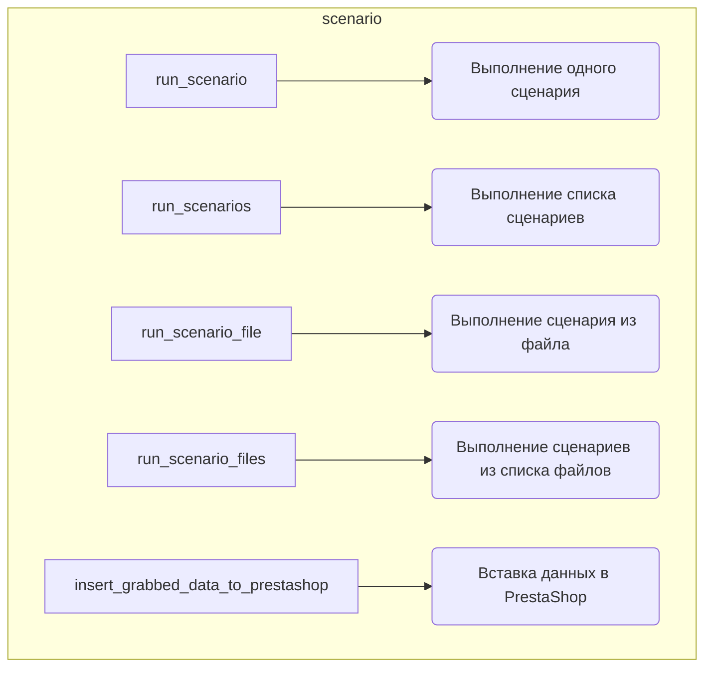

# Анализ кода `hypotez/src/scenario/__init__.py`

## Алгоритм

1.  **Инициализация**:
    *   Импортируются функции и классы из модуля `.executor`.
    *   Определяется, что модуль предоставляет функции для выполнения сценариев для поставщиков.

2.  **Выполнение сценариев**:
    *   `run_scenario`: Выполняет один сценарий.
        *   Пример: `run_scenario(supplier, scenario)`
    *   `run_scenarios`: Выполняет список сценариев.
        *   Пример: `run_scenarios(supplier, list_of_scenarios)`
    *   `run_scenario_file`: Выполняет сценарий из файла.
        *   Пример: `run_scenario_file(supplier, 'file1.json')`
    *   `run_scenario_files`: Выполняет сценарии из списка файлов.
        *   Пример: `run_scenario_files(supplier, ['file1.json', 'file2.json'])`

3.  **Вставка данных в PrestaShop**:
    *   `insert_grabbed_data_to_prestashop`: Вставляет собранные данные в PrestaShop.
        *   Пример: `insert_grabbed_data_to_prestashop(supplier, data)`

## Mermaid

*   `run_scenario`: Функция для выполнения одного сценария.
*   `run_scenarios`: Функция для выполнения списка сценариев.
*   `run_scenario_file`: Функция для выполнения сценария из файла.
*   `run_scenario_files`: Функция для выполнения сценариев из списка файлов.
*   `insert_grabbed_data_to_prestashop`: Функция для вставки собранных данных в PrestaShop.

## Объяснение

**Импорты**:

*   `.executor`: Импортируются функции из модуля `executor.py`, расположенного в той же директории `src/scenario/`. Этот модуль содержит основную логику выполнения сценариев.
    *   `run_scenario`, `run_scenarios`, `run_scenario_file`, `run_scenario_files` - функции, отвечающие за запуск сценариев.
    *   `insert_grabbed_data_to_prestashop` - функция, отвечающая за вставку данных, полученных в результате выполнения сценария, в PrestaShop.

**Функции**:

*   `run_scenario(supplier, scenario)`:
    *   Аргументы:
        *   `supplier`: Объект поставщика.
        *   `scenario`: Словарь, представляющий сценарий.
    *   Возвращаемое значение: Нет.
    *   Назначение: Выполняет один сценарий для указанного поставщика.
*   `run_scenarios(supplier, list_of_scenarios)`:
    *   Аргументы:
        *   `supplier`: Объект поставщика.
        *   `list_of_scenarios`: Список словарей, представляющих сценарии.
    *   Возвращаемое значение: Нет.
    *   Назначение: Выполняет список сценариев для указанного поставщика.
*   `run_scenario_file(supplier, file_path)`:
    *   Аргументы:
        *   `supplier`: Объект поставщика.
        *   `file_path`: Путь к файлу, содержащему сценарий.
    *   Возвращаемое значение: Нет.
    *   Назначение: Выполняет сценарий из указанного файла для указанного поставщика.
*   `run_scenario_files(supplier, list_of_file_paths)`:
    *   Аргументы:
        *   `supplier`: Объект поставщика.
        *   `list_of_file_paths`: Список путей к файлам, содержащим сценарии.
    *   Возвращаемое значение: Нет.
    *   Назначение: Выполняет сценарии из указанных файлов для указанного поставщика.
*   `insert_grabbed_data_to_prestashop(supplier, data)`:
    *   Аргументы:
        *   `supplier`: Объект поставщика.
        *   `data`: Данные, полученные в результате выполнения сценария.
    *   Возвращаемое значение: Нет.
    *   Назначение: Вставляет собранные данные в PrestaShop для указанного поставщика.

**Переменные**:

*   В данном файле переменные не определены, но используются в функциях:
    *   `supplier`: Объект класса, представляющий поставщика (например, `aliexpress`).
    *   `scenario`: Словарь, содержащий информацию о сценарии (URL, имя, категории и т.д.).
    *   `file_path`: Строка, представляющая путь к файлу сценария.
    *   `list_of_scenarios`: Список словарей, содержащих сценарии.
    *   `list_of_file_paths`: Список строк, представляющих пути к файлам сценариев.
    *   `data`: Данные, извлеченные из веб-сайта поставщика.

**Потенциальные ошибки и области для улучшения**:

*   Отсутствие обработки исключений: В коде не предусмотрена обработка возможных исключений, которые могут возникнуть при выполнении сценариев или вставке данных в PrestaShop.
*   Недостаточная документация: Документация модуля содержит только общее описание и примеры, но не хватает подробного описания каждой функции и класса.
*   Отсутствие проверок типов: В функциях не производится проверка типов входных аргументов, что может привести к ошибкам во время выполнения.

**Взаимосвязи с другими частями проекта**:

*   `src.scenario.executor`: Этот модуль зависит от модуля `executor.py`, который содержит основную логику выполнения сценариев.
*   `Supplier`: Предполагается, что существует класс `Supplier`, который представляет поставщика и предоставляет методы для взаимодействия с его веб-сайтом. Этот класс, вероятно, определен в другом модуле проекта.
*   `PrestaShop`: Модуль взаимодействует с PrestaShop через функцию `insert_grabbed_data_to_prestashop`, которая, вероятно, использует API PrestaShop для вставки данных.