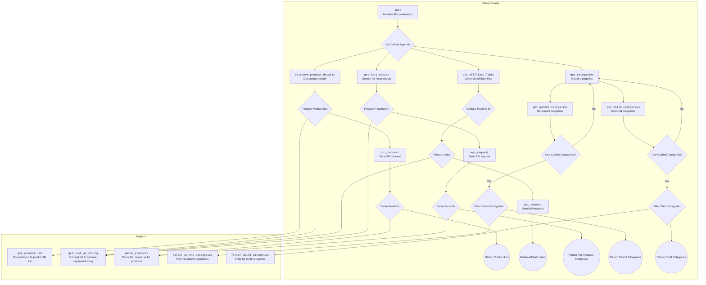

## Анализ кода: `hypotez/src/suppliers/aliexpress/api/api.py`

### 1. <алгоритм>

#### 1.  `AliexpressApi` класс

   - **Инициализация (`__init__`)**:
      - Принимает API ключ, секрет, язык, валюту и ID отслеживания.
      - Сохраняет эти параметры как атрибуты экземпляра класса.
      - Вызывает `setDefaultAppInfo` для установки информации о приложении для SDK.

        ```python
        def __init__(self, key: str, secret: str, language: model_Language, currency: model_Currency, tracking_id: str = None, app_signature: str = None, **kwargs):
            self._key = key
            self._secret = secret
            self._tracking_id = tracking_id
            self._language = language
            self._currency = currency
            self._app_signature = app_signature
            self.categories = None
            setDefaultAppInfo(self._key, self._secret)
        ```

   - **Получение деталей продукта (`retrieve_product_details`)**:
      - Принимает ID продукта(ов), список полей для извлечения и страну.
      - Использует `get_product_ids` и `get_list_as_string` для подготовки ID продуктов.
      - Создает объект запроса `AliexpressAffiliateProductdetailGetRequest`.
      - Вызывает `api_request` для отправки запроса и получения ответа.
      - Если продукты найдены, вызывает `parse_products` для разбора ответа.
      - Возвращает список объектов `model_Product`.

        ```python
        def retrieve_product_details(self, product_ids: str | list, fields: str | list = None, country: str = None, **kwargs) -> List[model_Product]:
            product_ids = get_product_ids(product_ids)
            product_ids = get_list_as_string(product_ids)

            request = aliapi.rest.AliexpressAffiliateProductdetailGetRequest()
            request.app_signature = self._app_signature
            request.fields = get_list_as_string(fields)
            request.product_ids = product_ids
            request.country = country
            request.target_currency = self._currency.upper()
            request.target_language = self._language.upper()
            request.tracking_id = self._tracking_id

            response = api_request(request, 'aliexpress_affiliate_productdetail_get_response')
            try:
                if response.current_record_count > 0:
                    response = parse_products(response.products.product)
                    return response
                else:
                    logger.warning('No products found with current parameters')
                    return
            except Exception as ex:
                logger.error(ex, exc_info=False)
                return
        ```

   - **Получение партнерских ссылок (`get_affiliate_links`)**:
      - Принимает список ссылок и тип ссылки.
      - Проверяет, установлен ли ID отслеживания.
      - Использует `get_list_as_string` для подготовки списка ссылок.
      - Создает объект запроса `AliexpressAffiliateLinkGenerateRequest`.
      - Вызывает `api_request` для отправки запроса.
      - Возвращает список партнерских ссылок.

        ```python
        def get_affiliate_links(self, links: str | list, link_type: model_LinkType = model_LinkType.NORMAL, **kwargs) -> List[model_AffiliateLink]:
            if not self._tracking_id:
                logger.error('The tracking id is required for affiliate links')
                return

            links = get_list_as_string(links)

            request = aliapi.rest.AliexpressAffiliateLinkGenerateRequest()
            request.app_signature = self._app_signature
            request.source_values = links
            request.promotion_link_type = link_type
            request.tracking_id = self._tracking_id

            response = api_request(request, 'aliexpress_affiliate_link_generate_response')
            if not response:
                return
            if response.total_result_count > 0:
                return response.promotion_links.promotion_link
            else:
                logger.warning('Affiliate links not available')
                return
        ```

   - **Получение популярных продуктов (`get_hotproducts`)**:
      - Принимает различные параметры фильтрации продуктов.
      - Создает объект запроса `AliexpressAffiliateHotproductQueryRequest`.
      - Вызывает `api_request` для отправки запроса.
      - Если продукты найдены, вызывает `parse_products` для разбора ответа.
      - Возвращает объект `model_HotProductsResponse`.

        ```python
        def get_hotproducts(self, category_ids: str | list = None, delivery_days: int = None, fields: str | list = None, keywords: str = None, max_sale_price: int = None, min_sale_price: int = None, page_no: int = None, page_size: int = None, platform_product_type: model_ProductType = None, ship_to_country: str = None, sort: model_SortBy = None, **kwargs) -> model_HotProductsResponse:
            request = aliapi.rest.AliexpressAffiliateHotproductQueryRequest()
            request.app_signature = self._app_signature
            request.category_ids = get_list_as_string(category_ids)
            request.delivery_days = str(delivery_days)
            request.fields = get_list_as_string(fields)
            request.keywords = keywords
            request.max_sale_price = max_sale_price
            request.min_sale_price = min_sale_price
            request.page_no = page_no
            request.page_size = page_size
            request.platform_product_type = platform_product_type
            request.ship_to_country = ship_to_country
            request.sort = sort
            request.target_currency = self._currency
            request.target_language = self._language
            request.tracking_id = self._tracking_id

            response = api_request(request, 'aliexpress_affiliate_hotproduct_query_response')

            if response.current_record_count > 0:
                response.products = parse_products(response.products.product)
                return response
            else:
                raise ProductsNotFoudException('No products found with current parameters')
        ```

   - **Получение категорий (`get_categories`)**:
      - Создает объект запроса `AliexpressAffiliateCategoryGetRequest`.
      - Вызывает `api_request` для отправки запроса.
      - Сохраняет категории в атрибуте `self.categories`.
      - Возвращает список категорий.

        ```python
        def get_categories(self, **kwargs) -> List[model_Category | model_ChildCategory]:
            request = aliapi.rest.AliexpressAffiliateCategoryGetRequest()
            request.app_signature = self._app_signature

            response = api_request(request, 'aliexpress_affiliate_category_get_response')

            if response.total_result_count > 0:
                self.categories = response.categories.category
                return self.categories
            else:
                raise CategoriesNotFoudException('No categories found')
        ```

   - **Получение родительских категорий (`get_parent_categories`)**:
      - Использует кешированные категории, если `use_cache` установлен в `True` и `self.categories` не `None`.
      - В противном случае вызывает `get_categories` для получения категорий.
      - Вызывает `filter_parent_categories` для фильтрации родительских категорий.
      - Возвращает список родительских категорий.

        ```python
        def get_parent_categories(self, use_cache=True, **kwargs) -> List[model_Category]:
            if not use_cache or not self.categories:
                self.get_categories()
            return filter_parent_categories(self.categories)
        ```

   - **Получение дочерних категорий (`get_child_categories`)**:
      - Использует кешированные категории, если `use_cache` установлен в `True` и `self.categories` не `None`.
      - В противном случае вызывает `get_categories` для получения категорий.
      - Вызывает `filter_child_categories` для фильтрации дочерних категорий на основе `parent_category_id`.
      - Возвращает список дочерних категорий.

        ```python
        def get_child_categories(self, parent_category_id: int, use_cache=True, **kwargs) -> List[model_ChildCategory]:
            if not use_cache or not self.categories:
                self.get_categories()
            return filter_child_categories(self.categories, parent_category_id)
        ```

#### 2.  Вспомогательные функции:

   - **`get_product_ids`**: Преобразует ввод в список ID продуктов.
   - **`get_list_as_string`**: Преобразует список в строку, разделенную запятыми.
   - **`api_request`**: Выполняет API запрос к AliExpress.
   - **`parse_products`**: Разбирает ответ API и возвращает список продуктов.
   - **`filter_parent_categories`**: Фильтрует список категорий для получения родительских категорий.
   - **`filter_child_categories`**: Фильтрует список категорий для получения дочерних категорий.

### 2. <mermaid>



**Объяснение диаграммы `mermaid`**:

- `AliexpressApi`: Представляет класс `AliexpressApi`, который является основным компонентом для взаимодействия с API AliExpress.
  - `__init__`: Инициализирует параметры API, такие как ключ, секрет, язык и валюта.
  - `retrieve_product_details`: Получает детали продукта по его ID.
  - `get_affiliate_links`: Генерирует партнерские ссылки для заданных ссылок.
  - `get_hotproducts`: Ищет популярные продукты на основе заданных критериев.
  - `get_categories`: Получает все доступные категории.
  - `get_parent_categories`: Получает список родительских категорий.
  - `get_child_categories`: Получает список дочерних категорий для заданной родительской категории.
- `Helpers`: Представляет вспомогательные функции, используемые классом `AliexpressApi`.
  - `get_product_ids`: Преобразует ввод в список ID продуктов.
  - `get_list_as_string`: Преобразует список в строку, разделенную запятыми.
  - `parse_products`: Разбирает ответ API и возвращает список продуктов.
  - `filter_parent_categories`: Фильтрует список категорий для получения родительских категорий.
  - `filter_child_categories`: Фильтрует список категорий для получения дочерних категорий.
- `api_request`: Функция для отправки API запросов к AliExpress.

### 3. <объяснение>

#### Импорты:

- `typing`: Используется для аннотации типов. `List`, `Union`
- `src.logger.logger`: Используется для логирования.
- `src.utils.printer`: Используется для красивого вывода данных (pretty print).
- `.models`: Импортирует классы моделей данных, такие как `AffiliateLink`, `Category`, `ChildCategory`, `Currency`, `HotProductsResponse`, `Language`, `LinkType`, `Product`, `ProductType`, `SortBy`.
- `.errors.exceptions`: Импортирует пользовательские исключения, такие как `CategoriesNotFoudException`.
- `.helpers.categories`: Импортирует функции для фильтрации категорий, такие как `filter_child_categories`, `filter_parent_categories`.
- `.skd`: Импортирует функции для работы с SDK AliExpress, такие как `setDefaultAppInfo` и `api as aliapi`.
- `.errors`: Импортирует исключения, такие как `ProductsNotFoudException`, `InvalidTrackingIdException`.
- `.helpers`: Импортирует вспомогательные функции, такие как `api_request`, `parse_products`, `get_list_as_string`, `get_product_ids`.

#### Класс `AliexpressApi`:

- Предоставляет методы для взаимодействия с API AliExpress.
- Атрибуты:
  - `_key` (str): API ключ.
  - `_secret` (str): API секрет.
  - `_tracking_id` (str): ID отслеживания.
  - `_language` (model_Language): Язык.
  - `_currency` (model_Currency): Валюта.
  - `_app_signature` (str): Подпись приложения.
  - `categories` (list): Список категорий.

#### Функции:

- `__init__`: Конструктор класса.
- `retrieve_product_details`: Получает информацию о продуктах.
- `get_affiliate_links`: Получает партнерские ссылки.
- `get_hotproducts`: Получает список популярных продуктов.
- `get_categories`: Получает список категорий.
- `get_parent_categories`: Получает список родительских категорий.
- `get_child_categories`: Получает список дочерних категорий.

#### Переменные:

- Все переменные аннотированы типами.

#### Потенциальные ошибки и области для улучшения:

- Обработка исключений: В некоторых методах используются `try...except` блоки с логированием ошибок, но без повторного возбуждения исключения или возврата значения по умолчанию. Это может привести к непредсказуемому поведению программы.
- Логирование: В некоторых местах используется `logger.warning` вместо `logger.error` для ошибок.
- Отсутствие документации: Некоторые части кода не имеют документации.
- Использование `Union`: Вместо `Union` следует использовать `|` (например, `str | list`).

#### Взаимосвязи с другими частями проекта:

- `src.logger.logger`: Используется для логирования событий и ошибок.
- `.models`: Используется для представления данных, возвращаемых API AliExpress.
- `.skd`: Предоставляет SDK для взаимодействия с API AliExpress.
- `.helpers`: Предоставляет вспомогательные функции для работы с API AliExpress.