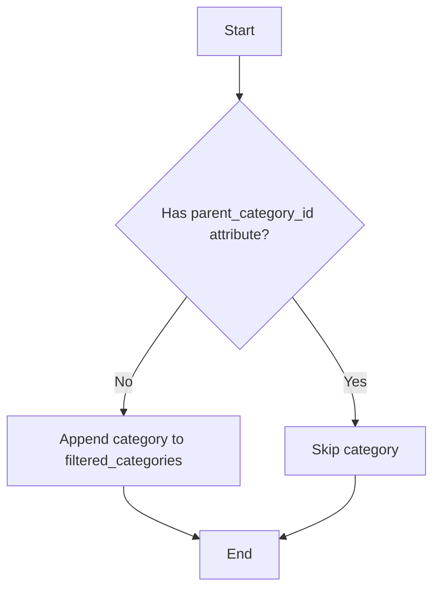
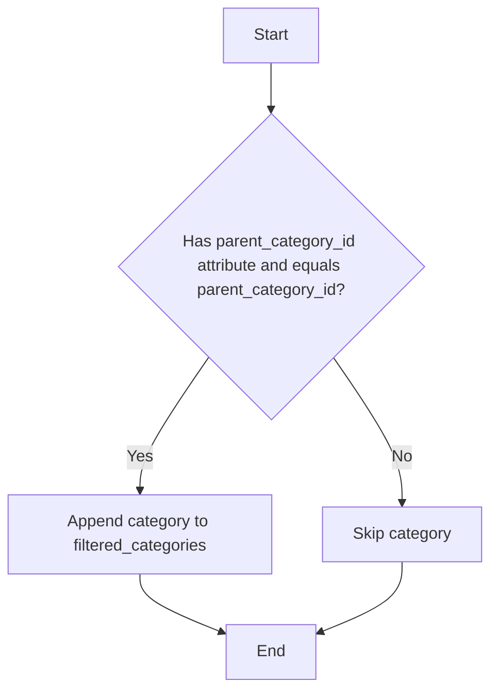

# Проект `hypotez`
# Роль `code explainer`

## АНАЛИЗ КОДА: `hypotez/src/suppliers/aliexpress/api/helpers/categories.py`

### 1. <алгоритм>

#### `filter_parent_categories`

1.  **На входе**: Список объектов категорий (`categories`), которые могут быть как родительскими категориями (`models.Category`), так и дочерними (`models.ChildCategory`).
2.  **Проверка типа**: Если входные данные (`categories`) являются строкой, числом (int или float), они преобразуются в список. Это нужно для унификации обработки, даже если передан только один элемент.
    *   **Пример**: Если `categories = "example"`, то `categories` становится `["example"]`.
3.  **Фильтрация**: Проходится по каждой категории в списке `categories`.
    *   **Проверка атрибута `parent_category_id`**: Проверяется, имеет ли текущая категория атрибут `parent_category_id`. Если атрибута нет, это считается родительской категорией.
    *   **Добавление в список**: Если категория не имеет `parent_category_id`, она добавляется в список `filtered_categories`.
4.  **На выходе**: Список `filtered_categories`, содержащий только объекты категорий, у которых отсутствует атрибут `parent_category_id`.

#### `filter_child_categories`

1.  **На входе**:
    *   Список объектов категорий (`categories`), которые могут быть как родительскими категориями (`models.Category`), так и дочерними (`models.ChildCategory`).
    *   `parent_category_id` – ID родительской категории, по которой нужно отфильтровать дочерние категории.
2.  **Проверка типа**: Если входные данные (`categories`) являются строкой, числом (int или float), они преобразуются в список. Это нужно для унификации обработки, даже если передан только один элемент.
    *   **Пример**: Если `categories = 123`, то `categories` становится `[123]`.
3.  **Фильтрация**: Проходится по каждой категории в списке `categories`.
    *   **Проверка атрибута `parent_category_id` и соответствия ID**: Проверяется, имеет ли текущая категория атрибут `parent_category_id` и равен ли он заданному `parent_category_id`.
    *   **Добавление в список**: Если категория имеет `parent_category_id`, который соответствует заданному, она добавляется в список `filtered_categories`.
4.  **На выходе**: Список `filtered_categories`, содержащий только объекты дочерних категорий, которые имеют `parent_category_id`, соответствующий заданному значению.

### 2. <mermaid>

**Объяснение:**

*   `A[Start]`: Начало процесса фильтрации родительских категорий.
*   `B{Has parent_category_id attribute?}`: Условие проверки наличия атрибута `parent_category_id` у текущей категории.
*   `C[Append category to filtered_categories]`: Если атрибута нет, категория добавляется в список отфильтрованных категорий.
*   `D[Skip category]`: Если атрибут есть, категория пропускается.
*   `E[End]`: Конец процесса.

**Объяснение:**

*   `A[Start]`: Начало процесса фильтрации дочерних категорий.
*   `B{Has parent_category_id attribute and equals parent_category_id?}`: Условие проверки наличия атрибута `parent_category_id` у текущей категории и его соответствия заданному `parent_category_id`.
*   `C[Append category to filtered_categories]`: Если атрибут есть и соответствует, категория добавляется в список отфильтрованных категорий.
*   `D[Skip category]`: Если атрибут отсутствует или не соответствует, категория пропускается.
*   `E[End]`: Конец процесса.

### 3. <объяснение>

#### Импорты:

*   `typing.List`, `typing.Union`: Используются для аннотации типов, чтобы указать, что функция принимает список (`List`) категорий и что категория может быть либо `models.Category`, либо `models.ChildCategory` (`Union`).
*   `.. import models`: Импортирует модуль `models` из родительского каталога `..`. Это позволяет использовать классы `Category` и `ChildCategory`, определенные в `models.py`, для аннотации типов и обработки данных.

#### Функции:

*   `filter_parent_categories(categories: List[models.Category | models.ChildCategory]) -> List[models.Category]`:
    *   **Аргументы**:
        *   `categories`: Список объектов, которые могут быть либо родительскими категориями (`models.Category`), либо дочерними категориями (`models.ChildCategory`).
    *   **Возвращаемое значение**: Список объектов `models.Category`, у которых отсутствует атрибут `parent_category_id`.
    *   **Назначение**: Фильтрует входной список категорий и возвращает только те, которые не имеют родительской категории (то есть являются родительскими категориями).
    *   **Пример**: Если на вход подается список, содержащий родительскую и дочернюю категории, функция вернет только родительскую категорию.
*   `filter_child_categories(categories: List[models.Category | models.ChildCategory], parent_category_id: int) -> List[models.ChildCategory]`:
    *   **Аргументы**:
        *   `categories`: Список объектов, которые могут быть либо родительскими категориями (`models.Category`), либо дочерними категориями (`models.ChildCategory`).
        *   `parent_category_id`: ID родительской категории, по которой нужно отфильтровать дочерние категории.
    *   **Возвращаемое значение**: Список объектов `models.ChildCategory`, у которых атрибут `parent_category_id` соответствует переданному значению `parent_category_id`.
    *   **Назначение**: Фильтрует входной список категорий и возвращает только те, которые являются дочерними категориями и принадлежат к указанной родительской категории.
    *   **Пример**: Если на вход подается список, содержащий родительскую и дочернюю категории, и `parent_category_id` соответствует ID родительской категории, функция вернет только дочернюю категорию.

#### Переменные:

*   `filtered_categories`: Список, используемый для хранения отфильтрованных категорий.

#### Потенциальные ошибки и области для улучшения:

*   **Обработка ошибок**: В функциях отсутствует явная обработка ошибок. Например, если входной список `categories` содержит объекты, не являющиеся категориями, может возникнуть исключение при попытке доступа к атрибуту `parent_category_id`.
*   **Валидация типов**: Желательно добавить валидацию типов для входных данных, чтобы убедиться, что `parent_category_id` является целым числом.
*   **Эффективность**: Преобразование одиночных значений в список может быть неэффективным, если функция часто вызывается с единичными значениями. Можно добавить проверку типа перед преобразованием.

#### Взаимосвязи с другими частями проекта:

*   Функции `filter_parent_categories` и `filter_child_categories` используются для обработки данных, полученных из API Aliexpress. Они фильтруют категории и подкатегории, чтобы получить нужную структуру данных для дальнейшей обработки.
*   Модуль `models` определяет структуру данных для категорий и подкатегорий, используемую в этих функциях.