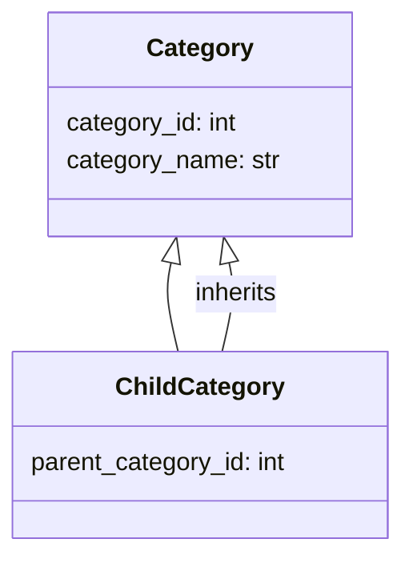

## Анализ кода `hypotez/src/suppliers/aliexpress/api/models/category.py`

### 1. <алгоритм>

**Общее описание:**

Файл `category.py` определяет две структуры данных (`dataclasses`) для представления категорий товаров AliExpress: `Category` и `ChildCategory`. `Category` представляет собой базовую категорию с идентификатором и названием. `ChildCategory` наследуется от `Category` и добавляет информацию об идентификаторе родительской категории.

**Блок-схема:**

```mermaid
graph TD
    A[Start] --> B{Определение класса Category};
    B --> C{Атрибуты: category_id (int), category_name (str)};
    C --> D{Определение класса ChildCategory (наследуется от Category)};
    D --> E{Атрибут: parent_category_id (int)};
    E --> F[End];
```

**Примеры:**

1.  Создание объекта `Category`:

```python
category = Category()
category.category_id = 123
category.category_name = 'Electronics'
print(category.category_id)  # Вывод: 123
print(category.category_name) # Вывод: Electronics
```

2.  Создание объекта `ChildCategory`:

```python
child_category = ChildCategory()
child_category.category_id = 456
child_category.category_name = 'Smartphones'
child_category.parent_category_id = 123
print(child_category.category_id)   # Вывод: 456
print(child_category.category_name)  # Вывод: Smartphones
print(child_category.parent_category_id) # Вывод: 123
```

### 2. <mermaid>



**Объяснение:**

Диаграмма классов показывает иерархию классов. Класс `Category` имеет два атрибута: `category_id` (целочисленный идентификатор категории) и `category_name` (строковое название категории). Класс `ChildCategory` наследуется от класса `Category` и добавляет атрибут `parent_category_id` (целочисленный идентификатор родительской категории).  Связь `ChildCategory --|> Category : inherits` обозначает, что `ChildCategory` наследует свойства `Category`.

### 3. <объяснение>

**Импорты:**

В данном файле нет явных импортов. Однако, в проекте `hypotez` может использоваться механизм неявных импортов или соглашения об именовании, позволяющие классам быть доступными без явного импорта в каждом файле.

**Классы:**

*   **`Category`**:
    *   **Роль:** Представляет собой базовую категорию товаров AliExpress.
    *   **Атрибуты:**
        *   `category_id` (int): Уникальный идентификатор категории.
        *   `category_name` (str): Название категории.
    *   **Методы:** Отсутствуют (показано в предоставленном коде).
    *   **Взаимодействие:** Используется как базовый класс для `ChildCategory`.
*   **`ChildCategory`**:
    *   **Роль:** Представляет собой подкатегорию товаров AliExpress, у которой есть родительская категория.
    *   **Атрибуты:**
        *   `parent_category_id` (int): Идентификатор родительской категории.
    *   **Методы:** Отсутствуют (показано в предоставленном коде).
    *   **Взаимодействие:** Наследует атрибуты от `Category` и добавляет свой атрибут `parent_category_id`.

**Функции:**

В данном файле функции отсутствуют.

**Переменные:**

*   `category_id`: Переменная типа `int`, представляющая идентификатор категории.
*   `category_name`: Переменная типа `str`, представляющая название категории.
*   `parent_category_id`: Переменная типа `int`, представляющая идентификатор родительской категории (только в `ChildCategory`).

**Потенциальные ошибки и области для улучшения:**

*   **Отсутствие документации:** Отсутствует документация к классам и их атрибутам. Рекомендуется добавить docstring для каждого класса и аннотации типов для атрибутов, чтобы улучшить читаемость и поддерживаемость кода.
*   **Отсутствие методов:** Классы `Category` и `ChildCategory` содержат только атрибуты и не имеют методов. В зависимости от требований проекта, может потребоваться добавление методов для работы с данными категорий (например, методы для получения информации о категории, проверки ее валидности и т.д.).
*   **Отсутствие обработки ошибок:** Не предусмотрена обработка ошибок при работе с данными категорий. Рекомендуется добавить обработку исключений, чтобы обеспечить более надежную работу приложения.
*   **Использование `dataclasses`:**  Для таких простых классов, как `Category` и `ChildCategory`, было бы целесообразно использовать `dataclasses` из модуля `dataclasses`. Это упростило бы создание классов и предоставило бы автоматическую реализацию методов, таких как `__init__`, `__repr__`, `__eq__` и т.д.

**Цепочка взаимосвязей с другими частями проекта:**

Данный файл, вероятно, используется другими модулями в проекте `hypotez` для представления категорий товаров, полученных из API AliExpress. Например, он может использоваться в модулях, отвечающих за:

*   Получение данных о товарах из API AliExpress.
*   Преобразование данных, полученных из API, в объекты `Category` и `ChildCategory`.
*   Сохранение данных о категориях в базе данных.
*   Отображение данных о категориях в пользовательском интерфейсе.