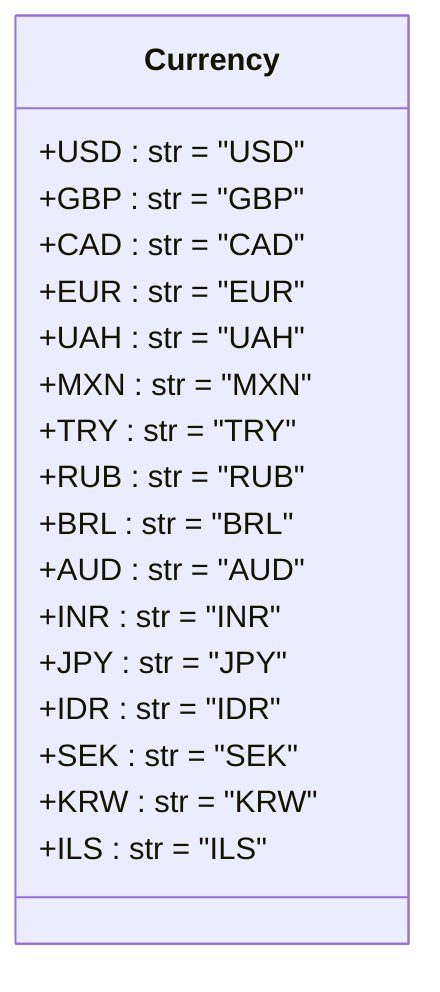

## Алгоритм

1.  **Определение класса `Currency`**: Класс `Currency` предназначен для хранения констант, представляющих различные валюты.
2.  **Инициализация атрибутов класса**: Внутри класса `Currency` определены строковые атрибуты, каждый из которых представляет собой код валюты (например, `'USD'` для доллара США, `'EUR'` для евро и т.д.).
3.  **Использование класса**: Класс `Currency` используется для унификации и удобства работы с валютами в других частях проекта. Вместо использования строковых литералов валют напрямую, можно использовать атрибуты класса `Currency`.

## Mermaid



**Объяснение диаграммы `mermaid`**:

*   `class Currency`: Определяет класс `Currency`, который содержит статические атрибуты, представляющие коды валют.
*   `+USD : str = "USD"`: Атрибут класса `Currency`, представляющий код доллара США. `+` указывает на то, что атрибут является публичным. `: str` указывает, что атрибут имеет тип `str`. `= "USD"` присваивает атрибуту значение `"USD"`.
*   Аналогично определены атрибуты для других валют.

## Объяснение

**Расположение файла**: Файл расположен в `src/suppliers/aliexpress/api/models/currencies.py`, что указывает на то, что он является частью API для работы с AliExpress, конкретно в разделе моделей данных, связанных с валютами.

**Назначение модуля**: Модуль `currencies.py` определяет класс `Currency`, который содержит статические атрибуты, представляющие коды различных валют.

**Класс `Currency`**:

*   **Роль**: Класс `Currency` служит для хранения кодов валют в виде констант. Это позволяет избежать использования строковых литералов напрямую в коде и обеспечивает централизованное место для управления валютами.
*   **Атрибуты**:
    *   `USD`, `GBP`, `CAD`, `EUR`, `UAH`, `MXN`, `TRY`, `RUB`, `BRL`, `AUD`, `INR`, `JPY`, `IDR`, `SEK`, `KRW`, `ILS`: Каждый из этих атрибутов является строкой, представляющей код соответствующей валюты.
*   **Взаимодействие с другими компонентами проекта**: Класс `Currency` может использоваться в других частях проекта для работы с валютами, например, при обработке цен, расчете стоимости доставки, конвертации валют и т.д.

**Пример использования**:

```python
from src.suppliers.aliexpress.api.models.currencies import Currency

def process_price(price: float, currency: str) -> str:
    """
    Форматирует цену в зависимости от валюты.
    """
    if currency == Currency.USD:
        return f'${price:.2f}'
    elif currency == Currency.EUR:
        return f'€{price:.2f}'
    else:
        return f'{price:.2f} {currency}'

price = 100.0
usd_price = process_price(price, Currency.USD)
eur_price = process_price(price, Currency.EUR)
uah_price = process_price(price, Currency.UAH)

print(f'USD Price: {usd_price}')
print(f'EUR Price: {eur_price}')
print(f'UAH Price: {uah_price}')
```

**Потенциальные улучшения**:

*   Можно добавить методы для проверки, является ли переданная строка валидным кодом валюты.
*   Можно добавить документацию к каждому атрибуту класса `Currency` для более ясного понимания их назначения.