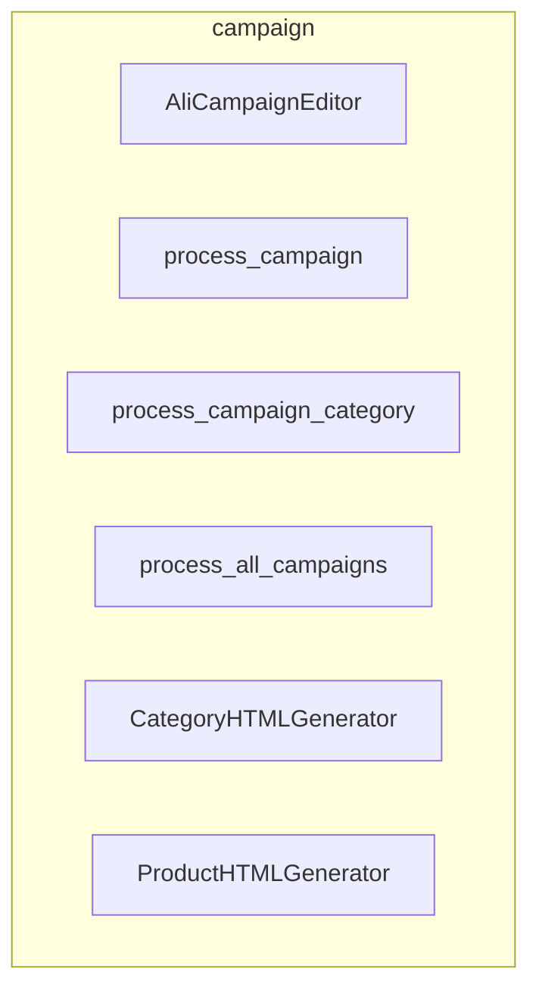

### **Анализ кода `hypotez/src/suppliers/aliexpress/campaign/__init__.py`**

#### **1. <алгоритм>**:

Этот файл `__init__.py` служит точкой входа для пакета `src.suppliers.aliexpress.campaign`. Он импортирует различные модули, связанные с управлением рекламными кампаниями Aliexpress.

**Блок-схема:**

1.  **Импорт `AliCampaignEditor`**:
    *   Импортирует класс `AliCampaignEditor` из модуля `ali_campaign_editor.py`.
    *   `AliCampaignEditor` вероятно, предоставляет функциональность для редактирования рекламных кампаний Aliexpress.
    *   Пример: `from .ali_campaign_editor import AliCampaignEditor`
2.  **Импорт `process_campaign`, `process_campaign_category`, `process_all_campaigns`**:
    *   Импортирует функции `process_campaign`, `process_campaign_category` и `process_all_campaigns` из модуля `prepare_campaigns.py`.
    *   Эти функции, вероятно, отвечают за обработку кампаний, кампаний по категориям и всех кампаний соответственно.
    *   Пример: `from .prepare_campaigns import process_campaign, process_campaign_category, process_all_campaigns`
3.  **Импорт `CategoryHTMLGenerator`, `ProductHTMLGenerator`**:
    *   Импортирует классы `CategoryHTMLGenerator` и `ProductHTMLGenerator` из модуля `html_generators.py`.
    *   Эти классы, вероятно, используются для генерации HTML-кода для категорий и продуктов.
    *   Пример: `from .html_generators import CategoryHTMLGenerator, ProductHTMLGenerator`

#### **2. <mermaid>**:

**Объяснение зависимостей:**

*   `AliCampaignEditor`: Класс для редактирования рекламных кампаний Aliexpress.
*   `process_campaign`, `process_campaign_category`, `process_all_campaigns`: Функции для обработки кампаний.
*   `CategoryHTMLGenerator`, `ProductHTMLGenerator`: Классы для генерации HTML-кода.

#### **3. <объяснение>**:

**Импорты:**

*   `.ali_campaign_editor import AliCampaignEditor`: Импортирует класс `AliCampaignEditor`, который, вероятно, предоставляет методы для управления и редактирования рекламных кампаний на платформе Aliexpress. Он может включать функциональность для обновления бюджета, изменения таргетинга и т.д.
*   `.prepare_campaigns import process_campaign, process_campaign_category, process_all_campaigns`: Импортирует функции, отвечающие за предварительную обработку и подготовку данных кампаний. `process_campaign` может обрабатывать отдельные кампании, `process_campaign_category` - кампании по категориям товаров, а `process_all_campaigns` - все кампании в целом. Эти функции могут выполнять задачи, такие как проверка данных, форматирование и т.д.
*   `.html_generators import CategoryHTMLGenerator, ProductHTMLGenerator`: Импортирует классы, предназначенные для генерации HTML-кода для отображения информации о категориях и продуктах в рекламных кампаниях. Это может быть полезно для создания привлекательных и информативных рекламных объявлений.

**Классы:**

*   `AliCampaignEditor`: Предоставляет интерфейс для редактирования рекламных кампаний Aliexpress. Может включать методы для изменения бюджета, таргетинга и других параметров кампании.
*   `CategoryHTMLGenerator`: Используется для генерации HTML-кода, отображающего информацию о категориях товаров в рекламных кампаниях.
*   `ProductHTMLGenerator`: Используется для генерации HTML-кода, отображающего информацию о продуктах в рекламных кампаниях.

**Функции:**

*   `process_campaign`: Обрабатывает данные для отдельной рекламной кампании.
*   `process_campaign_category`: Обрабатывает данные для рекламных кампаний, сгруппированных по категориям товаров.
*   `process_all_campaigns`: Обрабатывает данные для всех рекламных кампаний.

**Переменные:**

В данном файле явно не определены переменные, но импортированные модули и классы могут содержать свои собственные переменные, используемые для хранения и обработки данных кампаний.

**Потенциальные ошибки и области для улучшения:**

*   Отсутствуют комментарии, описывающие конкретное назначение каждой функции и класса.
*   Не указаны типы параметров и возвращаемых значений для функций.
*   Необходимо добавить документацию для каждого класса и функции, чтобы улучшить понимание кода.

**Взаимосвязь с другими частями проекта:**

Этот модуль является частью системы управления рекламными кампаниями Aliexpress. Он взаимодействует с другими модулями, такими как `ali_campaign_editor`, `prepare_campaigns` и `html_generators`, для выполнения различных задач, связанных с управлением кампаниями.