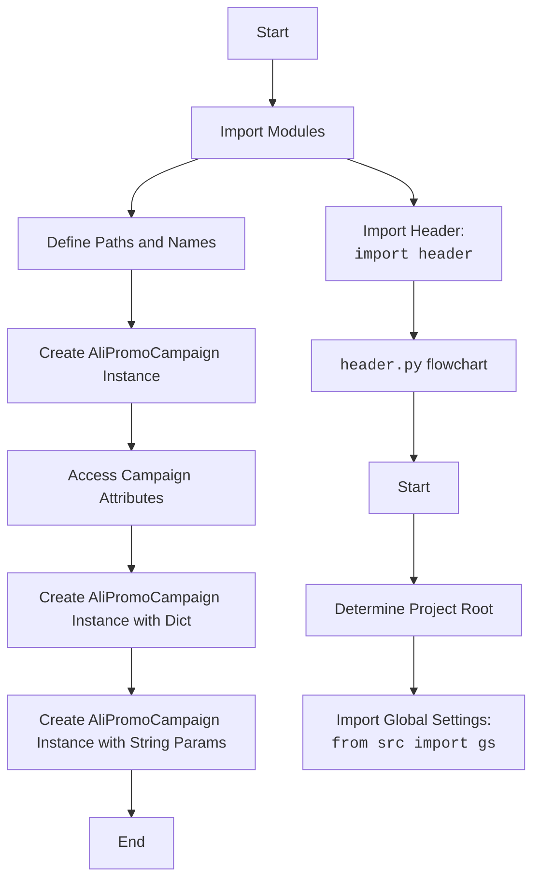

## <алгоритм>

1. **Импорт модулей:**
   - Импортируются необходимые модули и библиотеки для работы с файлами, конфигурацией, JSON, логированием и специфическими классами для AliExpress.
     - `header`: Определяет корень проекта.
     - `pathlib.Path`: Для работы с путями к файлам и директориям.
     - `types.SimpleNamespace`: Для создания простых объектов с атрибутами.
     - `src.gs`: Глобальные настройки проекта.
     - `src.suppliers.aliexpress.AliPromoCampaign`: Класс для управления рекламными кампаниями AliExpress.
     - `src.suppliers.aliexpress.AliAffiliatedProducts`: Класс для работы с партнерскими продуктами AliExpress.
     - `src.utils.get_filenames`, `src.utils.get_directory_names`, `src.utils.read_text_file`, `src.utils.csv2dict`: Утилиты для работы с файлами и директориями.
     - `src.utils.jjson.j_loads_ns`: Загрузка JSON в `SimpleNamespace`.
     - `src.utils.printer.pprint`: Функция для красивой печати.
     - `src.logger.logger`: Модуль для логирования.
   - **Пример**: `from pathlib import Path`

2. **Определение путей и имен:**
   - Определяется путь к директории с кампаниями AliExpress на Google Drive.
     - `campaigns_directory = Path(gs.path.google_drive, 'aliexpress', 'campaigns')`
   - Получается список имен директорий кампаний.
     - `campaign_names = get_directory_names(campaigns_directory)`
   - Задаются имя конкретной кампании, имя категории, язык и валюта.
     - `campaign_name = '280624_cleararanse'`
     - `category_name = 'gaming_comuter_accessories'`
     - `language = 'EN'`
     - `currency = 'USD'`
   - **Пример**: `campaign_name = '280624_cleararanse'`

3. **Создание экземпляра `AliPromoCampaign`:**
   - Создается экземпляр класса `AliPromoCampaign` с передачей параметров: имя кампании, имя категории, язык и валюта.
     - `a:SimpleNamespace = AliPromoCampaign(campaign_name = campaign_name, category_name = category_name, language = language, currency = currency)`
   - **Пример**: `a:SimpleNamespace = AliPromoCampaign(campaign_name = campaign_name, category_name = category_name, language = language, currency = currency)`

4. **Получение доступа к атрибутам:**
   - Получается доступ к атрибутам `campaign`, `category` и `products` через созданный экземпляр `a`.
     - `campaign = a.campaign`
     - `category = a.category`
     - `products = a.category.products`
   - **Пример**: `campaign = a.campaign`

5. **Создание экземпляров `AliPromoCampaign` (разные варианты):**
   - Создаются ещё два экземпляра `AliPromoCampaign` с разными способами передачи аргументов.
     - Один с словарем языков и валют: `a = AliPromoCampaign(campaign_name,category_name,{'EN':'USD'})`
     - Другой со строковыми значениями языка и валюты: `a = AliPromoCampaign(campaign_name,category_name, 'EN','USD')`
   - **Пример**: `a = AliPromoCampaign(campaign_name,category_name,{'EN':'USD'})`

## <mermaid>

## <объяснение>

### Импорты:

*   `header`:
    *   **Назначение**: Модуль, предположительно, отвечает за определение корневой директории проекта. Это позволяет делать относительные импорты внутри проекта независимо от текущей рабочей директории.
    *   **Взаимосвязь**:  Обеспечивает правильную работу остальных модулей, так как они могут зависеть от корректно определенного корня проекта.

*   `pathlib.Path`:
    *   **Назначение**: Предоставляет объектно-ориентированный способ работы с файловыми путями, делая код более читаемым и кросс-платформенным.
    *   **Взаимосвязь**: Используется для создания путей к директориям кампаний (`campaigns_directory`).

*   `types.SimpleNamespace`:
    *   **Назначение**: Класс, позволяющий создавать простые объекты с атрибутами, доступ к которым осуществляется через точечную нотацию.
    *   **Взаимосвязь**: Используется для хранения экземпляра `AliPromoCampaign`, а также других данных.

*   `src.gs`:
    *   **Назначение**: Модуль, содержащий глобальные настройки проекта, такие как пути к директориям.
    *   **Взаимосвязь**: Предоставляет путь к Google Drive для нахождения директории кампаний (`gs.path.google_drive`).

*   `src.suppliers.aliexpress.AliPromoCampaign`:
    *   **Назначение**: Класс, отвечающий за создание и управление рекламными кампаниями AliExpress.
    *   **Взаимосвязь**: Основной класс, который используется для создания экземпляров кампаний и получения доступа к их данным.

*   `src.suppliers.aliexpress.AliAffiliatedProducts`:
    *   **Назначение**: Класс, отвечающий за работу с партнерскими продуктами AliExpress.
    *   **Взаимосвязь**: Хотя и импортирован, в данном примере напрямую не используется.

*   `src.utils.get_filenames`, `src.utils.get_directory_names`, `src.utils.read_text_file`, `src.utils.csv2dict`:
    *   **Назначение**: Утилиты для работы с файлами и директориями, упрощающие чтение, запись и обработку данных.
    *   **Взаимосвязь**:  `get_directory_names` используется для получения списка имен директорий кампаний.

*   `src.utils.jjson.j_loads_ns`:
    *   **Назначение**: Утилита для загрузки JSON данных в `SimpleNamespace`.
    *   **Взаимосвязь**: В этом примере не используется, но импортируется.

*  `src.utils.printer.pprint`:
    *   **Назначение**: Функция для более читаемого вывода данных на экран.
    *   **Взаимосвязь**: В этом примере не используется, но импортируется.

*   `src.logger.logger`:
    *   **Назначение**: Модуль для логирования событий и ошибок.
    *   **Взаимосвязь**: В этом примере не используется, но импортируется.

### Классы:

*   `AliPromoCampaign`:
    *   **Роль**: Класс для управления рекламными кампаниями AliExpress. Он инкапсулирует всю логику, связанную с созданием, настройкой и доступом к данным кампании.
    *   **Атрибуты**:
        *   `campaign`: Объект, содержащий информацию о кампании.
        *   `category`: Объект, содержащий информацию о категории товаров.
        *   `category.products`: Список продуктов в категории.
    *   **Методы**: В коде не показаны, но можно предположить, что он имеет методы для инициализации, настройки кампании, добавления продуктов и т.д.
    *   **Взаимодействие**:  Используется для создания экземпляра кампании, к атрибутам которого потом происходит обращение.

### Функции:

*   `get_directory_names(path)`:
    *   **Аргументы**: `path` - путь к директории, в которой нужно получить список имен поддиректорий.
    *   **Возвращаемое значение**: Список строк с именами поддиректорий.
    *   **Назначение**:  Получает список имен директорий для дальнейшего использования.
    *   **Пример**: `campaign_names = get_directory_names(campaigns_directory)`.
*   `AliPromoCampaign(...)` (конструктор):
     *   **Аргументы**:  `campaign_name` (str), `category_name` (str) и вариации для языка и валюты: словарь (`{'EN':'USD'}`), или отдельные строки `language='EN'`, `currency='USD'`.
     *   **Возвращаемое значение**:  Экземпляр класса `AliPromoCampaign` (хранится в `SimpleNamespace`).
     *   **Назначение**: Создаёт экземпляр рекламной кампании, позволяя взаимодействовать с её данными.
     *   **Пример**: `a:SimpleNamespace = AliPromoCampaign(campaign_name=campaign_name, category_name=category_name, language=language, currency=currency)`
* Другие функции из `src.utils` также используются, но их конкретное назначение не очевидно из представленного фрагмента кода.

### Переменные:

*   `campaigns_directory`:
    *   **Тип**: `pathlib.Path`.
    *   **Использование**: Хранит путь к директории с кампаниями AliExpress на Google Drive.
*   `campaign_names`:
    *   **Тип**: `list` из `str`.
    *   **Использование**: Список имен директорий кампаний.
*   `campaign_name`:
    *   **Тип**: `str`.
    *   **Использование**: Имя конкретной кампании.
*  `category_name`:
    *    **Тип**: `str`.
    *    **Использование**: Имя категории товаров.
*   `language`:
    *   **Тип**: `str`.
    *   **Использование**: Язык кампании.
*   `currency`:
    *   **Тип**: `str`.
    *   **Использование**: Валюта кампании.
*  `a`:
   *   **Тип**: `SimpleNamespace`
   *   **Использование**: экземпляр `AliPromoCampaign`, через который можно получить данные о кампании.
*   `campaign`:
    *   **Тип**: Неизвестно, вероятно, кастомный класс, связанный с `AliPromoCampaign`.
    *   **Использование**: Объект, представляющий кампанию.
*   `category`:
    *   **Тип**: Неизвестно, вероятно, кастомный класс, связанный с `AliPromoCampaign`.
    *   **Использование**: Объект, представляющий категорию товаров.
*   `products`:
    *   **Тип**: Неизвестно, вероятно, `list` из объектов, представляющих товары.
    *   **Использование**: Список товаров в категории.

### Потенциальные ошибки и области для улучшения:

*   **Не используются импортированные модули:** Модули `AliAffiliatedProducts`, `j_loads_ns`, `pprint`, и `logger` импортируются, но не используются в данном примере кода. Это может быть признаком неполного или лишнего импорта.
*   **Жестко заданные параметры**: Имя кампании (`campaign_name`), имя категории (`category_name`), язык (`language`) и валюта (`currency`) заданы непосредственно в коде. Было бы лучше использовать конфигурационные файлы или аргументы командной строки для более гибкой настройки.
*   **Нет обработки ошибок:** В коде нет обработки ошибок, что может привести к неожиданному завершению программы в случае некорректных данных или проблем с файловой системой.
*   **Недостаточно комментариев:** Код содержит мало комментариев, что затрудняет его понимание.
*   **Отсутствуют проверки типов:** Не проводится проверка типов входных данных, что может привести к ошибкам во время выполнения.

### Цепочка взаимосвязей с другими частями проекта:

*   **`header.py`:** Определяет корневой каталог проекта, что важно для правильной работы относительных импортов.
*   **`src.gs`:** Предоставляет глобальные настройки, в том числе путь к Google Drive, где хранятся данные о кампаниях.
*   **`src.utils`:**  Содержит утилиты для работы с файлами и директориями, что позволяет читать данные о кампаниях из файлов и директорий.
*   **`src.suppliers.aliexpress`:** Содержит классы, специфичные для AliExpress, позволяющие управлять рекламными кампаниями.
*   **`src.logger`:**  Обеспечивает логирование для отслеживания событий и ошибок во время выполнения кода.
*   **Общая архитектура:** Модуль представляет собой часть системы для управления рекламными кампаниями AliExpress. Он зависит от других частей проекта для получения настроек, данных и функциональности.

Этот код предоставляет базовый пример создания рекламной кампании AliExpress. Он показывает как создавать экземпляры класса `AliPromoCampaign`, устанавливать основные параметры и получать доступ к атрибутам кампании. Для дальнейшего развития, нужно добавить обработку ошибок, валидацию данных и более гибкий механизм настройки.