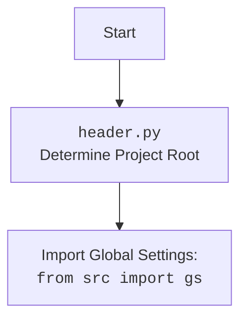

## Анализ кода

### 1. **<алгоритм>**

**test_save_text_file**:

1.  `@patch("src.utils.file.file.Path.open", new_callable=mock_open)`: Заменяем реальную функцию `Path.open` на мок-объект `mock_file_open`.
2.  `@patch("src.utils.file.file.Path.mkdir")`: Заменяем реальную функцию `Path.mkdir` на мок-объект `mock_mkdir`.
3.  `@patch("src.utils.file.file.logger")`: Заменяем реальный логгер на мок-объект `mock_logger`.
4.  Вызываем `save_text_file("test.txt", "This is a test.")`.
5.  Проверяем, что `mock_file_open` был вызван с аргументами `"w"` (режим записи) и `encoding="utf-8"`.
6.  Проверяем, что метод `write` мок-объекта `mock_file_open` был вызван с аргументом `"This is a test."`.
7.  Проверяем, что `mock_mkdir` был вызван один раз.

**test_read_text_file**:

1.  `@patch("src.utils.file.file.Path.open", new_callable=mock_open, read_data="This is a test.")`: Заменяем реальную функцию `Path.open` на мок-объект `mock_file_open`, который при чтении возвращает строку `"This is a test."`.
2.  Вызываем `read_text_file("test.txt")`.
3.  Проверяем, что возвращенное значение равно `"This is a test."`.
4.  Проверяем, что `mock_file_open` был вызван с аргументами `"r"` (режим чтения) и `encoding="utf-8"`.

**test_get_filenames**:

1.  `with patch("src.utils.file.file.Path.iterdir", return_value=[Path(f"file{i}.txt") for i in range(1, 3)]):`: Заменяем реальную функцию `Path.iterdir` на мок-объект, который возвращает список объектов `Path` для файлов `"file1.txt"` и `"file2.txt"`.
2.  Вызываем `get_filenames(Path("/some/dir"))`.
3.  Проверяем, что возвращенное значение равно `["file1.txt", "file2.txt"]`.

**test_get_directory_names**:

1.  `with patch("src.utils.file.file.Path.iterdir", return_value=[Path(f"dir{i}") for i in range(1, 3)]):`: Заменяем реальную функцию `Path.iterdir` на мок-объект, который возвращает список объектов `Path` для директорий `"dir1"` и `"dir2"`.
2.  Вызываем `get_directory_names(Path("/some/dir"))`.
3.  Проверяем, что возвращенное значение равно `["dir1", "dir2"]`.

### 2. **<mermaid>**

```mermaid
flowchart TD
    subgraph src.utils.file.file
        save_text_file[save_text_file(file_path, text, encoding='utf-8')]
        read_text_file[read_text_file(file_path, encoding='utf-8')]
        get_filenames[get_filenames(dir_path)]
        get_directory_names[get_directory_names(dir_path)]
    end

    test_save_text_file --> save_text_file
    test_read_text_file --> read_text_file
    test_get_filenames --> get_filenames
    test_get_directory_names --> get_directory_names
```

**Объяснение зависимостей `mermaid`**:

-   `src.utils.file.file`: Модуль, содержащий функции для работы с файлами и директориями.
    -   `save_text_file`: Функция для сохранения текста в файл.
    -   `read_text_file`: Функция для чтения текста из файла.
    -   `get_filenames`: Функция для получения списка имен файлов в директории.
    -   `get_directory_names`: Функция для получения списка имен директорий в пути.



### 3. **<объяснение>**

**Импорты**:

*   `import header`: Импортирует модуль `header`, который, вероятно, содержит общие настройки проекта.
*   `import pytest`: Импортирует библиотеку `pytest` для написания и запуска тестов.
*   `from unittest.mock import patch, mock_open, MagicMock`: Импортирует инструменты для создания мок-объектов и подмены функций в тестах.
*   `from pathlib import Path`: Импортирует класс `Path` для работы с путями к файлам и директориям.
*   `from src.utils.file.file import save_text_file, read_text_file, get_filenames, get_directory_names`: Импортирует функции для работы с файлами и директориями из модуля `src.utils.file.file`.

**Функции**:

*   `test_save_text_file(mock_logger, mock_mkdir, mock_file_open)`:
    *   Аргументы:
        *   `mock_logger (MagicMock)`: Мок-объект для логгера.
        *   `mock_mkdir (MagicMock)`: Мок-объект для функции `Path.mkdir`.
        *   `mock_file_open (MagicMock)`: Мок-объект для функции `Path.open`.
    *   Назначение: Тестирует функцию `save_text_file`.
    *   Пример: `test_save_text_file()`
*   `test_read_text_file(mock_file_open)`:
    *   Аргументы:
        *   `mock_file_open (MagicMock)`: Мок-объект для функции `Path.open`.
    *   Назначение: Тестирует функцию `read_text_file`.
    *   Пример: `content: str = test_read_text_file()`
*   `test_get_filenames()`:
    *   Назначение: Тестирует функцию `get_filenames`.
    *   Пример: `filenames: list[str] = test_get_filenames()`
*   `test_get_directory_names()`:
    *   Назначение: Тестирует функцию `get_directory_names`.
    *   Пример: `directories: list[str] = test_get_directory_names()`

**Переменные**:

*   `content`: Строка, содержащая содержимое файла, прочитанное функцией `read_text_file`.
*   `filenames`: Список строк, содержащий имена файлов, полученные функцией `get_filenames`.
*   `directories`: Список строк, содержащий имена директорий, полученные функцией `get_directory_names`.

**Потенциальные ошибки или области для улучшения**:

*   В коде отсутствуют обработки исключений. Стоит добавить блоки `try...except` для обработки возможных ошибок при работе с файлами и директориями.
*   Не все функции имеют `Returns` в docstring.

**Взаимосвязи с другими частями проекта**:

*   Модуль `src.utils.file.file` предоставляет функции для работы с файлами и директориями, которые используются в других частях проекта.
*   Тесты используют мок-объекты для изоляции тестируемого кода и упрощения тестирования.