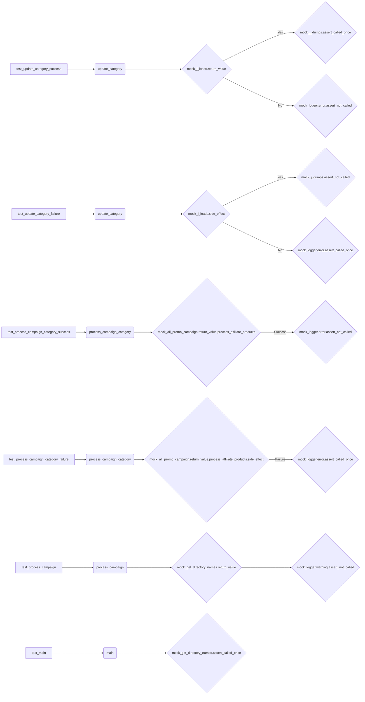

## Анализ кода `test_prepeare_campaigns.py`

### 1. <алгоритм>

#### test_update_category_success
1.  **Подготовка**:
    *   Определяется `mock_json_path` как `Path("mock/path/to/category.json")`.
        ```python
        mock_json_path = Path("mock/path/to/category.json")
        ```
    *   Создается `mock_category` как `SimpleNamespace(name="test_category")`.
        ```python
        mock_category = SimpleNamespace(name="test_category")
        ```
    *   Настраивается `mock_j_loads` для возврата `{"category": {}}`.
        ```python
        mock_j_loads.return_value = {"category": {}}
        ```
2.  **Выполнение**:
    *   Вызывается `update_category` с `mock_json_path` и `mock_category`.
        ```python
        result = update_category(mock_json_path, mock_category)
        ```
3.  **Проверка**:
    *   Проверяется, что `result` имеет значение `True`.
        ```python
        assert result is True
        ```
    *   Проверяется, что `mock_j_dumps` был вызван один раз с аргументами `{"category": {"name": "test_category"}}` и `mock_json_path`.
        ```python
        mock_j_dumps.assert_called_once_with({"category": {"name": "test_category"}}, mock_json_path)
        ```
    *   Проверяется, что `mock_logger.error` не был вызван.
        ```python
        mock_logger.error.assert_not_called()
        ```

#### test_update_category_failure
1.  **Подготовка**:
    *   Определяется `mock_json_path` как `Path("mock/path/to/category.json")`.
        ```python
        mock_json_path = Path("mock/path/to/category.json")
        ```
    *   Создается `mock_category` как `SimpleNamespace(name="test_category")`.
        ```python
        mock_category = SimpleNamespace(name="test_category")
        ```
    *   Настраивается `mock_j_loads` для вызова исключения `Exception("Error")`.
        ```python
        mock_j_loads.side_effect = Exception("Error")
        ```
2.  **Выполнение**:
    *   Вызывается `update_category` с `mock_json_path` и `mock_category`.
        ```python
        result = update_category(mock_json_path, mock_category)
        ```
3.  **Проверка**:
    *   Проверяется, что `result` имеет значение `False`.
        ```python
        assert result is False
        ```
    *   Проверяется, что `mock_j_dumps` не был вызван.
        ```python
        mock_j_dumps.assert_not_called()
        ```
    *   Проверяется, что `mock_logger.error` был вызван один раз.
        ```python
        mock_logger.error.assert_called_once()
        ```

#### test_process_campaign_category_success
1.  **Подготовка**:
    *   Определяются `mock_campaign_name`, `mock_category_name`, `mock_language` и `mock_currency`.
        ```python
        mock_campaign_name = "test_campaign"
        mock_category_name = "test_category"
        mock_language = "EN"
        mock_currency = "USD"
        ```
    *   Настраивается `mock_ali_promo_campaign` для возврата `mock_ali_promo`, у которого `process_affiliate_products` является `MagicMock`.
        ```python
        mock_ali_promo = mock_ali_promo_campaign.return_value
        mock_ali_promo.process_affiliate_products = MagicMock()
        ```
2.  **Выполнение**:
    *   Вызывается `process_campaign_category` с `mock_campaign_name`, `mock_category_name`, `mock_language` и `mock_currency`.
        ```python
        result = await process_campaign_category(mock_campaign_name, mock_category_name, mock_language, mock_currency)
        ```
3.  **Проверка**:
    *   Проверяется, что `result` не имеет значения `None`.
        ```python
        assert result is not None
        ```
    *   Проверяется, что `mock_logger.error` не был вызван.
        ```python
        mock_logger.error.assert_not_called()
        ```

#### test_process_campaign_category_failure
1.  **Подготовка**:
    *   Определяются `mock_campaign_name`, `mock_category_name`, `mock_language` и `mock_currency`.
        ```python
        mock_campaign_name = "test_campaign"
        mock_category_name = "test_category"
        mock_language = "EN"
        mock_currency = "USD"
        ```
    *   Настраивается `mock_ali_promo_campaign` для возврата `mock_ali_promo`, у которого `process_affiliate_products` вызывает исключение `Exception("Error")`.
        ```python
        mock_ali_promo = mock_ali_promo_campaign.return_value
        mock_ali_promo.process_affiliate_products.side_effect = Exception("Error")
        ```
2.  **Выполнение**:
    *   Вызывается `process_campaign_category` с `mock_campaign_name`, `mock_category_name`, `mock_language` и `mock_currency`.
        ```python
        result = await process_campaign_category(mock_campaign_name, mock_category_name, mock_language, mock_currency)
        ```
3.  **Проверка**:
    *   Проверяется, что `result` имеет значение `None`.
        ```python
        assert result is None
        ```
    *   Проверяется, что `mock_logger.error` был вызван один раз.
        ```python
        mock_logger.error.assert_called_once()
        ```

#### test_process_campaign
1.  **Подготовка**:
    *   Определяются `mock_campaign_name`, `mock_categories`, `mock_language`, `mock_currency` и `mock_force`.
        ```python
        mock_campaign_name = "test_campaign"
        mock_categories = ["category1", "category2"]
        mock_language = "EN"
        mock_currency = "USD"
        mock_force = False
        ```
    *   Настраивается `mock_get_directory_names` для возврата `mock_categories`.
        ```python
        mock_get_directory_names.return_value = mock_categories
        ```
2.  **Выполнение**:
    *   Вызывается `process_campaign` с `mock_campaign_name`, `mock_categories`, `mock_language`, `mock_currency` и `mock_force`.
        ```python
        results = process_campaign(mock_campaign_name, mock_categories, mock_language, mock_currency, mock_force)
        ```
3.  **Проверка**:
    *   Проверяется, что длина `results` равна 2.
        ```python
        assert len(results) == 2
        ```
    *   Проверяется, что каждый `category_name` в `results` содержится в `mock_categories` и что `result` не имеет значения `None`.
        ```python
        for category_name, result in results:
            assert category_name in mock_categories
            assert result is not None
        ```
    *   Проверяется, что `mock_logger.warning` не был вызван.
        ```python
        mock_logger.warning.assert_not_called()
        ```

#### test_main
1.  **Подготовка**:
    *   Определяются `mock_campaign_name`, `mock_categories`, `mock_language`, `mock_currency` и `mock_force`.
        ```python
        mock_campaign_name = "test_campaign"
        mock_categories = ["category1", "category2"]
        mock_language = "EN"
        mock_currency = "USD"
        mock_force = False
        ```
    *   Настраивается `mock_get_directory_names` для возврата `mock_categories`.
        ```python
        mock_get_directory_names.return_value = mock_categories
        ```
2.  **Выполнение**:
    *   Вызывается `main` с `mock_campaign_name`, `mock_categories`, `mock_language`, `mock_currency` и `mock_force`.
        ```python
        await main(mock_campaign_name, mock_categories, mock_language, mock_currency, mock_force)
        ```
3.  **Проверка**:
    *   Проверяется, что `mock_get_directory_names` был вызван один раз.
        ```python
        mock_get_directory_names.assert_called_once()
        ```

### 2. <mermaid>



**Объяснение:**

*   `test_update_category_success`: Тест проверяет успешное обновление категории.
*   `update_category`: Функция, которая обновляет категорию.
*   `mock_j_loads.return_value`: Мокированный результат загрузки JSON.
*   `mock_j_dumps.assert_called_once`: Проверяет, что функция сохранения JSON вызвана один раз.
*   `mock_logger.error.assert_not_called`: Проверяет, что ошибка не была зарегистрирована.
*   `test_update_category_failure`: Тест проверяет неудачное обновление категории.
*   `mock_j_loads.side_effect`: Мокированный вызов исключения при загрузке JSON.
*   `mock_j_dumps.assert_not_called`: Проверяет, что функция сохранения JSON не была вызвана.
*   `mock_logger.error.assert_called_once`: Проверяет, что ошибка была зарегистрирована.
*   `test_process_campaign_category_success`: Тест проверяет успешную обработку категории кампании.
*   `process_campaign_category`: Функция, которая обрабатывает категорию кампании.
*   `mock_ali_promo_campaign.return_value.process_affiliate_products`: Мокированный метод обработки партнерских продуктов.
*   `test_process_campaign_category_failure`: Тест проверяет неудачную обработку категории кампании.
*   `mock_ali_promo_campaign.return_value.process_affiliate_products.side_effect`: Мокированный вызов исключения при обработке партнерских продуктов.
*   `test_process_campaign`: Тест проверяет обработку кампании.
*   `process_campaign`: Функция, которая обрабатывает кампанию.
*   `mock_get_directory_names.return_value`: Мокированный результат получения списка категорий.
*   `mock_logger.warning.assert_not_called`: Проверяет, что предупреждение не было зарегистрировано.
*   `test_main`: Тест проверяет основную функцию.
*   `main`: Основная функция.
*   `mock_get_directory_names.assert_called_once`: Проверяет, что функция получения списка категорий вызвана один раз.

### 3. <объяснение>

#### Импорты:

*   `pytest`: Фреймворк для написания и запуска тестов.
*   `asyncio`: Библиотека для написания конкурентного кода с использованием синтаксиса async/await.
*   `pathlib.Path`: Класс для представления путей к файлам и каталогам.
*   `unittest.mock.patch`: Декоратор/менеджер контекста для замены объектов моками во время тестирования.
*   `unittest.mock.MagicMock`: Класс для создания мок-объектов с автоматической спецификацией.
*   `types.SimpleNamespace`: Простой класс для создания объектов с произвольными атрибутами.
*   `src.suppliers.aliexpress.campaign.prepare_campaigns`: Импортирует функции `update_category`, `process_campaign_category`, `process_campaign`, `main` из модуля `prepare_campaigns.py`.

#### Фикстуры:

*   `mock_j_loads`: Мокирует функцию `src.utils.jjson.j_loads` для тестирования функций, использующих загрузку JSON.
*   `mock_j_dumps`: Мокирует функцию `src.utils.jjson.j_dumps` для тестирования функций, использующих сохранение JSON.
*   `mock_logger`: Мокирует модуль `src.logger.logger` для проверки логирования.
*   `mock_get_directory_names`: Мокирует функцию `src.utils.get_directory_names` для тестирования функций, зависящих от получения списка директорий.
*   `mock_ali_promo_campaign`: Мокирует класс `src.suppliers.aliexpress.campaign.AliPromoCampaign` для тестирования функций, использующих этот класс.

#### Функции тестирования:

*   `test_update_category_success`: Тестирует успешное обновление категории. Проверяет, что функция `update_category` успешно обновляет JSON-файл категории и что не было ошибок логирования.
*   `test_update_category_failure`: Тестирует неудачное обновление категории. Проверяет, что функция `update_category` корректно обрабатывает исключения при обновлении JSON-файла категории и логирует ошибку.
*   `test_process_campaign_category_success`: Тестирует успешную обработку категории кампании. Проверяет, что функция `process_campaign_category` успешно обрабатывает категорию кампании и что не было ошибок логирования.
*   `test_process_campaign_category_failure`: Тестирует неудачную обработку категории кампании. Проверяет, что функция `process_campaign_category` корректно обрабатывает исключения при обработке категории кампании и логирует ошибку.
*   `test_process_campaign`: Тестирует обработку кампании. Проверяет, что функция `process_campaign` успешно обрабатывает кампанию для каждой категории и что не было предупреждений логирования.
*   `test_main`: Тестирует основную функцию `main`. Проверяет, что функция `main` вызывает функцию получения списка директорий.

#### Переменные:

*   `mock_json_path`: `Path`-объект, представляющий путь к мокированному JSON-файлу.
*   `mock_category`: `SimpleNamespace`-объект, представляющий мокированную категорию.
*   `mock_campaign_name`: Строка, представляющая имя мокированной кампании.
*   `mock_category_name`: Строка, представляющая имя мокированной категории.
*   `mock_language`: Строка, представляющая мокированный язык.
*   `mock_currency`: Строка, представляющая мокированную валюту.
*   `mock_force`: Булево значение, представляющее мокированный флаг принудительной обработки.
*   `results`: Результат выполнения функции `process_campaign`, представляющий список результатов для каждой категории.

#### Потенциальные улучшения:

*   В тестах можно добавить больше проверок на значения, передаваемые в мокированные функции, чтобы убедиться, что они соответствуют ожидаемым значениям.
*   Можно добавить тесты для обработки различных типов исключений, чтобы убедиться, что функция `update_category` корректно обрабатывает все возможные ошибки.

#### Взаимосвязи с другими частями проекта:

*   `src.utils.jjson`: Используется для загрузки и сохранения JSON-файлов.
*   `src.logger.logger`: Используется для логирования ошибок и предупреждений.
*   `src.suppliers.aliexpress.campaign.AliPromoCampaign`: Используется для обработки партнерских продуктов AliExpress.
*   `src.utils.get_directory_names`: Используется для получения списка директорий.