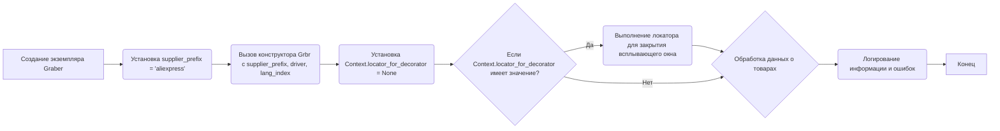

# Проект `hypotez`
# Роль `code explainer`
## <алгоритм>

### Общее описание алгоритма:
Модуль `graber.py` предназначен для сбора данных о товарах с веб-сайта AliExpress. Он включает класс `Graber`, который наследуется от базового класса `Graber` (`Grbr`) из модуля `src.suppliers.graber`. Основная задача класса `Graber` - инициализация и настройка параметров для сбора данных, используя веб-драйвер для взаимодействия с сайтом AliExpress.

### Пошаговая блок-схема:

1.  **Инициализация**:
    *   Создается экземпляр класса `Graber` с передачей экземпляра веб-драйвера `Driver` и индекса языка `lang_index`.
    *   Устанавливается префикс поставщика `supplier_prefix` как `'aliexpress'`.
    *   Вызывается конструктор родительского класса `Grbr` с указанием префикса поставщика, драйвера и индекса языка.
    *   Устанавливается значение локатора для декоратора `Context.locator_for_decorator` в `None`.

2.  **Наследование и расширение**:
    *   Класс `Graber` наследует методы и атрибуты от базового класса `Grbr`.
    *   При необходимости, методы базового класса могут быть переопределены для обработки специфических полей товаров на AliExpress.

3.  **Декоратор `close_pop_up` (опционально)**:
    *   Перед выполнением запроса к веб-драйверу может быть использован декоратор `close_pop_up` для закрытия всплывающих окон.
    *   Если `Context.locator_for_decorator` имеет значение, декоратор выполняет локатор для закрытия всплывающего окна.
    *   В случае ошибки выполнения локатора, информация об ошибке логируется.

4.  **Сбор данных**:
    *   Методы класса `Graber` используют веб-драйвер для навигации по страницам товаров на AliExpress и извлечения необходимых данных.
    *   Данные могут быть обработаны и отформатированы в соответствии с требованиями.

5.  **Логирование**:
    *   В процессе сбора данных и обработки ошибок используется модуль `logger` для записи информации о ходе выполнения и возникающих проблемах.

### Поток данных:



## <mermaid>

```mermaid
flowchart TD
    subgraph src.suppliers.aliexpress.graber
        A[Graber]
        B[Grbr (src.suppliers.graber)]
        C[Driver (src.webdriver.driver)]
        D[logger (src.logger.logger)]
        E[ExecuteLocatorException (src.logger.exceptions)]
        F[Context (src.suppliers.graber)]
    end

    A -- наследует --> B
    A -- использует --> C
    A -- использует --> D
    A -- обрабатывает --> E
    A -- использует --> F
```

### Описание зависимостей `mermaid`:

*   **`Graber`**: Основной класс, отвечающий за сбор данных с AliExpress.
*   **`Grbr (src.suppliers.graber)`**: Базовый класс для граберов, предоставляющий общую функциональность.
*   **`Driver (src.webdriver.driver)`**: Класс, управляющий веб-драйвером для взаимодействия с браузером.
*   **`logger (src.logger.logger)`**: Модуль для логирования информации о работе программы и ошибок.
*   **`ExecuteLocatorException (src.logger.exceptions)`**: Исключение, возникающее при ошибке выполнения локатора.
*   **`Context (src.suppliers.graber)`**: Контекст, хранящий параметры для работы грабера.

## <объяснение>

### Импорты:

*   `typing`: Модуль для аннотации типов.
*   `functools`: Модуль для работы с функциями высшего порядка, такими как декораторы.
*   `src.suppliers.graber.Graber as Grbr`: Импорт базового класса `Graber` из модуля `src.suppliers.graber` с переименованием в `Grbr`.
*   `src.suppliers.graber.Context`: Импорт класса `Context` из модуля `src.suppliers.graber`.
*   `src.suppliers.graber.close_pop_up`: Импорт функции `close_pop_up` из модуля `src.suppliers.graber`.
*   `src.webdriver.driver.Driver`: Импорт класса `Driver` из модуля `src.webdriver.driver`.
*   `src.logger.logger.logger`: Импорт модуля `logger` для логирования.
*   `src.logger.exceptions.ExecuteLocatorException`: Импорт класса исключения `ExecuteLocatorException` из модуля `src.logger.exceptions`.

### Классы:

*   **`Graber(Grbr)`**:
    *   **Роль**: Класс для сбора данных о товарах с AliExpress. Наследуется от `src.suppliers.graber.Graber`.
    *   **Атрибуты**:
        *   `supplier_prefix (str)`: Префикс поставщика, устанавливается в `'aliexpress'`.
    *   **Методы**:
        *   `__init__(self, driver: Driver, lang_index: int)`: Конструктор класса. Инициализирует экземпляр класса, устанавливает префикс поставщика, вызывает конструктор родительского класса и устанавливает значение локатора для декоратора в `None`.

### Функции:

*   `close_pop_up(value: Any = None) -> Callable` (закомментирована):
    *   **Роль**: Декоратор для закрытия всплывающих окон перед выполнением основной логики функции.
    *   **Аргументы**:
        *   `value (Any, optional)`: Дополнительное значение для декоратора. По умолчанию `None`.
    *   **Возвращаемое значение**:
        *   `Callable`: Декоратор, оборачивающий функцию.
    *   **Пример использования**:
        ```python
        @close_pop_up()
        async def some_function(self):
            ...
        ```

### Переменные:

*   `supplier_prefix (str)`: Префикс поставщика, используется для идентификации поставщика данных.
*   `Context.locator_for_decorator`: Статическая переменная класса `Context`, используемая для хранения локатора для декоратора `close_pop_up`.

### Потенциальные ошибки и области для улучшения:

*   **Обработка исключений**: В коде присутствует обработка исключения `ExecuteLocatorException` в декораторе `close_pop_up`, но возможно стоит добавить больше обработки исключений в другие методы класса `Graber` для обеспечения стабильности работы.
*   **Декоратор `close_pop_up`**: Декоратор закомментирован, что означает, что функциональность закрытия всплывающих окон не используется. Если это необходимо, следует раскомментировать и настроить декоратор.
*   **Логирование**: Добавить больше логирования для отслеживания процесса сбора данных и выявления проблем.

### Взаимосвязи с другими частями проекта:

*   Класс `Graber` наследуется от базового класса `Graber` (`Grbr`) из модуля `src.suppliers.graber`, что обеспечивает общую структуру и функциональность для всех граберов.
*   Используется класс `Driver` из модуля `src.webdriver.driver` для взаимодействия с веб-браузером и выполнения запросов к сайту AliExpress.
*   Модуль `logger` используется для логирования информации о работе программы и ошибок, что позволяет отслеживать и анализировать процесс сбора данных.

```mermaid
flowchart TD
    subgraph src.suppliers.aliexpress
        graber[graber.py]
    end

    subgraph src.suppliers
        graber_base[graber.py]
    end

    subgraph src.webdriver
        driver[driver.py]
    end

    subgraph src.logger
        logger[logger.py]
        exceptions[exceptions.py]
    end

    graber --> graber_base
    graber --> driver
    graber --> logger
    graber --> exceptions