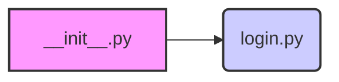

### **Алгоритм**

1.  **Импорт модуля `login`**:
    *   Импортируется модуль `login` из текущей директории (`.`).
    *   Модуль `login` содержит сценарий для входа в систему AliExpress.

### **Mermaid**

### **Объяснение**

**Расположение файла:**
Файл `__init__.py` расположен в директории `src/suppliers/aliexpress/scenarios`. Это указывает на то, что он является частью пакета, содержащего сценарии для работы с AliExpress.

**Функциональность:**
Файл `__init__.py` используется для обозначения директории как пакета Python. В данном случае он импортирует модуль `login`, делая его доступным при импорте пакета `src.suppliers.aliexpress.scenarios`.

**Импорты:**

*   `from .login import login`: Импортирует модуль `login.py`, расположенный в той же директории. Это позволяет использовать сценарий входа в систему AliExpress.

**Возможные улучшения:**

*   Добавить другие сценарии в пакет (например, сценарий поиска товаров, добавления в корзину и т. д.).
*   Добавить документацию для пакета и модуля `login`.