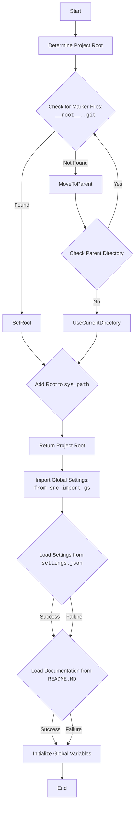

# Проект `hypotez`
# Роль `code explainer`

## АНАЛИЗ КОДА: `hypotez/src/suppliers/amazon/header.py`

### 1. <алгоритм>

1.  **Определение корневой директории проекта (`set_project_root`)**:
    *   Начинает поиск от директории текущего файла (`__file__`).
    *   Проверяет наличие файлов-маркеров (`__root__`, `.git`) в текущей директории и её родительских директориях.
    *   Если маркер найден, устанавливает родительскую директорию в качестве корневой.
    *   Добавляет корневую директорию в `sys.path`, если её там нет.
    *   Пример: Если скрипт находится в `/path/to/project/src/suppliers/amazon/header.py`, и маркер `.git` найден в `/path/to/project`, то `/path/to/project` будет установлена как корневая директория.

2.  **Инициализация `__root__`**:
    *   Вызывает `set_project_root()` для определения корневой директории.
    *   Пример: `__root__` может быть присвоено значение `Path('/path/to/project')`.

3.  **Импорт глобальных настроек**:
    *   Импортирует модуль `gs` из `src`, который, предположительно, предоставляет доступ к глобальным настройкам.
    *   Пример: `from src import gs`

4.  **Загрузка настроек из `settings.json`**:
    *   Пытается открыть и прочитать файл `settings.json` из директории `src` в корневой директории проекта.
    *   Обрабатывает исключения `FileNotFoundError` и `json.JSONDecodeError`, если файл не найден или содержит некорректный JSON.
    *   Пример: Если `settings.json` содержит `{"project_name": "hypotez", "version": "1.0"}`, то `settings` будет словарем `{'project_name': 'hypotez', 'version': '1.0'}`.

5.  **Чтение документации из `README.MD`**:
    *   Пытается открыть и прочитать файл `README.MD` из директории `src` в корневой директории проекта.
    *   Обрабатывает исключения `FileNotFoundError` и `json.JSONDecodeError`, если файл не найден.
    *   Пример: `doc_str` может содержать строку с содержимым файла `README.MD`.

6.  **Инициализация глобальных переменных**:
    *   Инициализирует глобальные переменные, такие как `__project_name__`, `__version__`, `__doc__`, `__author__`, `__copyright__`, `__cofee__`, используя значения из `settings`, если они доступны, иначе использует значения по умолчанию.
    *   Пример: `__project_name__` может быть присвоено значение `'hypotez'` из `settings`, или значение по умолчанию `'hypotez'`, если `settings` не определены.

### 2. <mermaid>



**Объяснение диаграммы зависимостей:**

*   Диаграмма начинается с определения корневой директории проекта.
*   Проверяет наличие файлов-маркеров (`__root__`, `.git`) для определения корневой директории.
*   Если маркеры найдены, устанавливает родительскую директорию как корневую и добавляет её в `sys.path`.
*   Если маркеры не найдены, переходит к родительской директории и повторяет проверку.
*   Затем загружает настройки из `settings.json` и документацию из `README.MD`.
*   Инициализирует глобальные переменные на основе загруженных настроек и документации.

### 3. <объяснение>

**Импорты**:

*   `sys`: Используется для работы с системными параметрами и функциями, такими как добавление пути к проекту в `sys.path`.
*   `json`: Используется для работы с JSON-файлами, в частности, для чтения файла настроек `settings.json`.
*   `packaging.version.Version`: (Не используется в предоставленном коде) Этот модуль используется для сравнения версий.
*   `pathlib.Path`: Используется для представления путей к файлам и директориям и выполнения операций с ними.
*   `src`: Представляет собой пакет, содержащий исходный код проекта. В данном случае используется `from src import gs`, где `gs` - это модуль, содержащий глобальные настройки проекта.

**Классы**:

*   Классы не используются в явном виде в предоставленном коде.

**Функции**:

*   `set_project_root(marker_files=('__root__', '.git')) -> Path`:
    *   **Аргументы**:
        *   `marker_files` (tuple): Кортеж файлов или директорий, используемых для определения корневой директории проекта. По умолчанию `('__root__', '.git')`.
    *   **Возвращаемое значение**:
        *   `Path`: Путь к корневой директории проекта.
    *   **Назначение**:
        *   Функция определяет корневую директорию проекта, начиная с директории текущего файла и двигаясь вверх по иерархии директорий, пока не найдет один из файлов-маркеров.
        *   Добавляет корневую директорию в `sys.path`, если её там нет.
    *   **Пример**:
        ```python
        root_path = set_project_root()
        print(root_path)  # Вывод: /path/to/project
        ```

**Переменные**:

*   `__root__` (Path): Путь к корневой директории проекта.
*   `settings` (dict): Словарь, содержащий настройки проекта, загруженные из файла `settings.json`.
*   `doc_str` (str): Строка, содержащая содержимое файла `README.MD`.
*   `__project_name__` (str): Название проекта.
*   `__version__` (str): Версия проекта.
*   `__doc__` (str): Документация проекта.
*   `__author__` (str): Автор проекта.
*   `__copyright__` (str): Информация об авторских правах.
*   `__cofee__` (str): Сообщение с предложением поддержать разработчика.

**Потенциальные ошибки и области для улучшения**:

*   Обработка исключений: В блоках `try...except` для чтения `settings.json` и `README.MD` используется `...` в блоке `except`, что не является хорошей практикой. Рекомендуется логировать ошибки с использованием модуля `logger` из `src.logger.logger` и, возможно, предпринимать какие-то действия для обработки ошибок.
*   Отсутствие обработки исключений при добавлении `__root__` в `sys.path`: Если `sys.path.insert(0, str(__root__))` вызовет исключение, оно не будет обработано.

**Взаимосвязи с другими частями проекта**:

*   `gs`: Модуль `gs` (предположительно, "global settings") предоставляет доступ к глобальным настройкам проекта, которые используются для определения путей к файлам настроек и документации.
*   `settings.json` и `README.MD`: Эти файлы содержат метаданные проекта, такие как название, версия, автор и документация.

```mermaid
flowchart TD
    Start --> Header[<code>header.py</code><br> Determine Project Root]

    Header --> import[Import Global Settings: <br><code>from src import gs</code>]