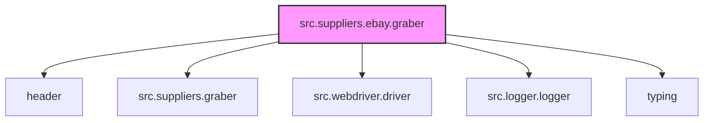
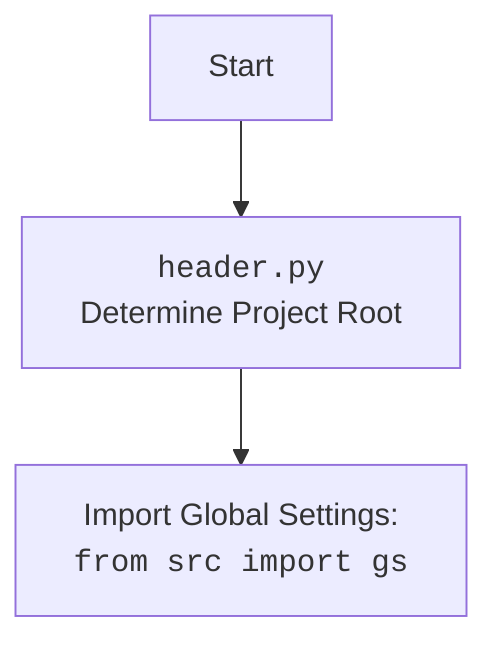

# Анализ кода `hypotez/src/suppliers/ebay/graber.py`

## 1. <алгоритм>

### Общая схема работы класса `Graber`

1.  **Инициализация**:
    *   Создается экземпляр класса `Graber`.
    *   Устанавливается префикс поставщика (`supplier_prefix`) как `'ebay'`.
    *   Вызывается конструктор родительского класса `Graber` (из `src.suppliers.graber`), передаются необходимые параметры (префикс поставщика, драйвер, индекс языка).
    *   Инициализируется `Context.locator_for_decorator` значением `None`.

### Блок-схема

```mermaid
graph TD
    A[Start] --> B{__init__};
    B --> C{self.supplier_prefix = 'ebay'};
    C --> D{super().__init__(supplier_prefix, driver, lang_index)};
    D --> E{Context.locator_for_decorator = None};
    E --> F[End];
```

### Описание элементов блок-схемы:

*   **A (Start)**: Начало процесса.
*   **B (\_\_init\_\_)**: Инициализация класса `Graber`.
*   **C (self.supplier\_prefix = 'ebay')**: Установка префикса поставщика для eBay.
*   **D (super().\_\_init\_\_(supplier\_prefix, driver, lang\_index))**: Вызов конструктора родительского класса.
*   **E (Context.locator\_for\_decorator = None)**: Инициализация атрибута `Context.locator_for_decorator`.
*   **F (End)**: Завершение процесса.

## 2. <mermaid>

### Схема зависимостей модулей



### Объяснение `mermaid` схемы:

*   **src.suppliers.ebay.graber**: Основной модуль, который анализируется.
*   **header**: Модуль `header`, который, вероятно, содержит общие настройки или функции.
*   **src.suppliers.graber**: Родительский класс `Graber`, от которого наследуется текущий класс.
*   **src.webdriver.driver**: Модуль, отвечающий за управление веб-драйвером.
*   **src.logger.logger**: Модуль для логирования событий и ошибок.
*   **typing**: Модуль для аннотации типов.

### mermaid flowchart для `header.py`:



## 3. <объяснение>

### Импорты:

*   `typing`: Используется для аннотации типов, что улучшает читаемость и помогает в отладке кода.
*   `header`: Представляет собой модуль, содержащий общие настройки и утилиты, используемые в проекте.
*   `src.suppliers.graber.Graber as Grbr`: Импортирует родительский класс `Graber` из модуля `src.suppliers.graber` и переименовывает его в `Grbr` для краткости.
*   `src.suppliers.graber.Context`: Импортирует класс `Context`, который, вероятно, используется для хранения контекстной информации, используемой в разных частях приложения.
*   `src.suppliers.graber.close_pop_up`: Импортирует декоратор `close_pop_up`, предназначенный для закрытия всплывающих окон.
*   `src.webdriver.driver.Driver`: Импортирует класс `Driver`, отвечающий за взаимодействие с веб-драйвером.
*   `src.logger.logger.logger`: Импортирует настроенный экземпляр логгера для записи информации о работе приложения и ошибок.

### Классы:

*   `Graber(Grbr)`:
    *   **Роль**: Класс предназначен для сбора данных с сайта eBay. Он наследуется от класса `Graber` из модуля `src.suppliers.graber`.
    *   **Атрибуты**:
        *   `supplier_prefix (str)`: Префикс поставщика, устанавливается в значение `'ebay'`.
    *   **Методы**:
        *   `__init__(self, driver: Driver, lang_index)`: Конструктор класса. Инициализирует префикс поставщика, вызывает конструктор родительского класса и устанавливает `Context.locator_for_decorator` в `None`.

### Функции:

*   `__init__(self, driver: Driver, lang_index)`:
    *   **Аргументы**:
        *   `driver (Driver)`: Экземпляр класса `Driver`, используемый для управления веб-драйвером.
        *   `lang_index`: Индекс языка.
    *   **Возвращаемое значение**: `None`.
    *   **Назначение**: Инициализирует экземпляр класса `Graber`, устанавливает префикс поставщика, вызывает конструктор родительского класса и инициализирует `Context.locator_for_decorator`.

### Переменные:

*   `supplier_prefix (str)`: Префикс поставщика, используется для идентификации поставщика (в данном случае, eBay).
*   `Context.locator_for_decorator`: Атрибут класса `Context`, используемый для хранения локатора, который будет использован декоратором `@close_pop_up`.

### Потенциальные ошибки и области для улучшения:

*   В коде присутствует закомментированный декоратор `close_pop_up`. Если он не используется, его следует удалить. Если планируется использование, необходимо реализовать его функциональность.
*   Отсутствует обработка исключений в конструкторе класса `Graber`.

### Взаимосвязи с другими частями проекта:

*   Класс `Graber` наследуется от класса `Graber` из модуля `src.suppliers.graber`, что указывает на общую структуру для сбора данных с разных поставщиков.
*   Используется класс `Driver` из модуля `src.webdriver.driver` для управления веб-драйвером, что позволяет взаимодействовать с веб-страницами.
*   Используется модуль `src.logger.logger` для логирования, что помогает в отладке и мониторинге работы приложения.
*   Используется класс `Context` для передачи контекстной информации между разными частями приложения, что обеспечивает гибкость и расширяемость.